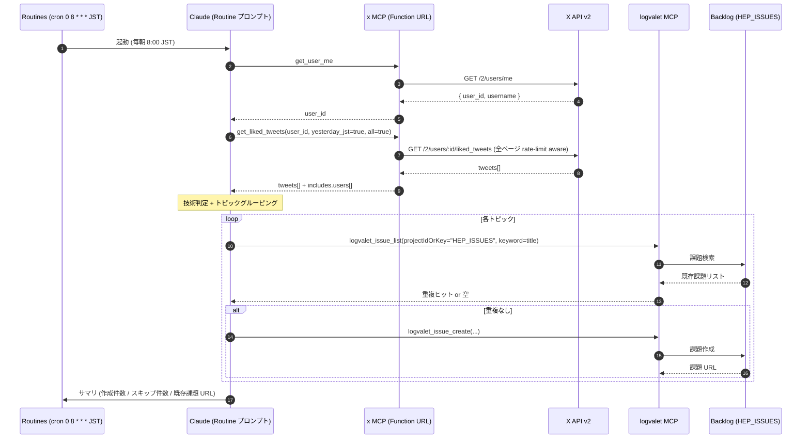

# Claude Code Routines 用プロンプト雛形

> **このドキュメントの位置付け**: 本リポジトリ `x` は Remote MCP サーバーの提供までで責務終わり。
> Routine 側のプロンプト設計は本来ユーザー責任だが、立ち上げ負荷を下げるための「動作確認可能な出発点」として雛形を置いておく。
> Routines は **research preview** のため、API・プロンプト構文・MCP コネクター仕様が予告なく変わる可能性がある。
> 必ず最新の [Claude Code Routines 公式ドキュメント](https://docs.claude.com/) を参照し、自分の環境で動作確認すること。

## 1. 想定シナリオ

毎朝 JST 8:00 に Routine を起動し、**前日に Like した X (Twitter) Post の中から「技術的に検証する価値があるもの」だけを抽出して Backlog (logvalet) に課題化** する。



## 2. 前提条件

- `x` MCP サーバーが Function URL (or 任意の HTTPS エンドポイント) で動作している。
  - デプロイ手順は [`../examples/lambroll/README.md`](../examples/lambroll/README.md) を参照。
- Routines のコネクター MCP に以下 2 つを登録済み:
  - **x** — 本リポジトリ提供 (全 20 ツール、M36 で readonly API カバレッジを拡張):
    - **基本**: `get_user_me` / `get_liked_tweets`
    - **Tweet 系 (M36)**: `get_tweet` / `get_tweets` / `get_liking_users` / `get_retweeted_by` / `get_quote_tweets`
    - **Search 系 (M36)**: `search_recent_tweets` / `get_tweet_thread`
    - **Timeline 系 (M36)**: `get_user_tweets` / `get_user_mentions` / `get_home_timeline`
    - **Users 系 (M36)**: `get_user` / `get_user_by_username` / `get_user_following` / `get_user_followers`
    - **Lists 系 (M36)**: `get_list` / `get_list_tweets`
    - **Misc 系 (M36)**: `search_spaces` / `get_trends`
  - **logvalet** — 別途構築 (Backlog 連携 MCP、`logvalet_issue_list` / `logvalet_issue_create` 等)
- シークレット類 (X API トークン / OIDC Client Secret / Cookie Secret) は **Lambda 環境変数 + SSM Parameter Store** で完結しており、Routines 側には保管しない。

### MCP ツール名表記の注意

本ドキュメントは **正規ツール名** (例: `get_user_me` / `logvalet_issue_list`) で記述する。
Routines / MCP クライアントによってはコネクター名を prefix する場合がある (例: `mcp__x__get_user_me`, `mcp__logvalet__logvalet_issue_list`)。
自分の環境で実際に `tools/list` を呼んで返ってくる名前を確認し、必要に応じて prefix を付与すること。

## 3. 推奨プロンプト雛形 (Routine にコピペ)

````markdown
あなたは「前日 X (Twitter) で Like した Post を Backlog (HEP_ISSUES) に技術検証タスクとして起票する」アシスタントです。
JST タイムゾーンで動作しています。出力は日本語。

## ステップ 1: 自分の X user_id を取得
- ツール: `get_user_me` (x MCP)
- 入力: なし
- 取得した `user_id` を保持

## ステップ 2: 前日の Like 全件を取得
- ツール: `get_liked_tweets` (x MCP)
- 入力:
  - `user_id`: ステップ 1 の値
  - `yesterday_jst`: true
  - `all`: true
  - `max_pages`: 20  # 1 日 2,000 件まで (それ以上は通常ありえない)
  - `tweet_fields`: "id,text,author_id,created_at,entities,public_metrics,referenced_tweets"
  - `expansions`: "author_id"
  - `user_fields`: "username,name"
- 戻り値の `data[]` と `includes.users[]` を保持

## ステップ 3: 技術判定 + トピックグルーピング
以下を満たす Post **のみ** を抽出し、似たトピックは 1 件に集約する:

採用:
- 新しいツール / ライブラリ / フレームワーク / API の紹介
- パフォーマンス計測・ベンチマーク結果
- セキュリティ脆弱性・運用ノウハウ
- アーキテクチャ・設計手法の解説
- 自分の業務 (バックエンド / クラウド / Claude Code 周辺) で試してみたい / 共有したい内容

除外:
- 純粋な情報共有 (ニュース URL のみ)
- 宣伝・キャンペーン
- ミーム・雑談・感想のみ
- 同じ著者の連投で内容が重複するもの (代表 1 件のみ採用)

## ステップ 4: 既存課題との重複チェック
各トピックについて:
- ツール: `logvalet_issue_list` (logvalet MCP)
- 入力:
  - `projectIdOrKey`: "HEP_ISSUES"
  - `keyword`: トピックのタイトル候補から主要キーワード 2-3 個
- 既存課題 (status: 未対応 / 処理中 / 完了済みも含む) がヒットしたら **スキップ** し、最後にサマリ出力にその URL を含める

## ステップ 5: 新規課題作成
重複していないトピックについて:
- ツール: `logvalet_issue_create` (logvalet MCP)
- 入力:
  - `projectIdOrKey`: "HEP_ISSUES"
  - `summary`: "[X Like] <トピック>" (50 文字以内)
  - `description`: 下記テンプレを Markdown で埋める
  - `issueTypeId`: "タスク" の ID (環境依存、初回に `logvalet_meta_issue_types` で取得して固定値化推奨)
  - `priorityId`: 3 (通常)

### description テンプレ

```
## 元 Post
- URL: https://x.com/<screen_name>/status/<id>
- 投稿者: @<screen_name> (<name>)
- 投稿日時 (JST): YYYY-MM-DD HH:MM
- Like 日時 (JST): (X API は Like 日時を返さないため、yesterday_jst で取得した日として記載)

## 要点 (3 行以内)
- ...

## 検証アクション案
- [ ] <試すべきコマンド・読むべき記事 / API>
- [ ] <必要なら社内 (Heptagon) で共有する範囲>

## 元 Post 本文
> <quoted text>
```

## ステップ 6: サマリ出力
最後に以下を出力:
- 取得した Like 件数 (total)
- 採用した件数 (created)
- 重複でスキップした件数 (skipped) + 既存課題 URL のリスト
- 除外した件数 (excluded)

エラーが発生した場合はそこで停止し、エラー内容をそのまま報告する。Backlog の不要な重複登録を避けるため、リトライは行わない。
````

## 3.1 拡張ユースケース (M36 で追加されたツールの活用例)

M36 で 18 個の readonly ツールが追加されたことで、Routines は単純な Liked Posts 抽出を超えた幅広いデータ収集が可能になった。代表的なパターン:

### 3.1.1 任意のツイートの会話スレッドを取得

```markdown
## ステップ: 指定ツイートのスレッドを取得し技術判定
- ツール: `get_tweet_thread`
- 入力: { "tweet_id": "<root tweet ID>", "author_only": true, "max_results": 100 }
- 出力: created_at 昇順に並んだ会話ツイート列。author_only=true で root 投稿者の連投のみ抽出
```

### 3.1.2 特定キーワードのリアルタイム調査

```markdown
## ステップ: ハッシュタグやキーワードを過去 7 日で検索
- ツール: `search_recent_tweets`
- 入力: { "query": "#AI lang:ja", "yesterday_jst": true, "max_results": 100, "all": true, "max_pages": 5 }
- 出力: 検索条件にマッチしたツイート全件
```

### 3.1.3 自分以外のユーザーのタイムラインを覗く

```markdown
## ステップ: 任意のユーザーの直近ツイートを取得
- ツール 1: `get_user_by_username` (入力: { "username": "alice" }) → user_id を取得
- ツール 2: `get_user_tweets` (入力: { "user_id": "<上記>", "exclude": ["replies","retweets"], "max_results": 50 })
```

### 3.1.4 リスト経由でキュレーションされた情報を取得

```markdown
## ステップ: 技術リストの最新ツイートを取得
- ツール: `get_list_tweets`
- 入力: { "list_id": "<list ID>", "max_results": 100, "all": true, "max_pages": 3 }
```

### 3.1.5 トレンドの監視 (日本 = 23424856)

```markdown
## ステップ: 日本のトレンドを取得し技術系トピックをフィルタ
- ツール: `get_trends`
- 入力: { "woeid": 23424856, "max_trends": 50 }
```

これらのツールはすべて env のみで動作する (file 読まない、spec §11 不変条件)。
JST 系パラメータ (`yesterday_jst` / `since_jst`) は `search_recent_tweets` / `get_user_tweets` /
`get_user_mentions` / `get_home_timeline` の 4 ツールで `get_liked_tweets` と同じ優先順位
(`yesterday_jst > since_jst > start_time/end_time`) で動作する。

## 4. 失敗モードと対処

| 症状 | 主な原因 | 対処 |
|---|---|---|
| `401` が返る (X API) | X API トークンが Lambda 環境変数に注入されていない / トークン失効 | `examples/lambroll/.env` と SSM Parameter Store の値を再確認。`x configure --check` でローカルでも検証可能 |
| `429` が返る (X API) | レート制限超過 | `x` MCP 側で最大 3 回まで自動 retry 済み。それでも失敗した場合は翌日に持ち越す (Routine 側ではリトライしない) |
| `logvalet_issue_create` が重複登録 | `logvalet_issue_list` のキーワードが弱い | キーワードを増やすか、`logvalet_issue_list` 検索後に Claude 自身が title 類似度を判定 |
| プロンプト指示が無視される (Routines 仕様変更) | research preview の breaking change | [Claude Code Routines docs](https://docs.claude.com/) で構文の最新版を確認し、Markdown 見出し階層やツール呼び出し記法を調整 |
| MCP ツール名が見つからない | Routines のコネクター prefix 仕様 | `tools/list` の出力を確認して prefix を補う (本ドキュメント §2 参照) |

## 5. 注意事項

- Routines は **research preview** であり、本プロンプト雛形は 2026-05-12 時点の挙動に基づく。仕様変更に備えて自分の環境で必ず動作確認すること。
- HEP_ISSUES プロジェクトは Heptagon 社内固有。他組織で使う場合は `projectIdOrKey` と `issueTypeId` / `priorityId` を読み替える。
- X API のコストは `--max-pages 20` (上記雛形) で **1 日最大 2,000 Posts ≈ $2** が上限 (実態は数十件のため $1/月 程度)。
- Routines 側で API キーや X トークンを **保管しない** のがセキュリティ上の前提。すべて Lambda 環境変数 + SSM Parameter Store 経由で `x` MCP が直接保持する。

## 6. 関連ドキュメント

- 本リポジトリ README: [`../README.md`](../README.md)
- スペック: [`./specs/x-spec.md`](./specs/x-spec.md) — §3 / §14 に Routines 連携の想定を記載
- X API リファレンス: [`./x-api.md`](./x-api.md)
- lambroll デプロイ手順: [`../examples/lambroll/README.md`](../examples/lambroll/README.md)
- [Claude Code Routines 公式ドキュメント](https://docs.claude.com/)
