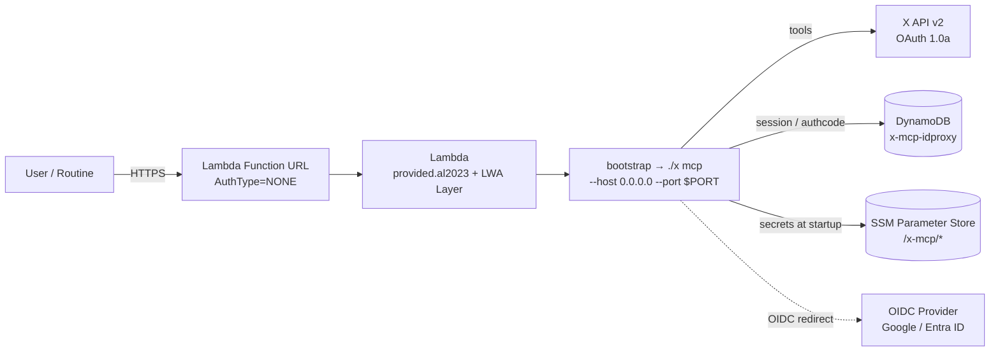

# x mcp on AWS Lambda Function URL

[lambroll](https://github.com/fujiwara/lambroll) + [Lambda Web Adapter (LWA)](https://github.com/awslabs/aws-lambda-web-adapter) で
`x mcp` (Remote MCP / Streamable HTTP) を **AWS Lambda Function URL** にデプロイするサンプル一式です。

想定ユースケースは **Anthropic Claude Code Routines のコネクター MCP** として毎朝呼び出されることです。
ローカルで動かしたいだけなら `x mcp --auth none` で十分なので、本ディレクトリは公開デプロイ専用と考えてください。

## アーキテクチャ



- Function URL の認可は **NONE** にして、認証は **idproxy (OIDC cookie session)** で行います。
- シークレット類 (X API 4 トークン / OIDC Client Secret / Cookie Secret) は **SSM Parameter Store** に SecureString で保管し、
  Lambda 起動時に注入します (`function.json` 内で `{{ ssm }}` テンプレ展開)。
- idproxy のセッション / 認可コードは **DynamoDB テーブル `x-mcp-idproxy`** に保存します。
- LWA Layer が `PORT` 環境変数を渡してくるので、bootstrap は `--port "${PORT:-8080}"` で受けます。

## 前提条件

| 項目 | 説明 |
|---|---|
| AWS アカウント | Lambda / IAM / SSM / DynamoDB の作成権限が必要 |
| AWS CLI | プロファイル設定済み (`aws sts get-caller-identity` が通る状態) |
| `lambroll` | `brew install fujiwara/tap/lambroll` |
| X API v2 OAuth 1.0a トークン | API Key / API Secret / Access Token / Access Token Secret (4 つ) |
| OIDC プロバイダ | Google Workspace か Microsoft Entra ID のテナント管理権限 |
| `openssl` | Cookie Secret 生成用 (macOS / Linux 標準) |

> `x` バイナリは GoReleaser によって [GitHub Releases](https://github.com/youyo/x/releases) で配布される
> `linux_arm64` を `bootstrap` と同じディレクトリに置く想定です (本ディレクトリで `lambroll deploy` を実行する前に
> 同梱しておいてください)。

## デプロイ手順

### Step 1. IAM ロールを作成する

Lambda 実行ロールを作成し、SSM 読み取りと DynamoDB CRUD のインラインポリシーを付与します。

```bash
# 1-1. 信頼ポリシーつきでロール作成
aws iam create-role \
  --role-name x-mcp-lambda-role \
  --assume-role-policy-document '{
    "Version": "2012-10-17",
    "Statement": [{
      "Effect": "Allow",
      "Principal": { "Service": "lambda.amazonaws.com" },
      "Action": "sts:AssumeRole"
    }]
  }'

# 1-2. CloudWatch Logs などの基本権限
aws iam attach-role-policy \
  --role-name x-mcp-lambda-role \
  --policy-arn arn:aws:iam::aws:policy/service-role/AWSLambdaBasicExecutionRole

# 1-3. SSM Parameter Store 読み取り
aws iam put-role-policy \
  --role-name x-mcp-lambda-role \
  --policy-name x-mcp-ssm-read \
  --policy-document '{
    "Version": "2012-10-17",
    "Statement": [{
      "Effect": "Allow",
      "Action": ["ssm:GetParameter", "ssm:GetParameters"],
      "Resource": "arn:aws:ssm:*:*:parameter/x-mcp/*"
    }]
  }'

# 1-4. DynamoDB CRUD (idproxy セッション用)
aws iam put-role-policy \
  --role-name x-mcp-lambda-role \
  --policy-name x-mcp-dynamodb-crud \
  --policy-document '{
    "Version": "2012-10-17",
    "Statement": [{
      "Effect": "Allow",
      "Action": [
        "dynamodb:GetItem",
        "dynamodb:PutItem",
        "dynamodb:UpdateItem",
        "dynamodb:DeleteItem"
      ],
      "Resource": "arn:aws:dynamodb:*:*:table/x-mcp-idproxy"
    }]
  }'

# 1-5. ARN を控える (.env の ROLE_ARN に貼る)
aws iam get-role --role-name x-mcp-lambda-role --query 'Role.Arn' --output text
```

### Step 2. DynamoDB テーブルを作成する

idproxy の DynamoDB ストアは PartitionKey `pk` (String) と TTL 属性 `ttl` (Number) を使います。
属性 `data` (String) は JSON ペイロードとして自動的に書き込まれます。

```bash
aws dynamodb create-table \
  --table-name x-mcp-idproxy \
  --attribute-definitions AttributeName=pk,AttributeType=S \
  --key-schema AttributeName=pk,KeyType=HASH \
  --billing-mode PAY_PER_REQUEST \
  --region ap-northeast-1

# テーブルが ACTIVE になるまで待つ
aws dynamodb wait table-exists \
  --table-name x-mcp-idproxy \
  --region ap-northeast-1

# DynamoDB ネイティブ TTL を ttl 属性で有効化
aws dynamodb update-time-to-live \
  --table-name x-mcp-idproxy \
  --time-to-live-specification 'Enabled=true,AttributeName=ttl' \
  --region ap-northeast-1
```

### Step 3. SSM Parameter Store にシークレットを投入する

`function.json` は以下の 6 キーを `{{ ssm ... }}` で参照します。**全 6 キーが揃わないと `lambroll deploy` が失敗します。**
`apikey` / `none` 運用にしたい場合でも、ダミー値 (例: `dummy`) を SecureString として投入してください。

| SSM キー | 値の意味 |
|---|---|
| `/x-mcp/x_api_key` | X API Consumer Key |
| `/x-mcp/x_api_secret` | X API Consumer Secret |
| `/x-mcp/x_access_token` | X API Access Token |
| `/x-mcp/x_access_token_secret` | X API Access Token Secret |
| `/x-mcp/oidc_client_secret` | OIDC Provider の Client Secret |
| `/x-mcp/cookie_secret` | idproxy Cookie 暗号鍵 (hex 32B+) |

```bash
REGION=ap-northeast-1

aws ssm put-parameter --region "$REGION" --type SecureString \
  --name /x-mcp/x_api_key --value "REPLACE_ME"
aws ssm put-parameter --region "$REGION" --type SecureString \
  --name /x-mcp/x_api_secret --value "REPLACE_ME"
aws ssm put-parameter --region "$REGION" --type SecureString \
  --name /x-mcp/x_access_token --value "REPLACE_ME"
aws ssm put-parameter --region "$REGION" --type SecureString \
  --name /x-mcp/x_access_token_secret --value "REPLACE_ME"
aws ssm put-parameter --region "$REGION" --type SecureString \
  --name /x-mcp/oidc_client_secret --value "REPLACE_ME"

# cookie_secret は openssl で生成 (hex 32 bytes = 64 chars 以上推奨)
aws ssm put-parameter --region "$REGION" --type SecureString \
  --name /x-mcp/cookie_secret --value "$(openssl rand -hex 32)"
```

### Step 4. OIDC プロバイダで OAuth クライアントを作成する

idproxy は **Google Workspace** と **Microsoft Entra ID** の両方に対応しています。複数を併用したい場合は
`OIDC_ISSUER` / `OIDC_CLIENT_ID` をカンマ区切りで対応順に並べ、`OIDC_CLIENT_SECRET` は一致する secret を
SSM に投入してください (現状の `function.json` テンプレは単一 secret 前提)。

#### 4.1 Google Workspace の場合

1. [Google Cloud Console](https://console.cloud.google.com/apis/credentials) → **認証情報** → **OAuth クライアント ID を作成**
2. アプリケーションの種類: **ウェブアプリケーション**
3. 承認済みのリダイレクト URI: `https://<your-host>/callback`
   - Function URL が確定するまで仮の値で登録し、デプロイ後に確定値へ更新します。
4. 控える値:
   - **Issuer URL**: `https://accounts.google.com`
   - **Client ID**: `OIDC_CLIENT_ID` に設定
   - **Client Secret**: SSM `/x-mcp/oidc_client_secret` に投入

#### 4.2 Microsoft Entra ID の場合

1. Azure Portal → **Microsoft Entra ID** → **アプリの登録** → **新規登録**
2. **リダイレクト URI**: プラットフォーム = Web、URI = `https://<your-host>/callback`
3. **証明書とシークレット** → **新しいクライアントシークレット** を作成
4. 控える値:
   - **Issuer URL**: `https://login.microsoftonline.com/<tenant-id>/v2.0`
   - **アプリケーション (クライアント) ID**: `OIDC_CLIENT_ID` に設定
   - **クライアント シークレット (値)**: SSM `/x-mcp/oidc_client_secret` に投入

### Step 5. `lambroll deploy`

```bash
cp .env.example .env
# .env を編集して ROLE_ARN / AWS_REGION / EXTERNAL_URL / OIDC_ISSUER / OIDC_CLIENT_ID を埋める
# EXTERNAL_URL は初回は仮値 (例: https://example.com) で OK。後で更新する。

set -a; . ./.env; set +a

# 同ディレクトリに linux_arm64 の x バイナリを置く (GitHub Releases から DL)
chmod +x bootstrap x

lambroll deploy --function function.json --function-url function_url.json
```

`lambroll deploy` の出力に Function URL が表示されます。これを `.env` の `EXTERNAL_URL` に貼り直してから
**再度 `lambroll deploy`** を実行し、環境変数を確定値で更新してください。
OIDC プロバイダ側のリダイレクト URI も `<確定 Function URL>/callback` に更新します。

> Function URL を確認するには:
> ```bash
> aws lambda get-function-url-config --function-name x-mcp \
>   --query 'FunctionUrl' --output text
> ```

### Step 6. 動作確認

```bash
FURL=$(aws lambda get-function-url-config --function-name x-mcp --query 'FunctionUrl' --output text)

# 6-1. ヘルスチェック (認証 middleware の外側に常時公開)
curl -i "${FURL%/}/healthz"
# → HTTP/1.1 200 OK
# → ok

# 6-2. ブラウザで Function URL を開く → OIDC ログイン → /mcp が応答することを確認
open "$FURL"

# 6-3. MCP クライアントから疎通確認 (例: claude.ai の Routines コネクター URL に Function URL を登録)
```

`get_user_me` と `get_liked_tweets` の 2 ツールが見えれば成功です。

## トラブルシュート FAQ

| 症状 | 主な原因と対処 |
|---|---|
| `401 Unauthorized` がブラウザで返る | OIDC 設定ミス。`OIDC_ISSUER` / `OIDC_CLIENT_ID` / SSM `oidc_client_secret` の組が一致しているか確認。Redirect URI が `<EXTERNAL_URL>/callback` と完全一致しているか確認。 |
| OIDC ログイン後にリダイレクトループ | `EXTERNAL_URL` が実際の Function URL と一致していない。`.env` を確定値に更新して再 deploy。Cookie の Secure 属性は HTTPS 必須。 |
| `lambroll deploy` が SSM 参照で失敗 | 6 キーすべて SecureString で投入済みか確認。IAM ロールに `ssm:GetParameter` (parameter/x-mcp/*) が付いているか確認 (Step 1-3)。 |
| `ResourceNotFoundException: Requested resource not found` (DynamoDB) | テーブル `x-mcp-idproxy` が未作成。Step 2 を再実行。リージョンが `.env` の `AWS_REGION` と一致しているか確認。 |
| DynamoDB ProvisionedThroughputExceededException | `PAY_PER_REQUEST` (オンデマンド) になっているか確認。 |
| Cold start が遅い (>1s) | arm64 + 256MB で p95 500ms 程度が目安。`Provisioned Concurrency` はルーチン用途では費用対効果が悪いので非推奨。 |
| `OIDC issuer is required` 等のエラーで Lambda が起動しない | `X_MCP_AUTH=idproxy` (既定) のとき、Issuer / Client ID / Client Secret / Cookie Secret / EXTERNAL_URL の 5 つが必須。 |
| ブラウザに白画面、CloudWatch Logs に何も出ない | LWA Layer ARN がリージョンと一致しているか確認 (`function.json` の `arn:aws:lambda:<region>:753240598075:...`)。 |

## コスト見積もり (概算)

毎日 1 回 Routines から呼び出される想定 (月 30 回程度) の概算です。

| サービス | 月額目安 |
|---|---|
| Lambda (arm64, 256MB, 平均 5 秒 / 30 回) | 約 $0.01 未満 (無料枠内に収まることが多い) |
| DynamoDB (PAY_PER_REQUEST, 100 RCU/WCU/月 程度) | 約 $0.001 |
| SSM Parameter Store (Standard / SecureString) | 無料 |
| CloudWatch Logs | 数 MB / 月のため約 $0.01 |
| X API v2 | プランに依存 (Free プランで賄える前提) |

> 利用頻度が増えた場合 (毎時実行など) でも Lambda + DynamoDB 合計で $1/月未満に収まる見込みです。
> 厳密な見積もりは [AWS Pricing Calculator](https://calculator.aws/) を参照してください。

## クリーンアップ

```bash
# Lambda 関数 + Function URL を削除
lambroll delete --function function.json

# DynamoDB テーブル
aws dynamodb delete-table --table-name x-mcp-idproxy --region ap-northeast-1

# SSM パラメータ
for k in x_api_key x_api_secret x_access_token x_access_token_secret oidc_client_secret cookie_secret; do
  aws ssm delete-parameter --name "/x-mcp/$k" --region ap-northeast-1
done

# IAM ロール
aws iam delete-role-policy --role-name x-mcp-lambda-role --policy-name x-mcp-ssm-read
aws iam delete-role-policy --role-name x-mcp-lambda-role --policy-name x-mcp-dynamodb-crud
aws iam detach-role-policy --role-name x-mcp-lambda-role \
  --policy-arn arn:aws:iam::aws:policy/service-role/AWSLambdaBasicExecutionRole
aws iam delete-role --role-name x-mcp-lambda-role
```

## 環境変数リファレンス

`.env.example` も併せて参照してください。SSM 経由のキーは `function.json` 内で展開されるため、
`.env` には書きません。

### lambroll が必要とする env (`.env`)

| 変数 | 必須 | 既定 | 説明 |
|---|:---:|---|---|
| `ROLE_ARN` | ✅ | — | Step 1 で作成した Lambda 実行ロール ARN |
| `AWS_REGION` | ✅ | — | デプロイ先リージョン (LWA Layer ARN にも展開される) |
| `EXTERNAL_URL` | ✅ | — | Function URL or 独自ドメイン。末尾スラッシュなし。初回は仮値で OK |
| `X_MCP_AUTH` | | `idproxy` | `none` / `apikey` / `idproxy` |
| `X_MCP_API_KEY` | △ | (空) | `X_MCP_AUTH=apikey` のときのみ必須 |
| `OIDC_ISSUER` | △ | (空) | `X_MCP_AUTH=idproxy` のとき必須。カンマ区切り複数可 |
| `OIDC_CLIENT_ID` | △ | (空) | `OIDC_ISSUER` と同じ順序で対応 |
| `STORE_BACKEND` | | `dynamodb` | Lambda では `dynamodb` 推奨 |
| `DYNAMODB_TABLE_NAME` | | `x-mcp-idproxy` | Step 2 で作成したテーブル名 |
| `LOG_LEVEL` | | `info` | `debug` / `info` / `warn` / `error` |

### SSM Parameter Store 経由で注入される env (Lambda コンテナ内)

| Lambda 環境変数 | SSM キー | 説明 |
|---|---|---|
| `X_API_KEY` | `/x-mcp/x_api_key` | X API Consumer Key |
| `X_API_SECRET` | `/x-mcp/x_api_secret` | X API Consumer Secret |
| `X_ACCESS_TOKEN` | `/x-mcp/x_access_token` | X API Access Token |
| `X_ACCESS_TOKEN_SECRET` | `/x-mcp/x_access_token_secret` | X API Access Token Secret |
| `OIDC_CLIENT_SECRET` | `/x-mcp/oidc_client_secret` | OIDC Provider Client Secret |
| `COOKIE_SECRET` | `/x-mcp/cookie_secret` | Cookie 暗号鍵 (`openssl rand -hex 32`) |

## 関連ドキュメント

- リポジトリ README: [`../../README.md`](../../README.md)
- 仕様書: [`../../docs/specs/x-spec.md`](../../docs/specs/x-spec.md)
- Claude Code Routines 用プロンプト雛形 (M28 で追加予定): `../../docs/routine-prompt.md`
