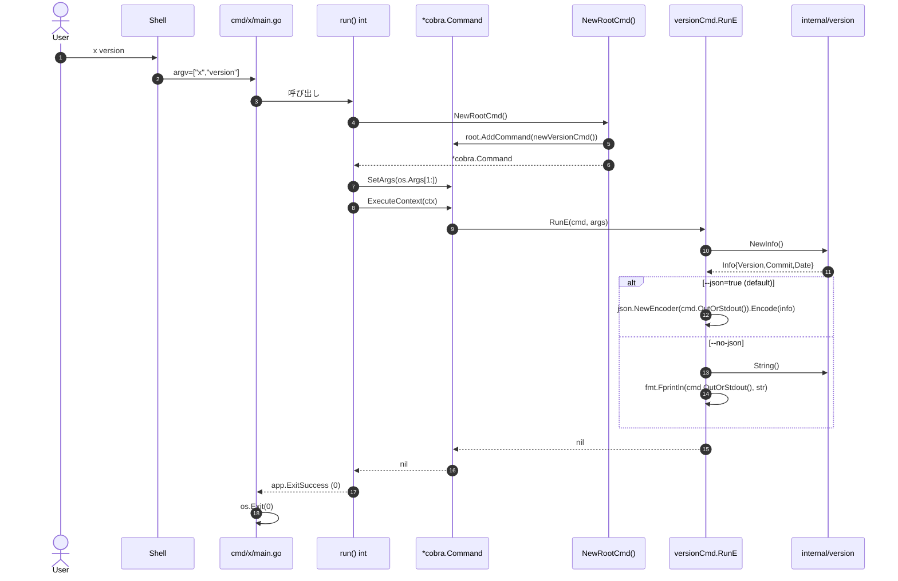
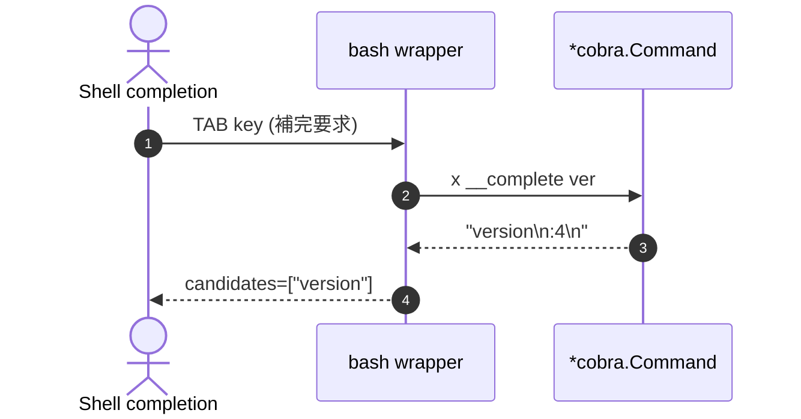

# M1: リポジトリ初期化 + Cobra スケルトン + `x version`

> Layer 2: M1 マイルストーン詳細計画。Layer 1 ロードマップは [plans/x-roadmap.md](./x-roadmap.md) を参照。

## 1. Overview

| 項目 | 値 |
|---|---|
| マイルストーン | M1 |
| ステータス | Planned |
| バージョン | 0.0.1 (initial scaffold) |
| 依存 | なし |
| 後続マイルストーン | M2 (CI / golangci-lint / Dockerfile), M3 (config loader + render パッケージ) |
| 対象モジュール | `github.com/youyo/x` |
| バイナリ名 | `x` |
| Go バージョン | 1.26.1 (mise 管理) |
| 主要外部依存 | `github.com/spf13/cobra v1.x` のみ |
| TDD | 必須 (Red → Green → Refactor を機能単位で適用) |
| 対象ファイル数 | 13 (go.sum 含む。completion.go は Cobra 標準で不要) |
| LOC 目安 | プロダクション ~150 / テスト ~280 |
| 参考実装 | kubectl / gh CLI / hugo (Cobra デファクト実装の代表例) |

### M1 で**やること**
- `go mod init github.com/youyo/x`
- **Cobra** ベースの最小 CLI スケルトン構築
- `x version` サブコマンド (JSON / human 切替) の実装
- `x completion {bash,zsh,fish,powershell}` (Cobra 標準機能で**実装不要**、ただしテストで動作確認)
- `cobra.Command.Version` フィールドで `--version` 自動対応
- `__complete` による動的補完 (Cobra 標準、Parse 前 intercept 不要)
- exit code 定数 6 個 (0/1/2/3/4/5) の確立
- 最小 `.gitignore` / `mise.toml`

### M1 で**やらないこと** (将来マイルストーン)
- GitHub Actions / golangci-lint / Dockerfile / GoReleaser (→ M2)
- PersistentFlags の本格利用 / `internal/render` パッケージ (→ M3)
- `internal/config` loader (→ M3)
- viper 統合 (→ M3 で導入検討)
- `internal/xapi` (OAuth1 + X API クライアント) (→ M5)
- `x configure` / `x me` / `x liked list` / `x mcp` 各サブコマンド (→ M9+)
- 追加 exit code (API error / config error 等) (→ M5+)

## 2. Goal

### 機能要件
- [ ] `x version` がデフォルトで JSON 出力 (`{"version":"...","commit":"...","date":"..."}`)
- [ ] `x version --no-json` が human-readable 単一行 (`dev (commit: none, built: unknown)`)
- [ ] `x --version` が Cobra `Version` フィールド経由でバージョン表示し exit 0
- [ ] `x --help` / `x help` が Cobra 標準ヘルプを表示し exit 0
- [ ] `x completion {bash,zsh,fish,powershell}` が各シェル用 wrapper を stdout 出力 (Cobra 標準機能)
- [ ] `x __complete` (動的補完エンジン) が Cobra 標準で動作する
- [ ] 未知サブコマンド (`x nonexistent`) は exit 2 (`ExitArgumentError`)
- [ ] `internal/version.Version` / `Commit` / `Date` が ldflags 注入可能

### 非機能要件
- [ ] `go test -race -count=1 ./...` 全 pass
- [ ] `go vet ./...` 警告ゼロ
- [ ] 全ファイル日本語ドキュメンテーションコメント
- [ ] 外部依存は `cobra` のみ (transitive で `spf13/pflag` が入る)
- [ ] `cmd/x/main.go` の `run() int` は os.Exit から分離 (テスト可能)
- [ ] `NewRootCmd()` factory パターンで `*cobra.Command` を返す (テスト時の依存差し替え容易)

## 3. Architecture Notes

### モジュール構造 (M1 完了時)

```
github.com/youyo/x
├── go.mod
├── go.sum
├── .gitignore
├── mise.toml
├── cmd/x/main.go             ← cobra.Execute + exit code 伝播
└── internal/
    ├── app/
    │   ├── exit.go            ← Exit code 定数 (0/1/2/3/4/5)
    │   └── exit_test.go
    ├── version/
    │   ├── version.go         ← Version/Commit/Date + Info + NewInfo + String
    │   └── version_test.go
    └── cli/
        ├── root.go            ← NewRootCmd() factory (cobra.Command + Version + subcommands)
        ├── root_test.go
        ├── version.go         ← newVersionCmd() (JSON / --no-json 切替)
        └── version_test.go
```

**注: completion.go は不要**。Cobra が `x completion bash|zsh|fish|powershell` を root.Command に自動追加する (`AddCommand(completionCmd)` の代わりに `DisableSuggestions = false` のままにしておけば内部生成)。

### 起動シーケンス (正常系)



### 動的補完 (Cobra 標準: `__complete` hidden command)

Cobra は **自動的に** `__complete` という hidden subcommand を root に追加する。
シェル wrapper (`x completion bash` で出力されるもの) はこれを呼び出して候補を取得するため、Kong のような Parse 前 intercept 実装は不要。



### Cobra root structure

```go
// internal/cli/root.go
func NewRootCmd() *cobra.Command {
    root := &cobra.Command{
        Use:           "x",
        Short:         "X (Twitter) API CLI & Remote MCP",
        Long:          "x is a CLI/MCP wrapper for the X API v2. ...",
        Version:       version.String(),      // --version を自動有効化
        SilenceUsage:  true,                  // RunE エラー時に Usage を出さない
        SilenceErrors: true,                  // エラー出力は呼び出し側で
    }
    root.SetVersionTemplate("{{.Version}}\n")
    root.AddCommand(newVersionCmd())
    // completion subcommand は Cobra が自動で追加 (`HasAvailableSubCommands` 真の時)
    return root
}
```

設計判断:
- `SilenceUsage: true` + `SilenceErrors: true` で、エラー時の Cobra 自動 Usage 出力を抑制し、`cmd/x/main.go` の `run() int` で一元的にエラー → exit code マッピング
- `Version` フィールドで `--version` / `-v` (Cobra 自動 short flag は未割当) 対応
- `Use: "x"` で補完スクリプトのコマンド名が `x` に固定される
- M3 で PersistentFlags (`--format` / `--no-color` 等) を追加予定

## 4. TDD Test Design (21 ケース)

Cobra へ変更したことで補完テストの大部分が削減され、`cmd.SetOut()` / `cmd.SetArgs()` / `cmd.Execute()` を駆使したパターンに刷新。

| # | テストケース | 入力 | 期待 | テストファイル |
|---|---|---|---|---|
| T1-1〜T1-6 | exit code 6 個の値検証 (0/1/2/3/4/5) | `app.Exit*` 定数 | 各定数が正しい数値 | `internal/app/exit_test.go` (table-driven) |
| T2-1 | Version デフォルト | `version.Version` | `== "dev"` | `internal/version/version_test.go` |
| T2-2 | Commit デフォルト | `version.Commit` | `== "none"` | 同上 |
| T2-3 | Date デフォルト | `version.Date` | `== "unknown"` | 同上 |
| T2-4 | NewInfo() | `version.NewInfo()` | 3 フィールド一致 | 同上 |
| T2-5 | String() 出力 | `version.String()` | 空でない、`"dev"` を含む | 同上 |
| T2-6 | JSON シリアライズ | `json.Marshal(NewInfo())` | `version`/`commit`/`date` キー存在 | 同上 |
| T3-1 | `x version` JSON 出力 (default) | `cmd.SetArgs([]string{"version"})` → `cmd.Execute()` (`cmd.SetOut(buf)`) | json.Unmarshal 成功、`version`/`commit`/`date` キー存在 | `internal/cli/version_test.go` |
| T3-2 | JSON にデフォルト値 | (同上) | `m["version"]=="dev"` | 同上 |
| T3-3 | `x version --no-json` human 出力 | `cmd.SetArgs([]string{"version","--no-json"})` | `"dev"` / `"commit:"` / `"built:"` を含み、JSON でない | 同上 |
| T3-4 | `x version` のヘルプに `--no-json` が出る | `cmd.SetArgs([]string{"version","--help"})` | 出力に `--no-json` を含む | 同上 |
| T4-1 | `x --version` がバージョン出力 | `cmd.SetArgs([]string{"--version"})` | 出力に `"dev"` を含み、exit エラーなし | `internal/cli/root_test.go` |
| T4-2 | `x --help` の出力に `version` サブコマンドが見える | `cmd.SetArgs([]string{"--help"})` | 出力に `"version"` を含む | 同上 |
| T4-3 | `x --help` の出力に `completion` サブコマンドが見える (Cobra 自動追加) | 同上 | 出力に `"completion"` を含む | 同上 |
| T4-4 | `x completion bash` が wrapper 出力 | `cmd.SetArgs([]string{"completion","bash"})` | 出力に `"# bash completion"` または `_x()` を含む | 同上 |
| T4-5 | `x completion zsh` が wrapper 出力 | `cmd.SetArgs([]string{"completion","zsh"})` | 出力に `"#compdef _x"` または `compdef` を含む | 同上 |
| T4-6 | `x completion fish` が wrapper 出力 | `cmd.SetArgs([]string{"completion","fish"})` | 出力に `complete -c x` を含む | 同上 |
| T4-7 | `x completion powershell` が wrapper 出力 | `cmd.SetArgs([]string{"completion","powershell"})` | 出力にスクリプトを含む (空でない) | 同上 |
| T4-8 | `x __complete ""` が `version completion` を返す | `cmd.SetArgs([]string{"__complete",""})` | 出力に `"version"` と `"completion"` を含む | 同上 |
| T4-9 | 未知サブコマンドはエラー (`SilenceUsage` で usage 抑制) | `cmd.SetArgs([]string{"nonexistent"})` → `cmd.Execute()` | `err != nil` | 同上 |

### テスト原則

- **`cmd.SetArgs()` + `cmd.SetOut(buf)` + `cmd.SetErr(buf)`**: Cobra 標準のテスト方式。`os.Args` には触れない
- **factory パターン**: 各テストで `NewRootCmd()` を新規生成し、グローバル状態を持たない
- **table-driven**: T1 / T2 は 1 関数で table-driven
- **`-race` 必須**: `go test -race ./...` 通過
- **`run() int` のテスト**: `cmd/x/main_test.go` で `os.Args` を一時差し替えて exit code 検証 (M1 のスコープでは省略可、M2 の CI でカバー)

## 5. Implementation Steps

### Step 0: リポジトリ初期化
- `go mod init github.com/youyo/x`
- `go get github.com/spf13/cobra@latest`
- `.gitignore` / `mise.toml` 作成

### Step 1: `internal/app/exit.go` (TDD)
- **Red**: T1-1〜T1-6 を table-driven で記述
- **Green**: 6 定数を定義
- **Refactor**: パッケージドキュコメント + 日本語コメント

### Step 2: `internal/version/version.go` (TDD)
- **Red**: T2-1〜T2-6
- **Green**: Version/Commit/Date 変数 + Info 構造体 + NewInfo() + String()
- **Refactor**: ldflags 注入方法のドキュコメント

### Step 3: `internal/cli/version.go` (TDD)
- **Red**: T3-1〜T3-4
- **Green**:
  ```go
  func newVersionCmd() *cobra.Command {
      var noJSON bool
      cmd := &cobra.Command{
          Use:   "version",
          Short: "display version information",
          RunE: func(cmd *cobra.Command, args []string) error {
              info := version.NewInfo()
              if !noJSON {
                  return json.NewEncoder(cmd.OutOrStdout()).Encode(info)
              }
              _, err := fmt.Fprintln(cmd.OutOrStdout(), version.String())
              return err
          },
      }
      cmd.Flags().BoolVar(&noJSON, "no-json", false, "output human-readable text instead of JSON")
      return cmd
  }
  ```
- **Refactor**: M3 で `--format json|yaml|table` 統一フラグを `PersistentFlags` に移行する予告コメント

### Step 4: `internal/cli/root.go` (TDD)
- **Red**: T4-1〜T4-9 (`cmd.SetArgs` + `cmd.SetOut(buf)` パターン)
- **Green**:
  ```go
  func NewRootCmd() *cobra.Command {
      root := &cobra.Command{
          Use:           "x",
          Short:         "X (Twitter) API CLI & Remote MCP",
          Long:          "x is a CLI/MCP wrapper for the X API v2.\nSee https://github.com/youyo/x for details.",
          Version:       version.String(),
          SilenceUsage:  true,
          SilenceErrors: true,
      }
      root.SetVersionTemplate("{{.Version}}\n")
      root.AddCommand(newVersionCmd())
      return root
  }
  ```
- **Refactor**: M3 で PersistentFlags 追加箇所をコメントで明示

### Step 5: `cmd/x/main.go`
- **Green**:
  ```go
  func main() { os.Exit(run()) }

  func run() int {
      root := cli.NewRootCmd()
      if err := root.ExecuteContext(context.Background()); err != nil {
          fmt.Fprintf(os.Stderr, "エラー: %v\n", err)
          // Cobra のエラー型から exit code を判別
          // - 未知フラグ / 未知サブコマンド → ExitArgumentError
          // - その他 → ExitGenericError
          if isArgumentError(err) {
              return app.ExitArgumentError
          }
          return app.ExitGenericError
      }
      return app.ExitSuccess
  }

  // isArgumentError は Cobra のエラーメッセージプレフィックスで判定する
  // (Cobra v1 にはエラー型がないため文字列マッチで分類)
  func isArgumentError(err error) bool {
      msg := err.Error()
      return strings.HasPrefix(msg, "unknown command") ||
             strings.HasPrefix(msg, "unknown flag") ||
             strings.HasPrefix(msg, "unknown shorthand")
  }
  ```
- **Refactor**: M5+ で `isArgumentError` を `internal/clierr` 等に切り出す予告

### Step 6: 統合動作確認 (§7 Verification)

## 6. File List

| # | パス | 役割 | LOC |
|---|---|---|---|
| 1 | `go.mod` | モジュール定義 | 10 |
| 2 | `go.sum` | 依存ハッシュ | (自動) |
| 3 | `.gitignore` | 除外 | 15 |
| 4 | `mise.toml` | Go 1.26.1 pinned | 5 |
| 5 | `cmd/x/main.go` | エントリ + run() + isArgumentError | ~55 |
| 6 | `internal/app/exit.go` | exit code 定数 | ~25 |
| 7 | `internal/app/exit_test.go` | T1 table-driven | ~40 |
| 8 | `internal/version/version.go` | バージョン情報 | ~35 |
| 9 | `internal/version/version_test.go` | T2 | ~90 |
| 10 | `internal/cli/root.go` | NewRootCmd() factory | ~30 |
| 11 | `internal/cli/root_test.go` | T4 (root + completion 自動追加) | ~120 |
| 12 | `internal/cli/version.go` | newVersionCmd() factory | ~35 |
| 13 | `internal/cli/version_test.go` | T3 | ~70 |

合計 約 530 LOC (Cobra 採用で `completion.go` 自前実装が消えた分、Kong 案から約 270 LOC 削減)

### `.gitignore`

```
# binary
/x
/dist/

# secrets
credentials.toml
.env
.env.*
!.env.example

# Go
*.test
*.out
coverage.out
go.work
go.work.sum

# macOS
.DS_Store

# IDE
.idea/
.vscode/
```

### `mise.toml`

```toml
[tools]
go = "1.26.1"
```

## 7. Verification

### 自動テスト

```bash
go test -race -count=1 ./...
go vet ./...
go build -o /tmp/x ./cmd/x
```

### 手動動作確認

```bash
# version
/tmp/x version                # → {"version":"dev (commit: none, built: unknown)","commit":"none","date":"unknown"}
/tmp/x version --no-json      # → dev (commit: none, built: unknown)

# --version フラグ (Cobra 自動)
/tmp/x --version              # → dev (commit: none, built: unknown)

# --help (Cobra 標準)
/tmp/x --help                 # version / completion / help が見える
/tmp/x version --help         # --no-json が見える

# completion (Cobra 自動: bash/zsh/fish/powershell の 4 シェル無料対応)
/tmp/x completion bash       | head -20
/tmp/x completion zsh        | head -20
/tmp/x completion fish       | head -10
/tmp/x completion powershell | head -10

# 動的補完 (Cobra 標準: __complete hidden command)
/tmp/x __complete ""          # → version / completion / help
/tmp/x __complete "ver"       # → version
/tmp/x __complete version ""  # → フラグ候補 (--no-json / --help 等)

# 異常系
/tmp/x nonexistent-cmd; echo "exit=$?"   # → exit=2

# ldflags 注入
go build -ldflags="-X github.com/youyo/x/internal/version.Version=v0.0.1 -X github.com/youyo/x/internal/version.Commit=abcdef0 -X github.com/youyo/x/internal/version.Date=2026-05-12" -o /tmp/x ./cmd/x
/tmp/x version --no-json    # → v0.0.1 (commit: abcdef0, built: 2026-05-12)
/tmp/x --version            # → v0.0.1 (commit: abcdef0, built: 2026-05-12)
```

## 8. Risks

| # | リスク | 影響 | 確率 | 対策 |
|---|---|---|---|---|
| R1 | Cobra のエラー型が文字列ベース。`isArgumentError` 判定が他言語ロケールで壊れる可能性 | 中 | 中 | T4-9 で「未知サブコマンド時にエラーが返る」だけテスト、`os.Setenv("LANG","C")` の必要性は M2 CI 設定時に確認 |
| R2 | Cobra `Version` フィールドに `String()` を渡すと `--version` 出力に括弧が含まれて冗長 | 低 | 高 | `SetVersionTemplate("{{.Version}}\n")` で改行のみ追加。形式は `dev (commit: none, built: unknown)` で受容 |
| R3 | M3 で `--format` PersistentFlag 導入時に `--no-json` の互換性問題 | 低 | 高 | M1 は `--no-json`、M3 で `--format human|json` を導入し `--no-json` は alias として残す方針 |
| R4 | Cobra v1 → v2 メジャー移行 (現在 v1.8 系) | 低 | 低 | v1.x pinned、kubectl/gh で実績あり安定 |
| R5 | exit code 追加時 (M5+) のテスト破損 | 低 | 中 | T1 は table-driven、追加に強い |
| R6 | `cmd.SetOut(buf)` を子コマンドに伝播する Cobra 仕様 (Out は親→子に継承される) | 低 | 中 | テストで `NewRootCmd()` 直後に `SetOut(buf)` を呼び、ヘルプ出力もキャプチャ |
| R7 | バイナリ名 `x` の shell builtin 衝突 | 低 | 低 | README で `eval "$(x completion zsh)"` 推奨 |
| R8 | `__complete` の出力フォーマットが Cobra 内部仕様変更で変わる可能性 | 低 | 低 | T4-8 は「`version` を含む」とだけ assert (改行や `:4` メタ文字には依存しない) |
| R9 | ldflags パスタイポ | 低 | 中 | §6/§7 に正確パス明記、M2 で GoReleaser 自動化 |
| R10 | Cobra 自動追加の `completion` サブコマンドが消える Cobra version 変更 | 低 | 低 | T4-3 でテスト固定。万一消えたら明示的に `AddCommand(carapace.Gen()...)` 等で代替 |

## 9. DoD (Definition of Done)

### コード品質
- [ ] `go test -race -count=1 ./...` 全 PASS (21 ケース)
- [ ] `go vet ./...` 警告ゼロ
- [ ] `go build ./...` エラーなし
- [ ] 全 `.go` ファイルに日本語パッケージドキュコメント
- [ ] 外部直接依存は `github.com/spf13/cobra` のみ (transitive で pflag)

### 動作
- [ ] `x version` JSON
- [ ] `x version --no-json` human
- [ ] `x --version`
- [ ] `x --help` / `x help`
- [ ] `x completion {bash,zsh,fish,powershell}` 全 OK
- [ ] `x __complete "ver"` で `version` 候補
- [ ] `x nonexistent` exit 2
- [ ] ldflags 注入反映

### 構造
- [ ] File List 13 個すべて存在
- [ ] `run() int` が os.Exit 分離
- [ ] `NewRootCmd()` factory がグローバル状態なしで `*cobra.Command` を返す
- [ ] `SilenceUsage: true` + `SilenceErrors: true` で `run()` がエラー一元処理

### 受け入れ
- [ ] Conventional Commits 日本語コミット (`feat: M1 リポジトリ初期化と x version コマンドのスケルトン実装 (Cobra ベース)`)

---

## Next Action (本ロードマップ承認後)

ExitPlanMode 後に以下を実施:

1. **spec 更新**: `docs/specs/x-spec.md` を「Spec Update Required」セクション通りに 6 点修正
2. **plan file 分離**: 本ファイルを以下に分離コピー
   - `plans/x-roadmap.md` (Layer 1: Roadmap)
   - `plans/x-m01-bootstrap.md` (Layer 2: M1 詳細計画)
3. **drifting-watching-rocket.md は削除**: spec/roadmap が正式配置されたら不要

その後の選択肢:

- `/devflow:implement` — M1 (リポジトリ初期化 + Kong スケルトン + `x version`) の実装を開始
- `/devflow:cycle` — 全 28 マイルストーンを自律ループで連続実行 (TDD ガード付き)
- `/devflow:plan` — M2 (CI 軽量基盤) の詳細計画を別途生成 (M2 着手前に推奨)

**実装はまだ開始しません。** 本ロードマップ・M1 詳細計画への最終フィードバックをください。
