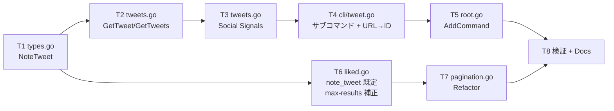
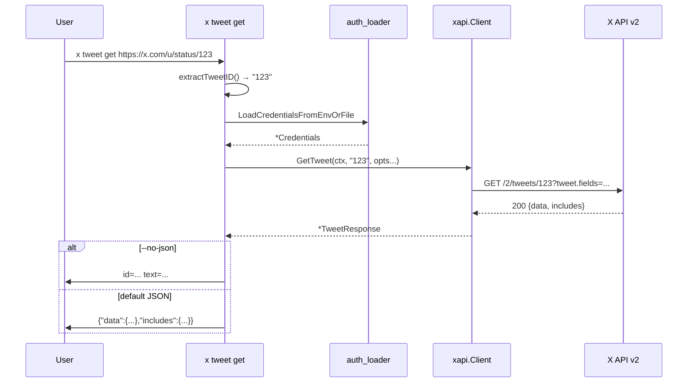

# M29: Posts Lookup / Social Signals + Note Tweet 既定 + liked 下限補正

## Overview

| 項目 | 値 |
|------|---|
| ステータス | 計画中 |
| 対象 v リリース | v0.4.0 |
| Phase | I: readonly API 包括サポート (第 1 回) |
| 依存 | M5-M8 (xapi 基盤), M10-M11 (liked list), M12 (config.toml [liked]) |
| 主要対象ファイル | `internal/xapi/{types.go, tweets.go, pagination.go}`, `internal/cli/{tweet.go, liked.go, root.go}`, `internal/config/config.go` |

## Goal

`x tweet get <ID|URL>` / `x tweet get --ids ID1,ID2,...` でツイートを直接取得し、`x tweet liking-users`, `x tweet retweeted-by`, `x tweet quote-tweets` で Social Signals を確認する。既存 `liked list` も含め `note_tweet` (ロングツイート) の既定取得・表示優先と `--max-results<5` 自動補正を導入する。

## 対象エンドポイント

| API | 説明 | max_results | レスポンス型 |
|-----|------|-------------|---|
| `GET /2/tweets/:id` | 単一 Post 取得 | — | `{data: Tweet, includes}` |
| `GET /2/tweets` | バッチ取得 (最大 100 件、`?ids=` 必須) | — | `{data: []Tweet, includes}` |
| `GET /2/tweets/:id/liking_users` | いいねしたユーザー一覧 | 1〜100 | `{data: []User, includes, meta}` |
| `GET /2/tweets/:id/retweeted_by` | RT したユーザー一覧 | 1〜100 | `{data: []User, includes, meta}` |
| `GET /2/tweets/:id/quote_tweets` | 引用ツイート一覧 | 1〜100 | `{data: []Tweet, includes, meta}` |

## Tasks (TDD: Red → Green → Refactor)

### T1: types.go 拡張 (NoteTweet / ConversationID)

**目的**: ロングツイート (note_tweet) と会話 ID を `Tweet` DTO に追加し、JSON unmarshal を担保する。

- 対象: `internal/xapi/types.go`, `internal/xapi/types_test.go`
- 変更:
  - `Tweet` に `NoteTweet *NoteTweet \`json:"note_tweet,omitempty"\`` と `ConversationID string \`json:"conversation_id,omitempty"\`` を追加
  - 新規型 `NoteTweet struct { Text string \`json:"text"\`; Entities *TweetEntities \`json:"entities,omitempty"\` }` を定義 (D-6: TweetEntities 流用)
- テスト (新規 3 ケース以上):
  - `TestTweet_Unmarshal_WithNoteTweet`: note_tweet あり、text のみ → `t.NoteTweet.Text` が読める
  - `TestTweet_Unmarshal_WithNoteTweetEntities`: note_tweet.entities つき → `t.NoteTweet.Entities.URLs` が読める
  - `TestTweet_Unmarshal_WithoutNoteTweet`: note_tweet なし → `t.NoteTweet == nil`
  - `TestTweet_Unmarshal_WithConversationID`: conversation_id ありで読める
- Red: テストを書いて落とす → Green: 構造体追加で通す → Refactor: doc コメント整備
- パッケージ doc は **書かない** (types.go には書かないルールを継続)

### T2: tweets.go 新規 (GetTweet / GetTweets)

**目的**: 単一 Post 取得 (`/2/tweets/:id`) とバッチ取得 (`/2/tweets`) を xapi 層で提供。

- 対象: `internal/xapi/tweets.go` (新規), `internal/xapi/tweets_test.go` (新規)
- 変更:
  - 関数: `(c *Client) GetTweet(ctx, tweetID string, opts ...TweetLookupOption) (*TweetResponse, error)`
  - 関数: `(c *Client) GetTweets(ctx, ids []string, opts ...TweetLookupOption) (*TweetsResponse, error)`
    - `ids` が空 → `fmt.Errorf("xapi: GetTweets: ids must be non-empty")` (CLI 層で wrap)
    - `len(ids) > 100` → エラー (X API 上限)
  - Option 関数: `WithGetTweetFields(...)`, `WithGetTweetExpansions(...)`, `WithGetTweetUserFields(...)`, `WithGetTweetMediaFields(...)`
    - 関数オプション型は `TweetLookupOption func(*tweetLookupConfig)` 単一型に統一 (likes.go と同じパターン)
  - DTO: 
    - `TweetResponse struct { Data *Tweet; Includes Includes }` (data はオブジェクト)
    - `TweetsResponse struct { Data []Tweet; Includes Includes; Errors []TweetLookupError \`json:"errors,omitempty"\` }`
      - X API はバッチで一部 ID が見つからない場合に top-level `errors` を返す
    - 新規型 `TweetLookupError struct { Value, Detail, Title, ResourceType, Parameter, ResourceID, Type string }` (D-9, advisor 指摘反映)
      - X API v2 `GET /2/tweets?ids=...` の partial error スキーマに合わせる
      - 既存 `ErrorResponse` / `APIErrorPayload` とフィールドが異なるため別型
  - 既定の tweet.fields は xapi 層では自動付与しない。呼び出し側 (CLI) が明示的に Option を渡す。
  - パッケージ doc は **書かない**
- テスト (httptest, 最低 10 ケース):
  - 200/single, 200/batch, 401/single → ErrAuthentication, 404 → ErrNotFound, decode error
  - tweetID の `url.PathEscape` 検証 (`/admin` 等)
  - `--ids` の URL 組み立て (`?ids=1,2,3` カンマ区切り)
  - 全 Option クエリ反映 (`tweet.fields=...`, `expansions=...`, `user.fields=...`, `media.fields=...`)
  - 空 `ids` でエラー、101 件でエラー (バリデーション)
  - top-level `errors` を持つレスポンスが `TweetsResponse.Errors` にデコード

### T3: tweets.go 拡張 (Social Signals)

**目的**: ツイートにいいね/RT/引用したユーザー・ツイートの一覧を取得。

- 対象: `internal/xapi/tweets.go`, `internal/xapi/tweets_test.go`
- 変更:
  - 関数: `(c *Client) GetLikingUsers(ctx, tweetID string, opts ...UsersByTweetOption) (*UsersByTweetResponse, error)`
  - 関数: `(c *Client) GetRetweetedBy(ctx, tweetID string, opts ...UsersByTweetOption) (*UsersByTweetResponse, error)`
  - 関数: `(c *Client) GetQuoteTweets(ctx, tweetID string, opts ...QuoteTweetsOption) (*QuoteTweetsResponse, error)`
  - DTO:
    - `UsersByTweetResponse struct { Data []User; Includes Includes; Meta Meta }` (D-7)
    - `QuoteTweetsResponse struct { Data []Tweet; Includes Includes; Meta Meta }`
  - Option:
    - `UsersByTweetOption func(*usersByTweetConfig)`: max_results / pagination_token / user.fields / expansions / tweet.fields (引用 RT 等の追加情報用)
    - `QuoteTweetsOption func(*quoteTweetsConfig)`: max_results / pagination_token / exclude (`retweets` / `replies`) / tweet.fields / expansions / user.fields / media.fields
- ページネーション iterator は今 M では追加しない (M30 で `EachSearchPage` 等に共通化)。CLI 側で `--all` を提供しない。
- テスト (最低 9 ケース):
  - 各エンドポイント 200/401/404
  - Option クエリ反映 (max_results / pagination_token / 各 fields)
  - `quote_tweets` の `exclude` フラグ

### T4: cli/tweet.go 新規

**目的**: CLI サブコマンド群を追加し、URL→ID 変換も担う。

- 対象: `internal/cli/tweet.go` (新規), `internal/cli/tweet_test.go` (新規)
- factory 関数:
  - `newTweetCmd()` 親 (help のみ)
  - `newTweetGetCmd()`: 引数 `[ID|URL]` (省略可、`--ids ID,ID,...` と排他、`cobra.MaximumNArgs(1)`)、フラグ `--ids`, `--tweet-fields`, `--expansions`, `--user-fields`, `--media-fields`, `--no-json`
    - `--ids` 指定時は GetTweets バッチ、引数 1 個なら GetTweet
    - 両方指定はエラー、両方未指定もエラー
    - URL/ID 解釈は `extractTweetID(s)` (D-1, 先頭/末尾は `strings.TrimSpace`)
  - **デフォルト値 (CLI 層に hardcode, D-10)**:
    - `--tweet-fields` default: `"id,text,author_id,created_at,entities,public_metrics,note_tweet,conversation_id"`
    - `--expansions` default: `"author_id"`
    - `--user-fields` default: `"username,name"`
    - `--media-fields` default: `""` (未指定で X API 既定)
    - `config.toml [tweet]` セクションは今 M では追加しない (M30 以降で必要になれば検討)
  - `newTweetLikingUsersCmd()`: 引数 `<ID|URL>` 必須、フラグ `--max-results` (default 100, 1-100), `--pagination-token`, `--user-fields`, `--expansions`, `--tweet-fields`, `--no-json`
  - `newTweetRetweetedByCmd()`: liking-users と同フラグ
  - `newTweetQuoteTweetsCmd()`: 加えて `--exclude` フラグ (CSV: `retweets` / `replies`)
- 関数:
  - `extractTweetID(s string) (string, error)` (D-1):
    - 先頭/末尾を `strings.TrimSpace`
    - `s` が全 ASCII 数字 (`^[0-9]+$`) なら ID としてそのまま返す
    - そうでなければ `url.Parse(s)` し、`u.Path` に対して `regexp.MustCompile(\`/status(?:es)?/(\d+)`)` を適用
    - マッチしなければ `fmt.Errorf("%w: cannot extract tweet ID from %q", ErrInvalidArgument, s)`
- インターフェイス + var-swap (httptest 注入):
  - `tweetClient interface { GetTweet / GetTweets / GetLikingUsers / GetRetweetedBy / GetQuoteTweets }`
  - `var newTweetClient = func(ctx, creds) (tweetClient, error) { return xapi.NewClient(...), nil }`
- 出力:
  - `--no-json` (human): tweet 1 行 / user 1 行のフォーマット
    - tweet: `id=...\tauthor=...\tcreated=...\ttext=...` (既存 liked と同じ format / 80 ルーン truncate, note_tweet 優先 D-3)
    - user: `id=...\tusername=...\tname=...`
  - default JSON: 全体 (`*TweetResponse` / `*TweetsResponse` 等) を `json.NewEncoder.Encode()`
- パッケージ doc は **書かない**
- テスト (最低 14 ケース):
  - `extractTweetID`: ID-only 数字, `https://x.com/u/status/123`, `https://twitter.com/u/statuses/456` (旧), `https://mobile.twitter.com/u/status/789`, `https://x.com/i/web/status/100`, クエリ付き (`?s=20`), fragment 付き (`#m`), 不正 (404 URL でエラー)
  - `tweet get` 単一 (ID), `tweet get` 単一 (URL), `tweet get --ids 1,2,3` バッチ, `--ids` と引数併用エラー, 引数なし `--ids` なしエラー
  - `tweet liking-users` 200/--no-json
  - `tweet retweeted-by` 200
  - `tweet quote-tweets --exclude retweets,replies` クエリ反映

### T5: cli/root.go 接続

**目的**: 親コマンドを root に追加。

- 対象: `internal/cli/root.go`
- 変更: `root.AddCommand(newTweetCmd())` を 1 行追加
- テスト: `TestRootHelpShowsTweet` で `--help` 出力に `tweet` が含まれることを検証 (1 ケース)

### T6: liked.go 改修 (note_tweet 既定 + max-results 下限補正 + human 優先)

**目的**: spec §6 デフォルト tweet.fields に `note_tweet` を追加し、CLI の使い勝手を改善。

- 対象: `internal/config/config.go`, `internal/cli/liked.go`, `internal/cli/liked_test.go`
- 変更:
  - `config.DefaultCLIConfig().Liked.DefaultTweetFields` を `"id,text,author_id,created_at,entities,public_metrics,note_tweet"` に更新 (config_test.go の期待値も更新)
  - `liked list` の `--max-results` 下限補正 (D-2 確定):
    - **n が 1..4 かつ `--all=false`**: X API に `max_results=5` を送り、レスポンスの `resp.Data = resp.Data[:min(n, len(resp.Data))]` で絞る
    - **n が 1..4 かつ `--all=true`**: `ErrInvalidArgument` で拒否する (UX 上の混乱を避ける、advisor 指摘反映)
      - エラーメッセージ: `--max-results 1..4 cannot be combined with --all (X API per-page minimum is 5)`
    - **5 ≤ n ≤ 100**: 従来通り、補正なし
  - `writeLikedHuman` の note_tweet 優先 (D-3):
    - `tw.NoteTweet != nil && tw.NoteTweet.Text != ""` のとき `text` 表示部を `tw.NoteTweet.Text` に置換
    - sanitize/truncate は同じ
    - JSON / NDJSON 出力は無変更 (元データを忠実に出す)
- テスト (新規 5 ケース):
  - `TestLikedList_MaxResults_BelowFive_SinglePage`: `--max-results 1`, モックは 5 件返す → 出力は 1 件、リクエストクエリ `max_results=5`
  - `TestLikedList_MaxResults_BelowFive_NoJSON`: `--max-results 2 --no-json` → 2 行のみ
  - `TestLikedList_MaxResults_BelowFive_All_RejectsArgument`: `--all --max-results 1` → `ErrInvalidArgument` (exit 2)
  - `TestLikedList_NoteTweet_HumanOverride`: モックで note_tweet ありと無しを返す → human 出力で note_tweet ありの行は note_tweet.text、無しの行は tw.text が表示される
  - `TestLikedList_NoteTweet_JSON_Unchanged`: JSON 出力では note_tweet も text もそのまま含まれる (後方互換)

### T7: pagination.go 共通化 (Refactor)

**目的**: rate-limit aware ページ間待機ロジックを切り出し、M30 以降 (SearchRecent) で再利用可能にする。

- 対象: `internal/xapi/pagination.go` (新規), `internal/xapi/likes.go` (差分のみ)
- 変更:
  - 新規 `pagination.go` に `(c *Client) computeInterPageWait(rl RateLimitInfo, threshold int) time.Duration` を抽出
    - 中身は `likes.go` の `computeLikesInterPageWait` ロジックそのまま (`Raw` / `Remaining` / `Reset` / `now()` のみに依存)
    - 共通定数 `defaultInterPageDelay = 200 * time.Millisecond` も移動
  - `likes.go` の `computeLikesInterPageWait` を削除し、`c.computeInterPageWait(fetched.rateLimit, likesRateLimitThreshold)` を呼ぶ
  - パッケージ doc は **書かない** (既存 oauth1.go に集約済み)
- スコープ限定 (D-4): EachLikedPage の汎用化はしない。`*LikedTweetsResponse` 型固定のまま残す。汎用 iterator は generics 待ちで M30 以降に判断。
- テスト: 既存 likes_test.go の sleep 関連テストが全 pass のまま (Green を維持) → リファクタの安全性証明

### T8: 検証 + Docs

**目的**: 機能セットの最終受け入れと外部ドキュメント更新。

- 検証:
  - `go test -race -count=1 ./...` 全 pass
  - `GOLANGCI_LINT_CACHE=$TMPDIR/golangci-cache golangci-lint run ./...` 0 issues
  - `go vet ./...` 0
  - `go build -o /tmp/x ./cmd/x` ローカルビルド成功
- 実機確認 (可能なら):
  - `/tmp/x tweet get <ID>` / `--ids` / URL
  - `/tmp/x tweet liking-users <ID> --no-json`
  - `/tmp/x liked list --max-results 1 --no-json`
- ドキュメント更新:
  - `docs/specs/x-spec.md` §6 CLI に tweet 系コマンドを追記、§6 `liked list --tweet-fields` 既定値に `note_tweet` を追記
  - `docs/x-api.md` に対応エンドポイント表 + note_tweet 仕様メモ + max_results 下限補正の解説を追記
  - `README.md` / `README.ja.md` のサブコマンド一覧に tweet を追加 (英日両方)
  - `CHANGELOG.md` `[0.4.0]` セクション追加 (Added: tweet サブコマンド、Changed: liked list の note_tweet 既定 / max-results<5 補正)

## Completion Criteria

- `go test -race -count=1 ./...` 全 pass (新規テスト 28+ ケース)
- `golangci-lint run ./...` 0 issues, `go vet ./...` 0
- `x tweet get <ID>` / `x tweet get https://x.com/USER/status/ID` / `x tweet get --ids 1,2,3` がモック上で動作
- `x liked list --max-results 1 --no-json` が API バリデーションエラーにならず 1 件のみ表示
- `x tweet liking-users <ID> --no-json` / `x tweet retweeted-by <ID>` / `x tweet quote-tweets <ID> --exclude retweets` がモック上で動作
- `docs/specs/x-spec.md` §6 / `docs/x-api.md` / `CHANGELOG.md [0.4.0]` 更新済
- 各タスクが独立コミット (Conventional Commits 日本語、フッター `Plan: plans/x-m29-posts-lookup.md`)

## 設計上の決定事項

| # | テーマ | 採用 | 理由 |
|---|--------|------|------|
| D-1 | URL→ID 抽出 | `url.Parse(s)` → `parsed.Path` に `/status(?:es)?/(\d+)` regex 適用。数値のみの入力はパススルー | 生 URL 文字列に直接 regex すると `?s=20` や `#frag` が誤マッチする恐れ。`url.Parse` を経由すれば fragment/query が分離される |
| D-2 | `--max-results<5` 補正 | `--all=false` 時は X API に 5 投げて `Data[:n]`。`--all=true` 時は補正のみ実施し集約結果の slice はしない | 既存 spec §6 「`--max-results` は単一ページ件数」と矛盾しない最小変更。`--all` との組み合わせは「補正」の責務だけに絞る (簡潔性優先) |
| D-3 | note_tweet の human 出力 | `tw.NoteTweet.Text` 非空ならそれを表示、80 ルーン truncate (既存と同じ) | 真の本文を表示。JSON は両方含め後方互換 |
| D-4 | pagination 共通化スコープ | `computeInterPageWait(rl, threshold)` のみ抽出。`EachLikedPage` は型固定のまま | 汎用化 (`Each[T]`) は generics 等で爆発。共通化は「rate-limit aware sleep ロジック」だけに留めて M30 (SearchRecent) で再利用 |
| D-5 | パッケージ doc | 新ファイル `tweets.go` / `pagination.go` / `cli/tweet.go` には書かない | revive: package-comments (既存 `oauth1.go` / `cli/root.go` に集約済み) |
| D-6 | `NoteTweet.Entities` の型 | 既存 `*TweetEntities` を流用 | X API 仕様上 cashtags 等は将来追加され得るが、annotations が nil でも `omitempty` で省略され問題なし。型分割すると mapping コスト増 |
| D-7 | `liking_users` / `retweeted_by` のレスポンス型 | `UsersByTweetResponse{ Data []User, Includes, Meta }` 新設。`quote_tweets` は `QuoteTweetsResponse{ Data []Tweet, ... }` | `LikedTweetsResponse` 流用は型不一致 (Data の要素型違い)。役割が違うので別型を起こす方が後で安全 |
| D-8 | 関数オプション型 | `tweets.go` 内は単一の中間構造体に集約 (`tweetLookupConfig` / `usersByTweetConfig` / `quoteTweetsConfig`) | `likes.go` 既定パターンと統一。`func(*url.Values)` は採用しない |
| D-9 | `GetTweets` partial error の型 | 専用型 `TweetLookupError` を新設 | X API v2 のバッチ partial error スキーマ (`{value, detail, title, resource_type, parameter, resource_id, type}`) は既存 `ErrorResponse` / `APIErrorPayload` とフィールドが異なる (advisor 指摘) |
| D-10 | `x tweet get` 系のデフォルト fields | CLI 層に hardcode、`config.toml [tweet]` セクションは追加しない | `liked` と `tweet` は別ドメイン。今 M で config に既定を持たせる必然性がない。M30 以降で再評価可 |
| D-11 | `--all` × `--max-results<5` | `ErrInvalidArgument` で拒否 (exit 2) | UX 上「1 件しか要らないので 1 ページで終わって」と読めるが実装は 5×N の集約になる。安全な拒否を選ぶ (advisor 指摘反映) |

## Risks

| リスク | 対策 |
|--------|------|
| note_tweet が実機で返らない (旧 280 字内のツイート) | T8 で自分の 280 字超ツイートで検証。`tw.text` フォールバック (D-3) |
| URL バリアントの抽出漏れ | T4 のテストで 6 ケース以上カバー (クエリ付き / fragment / mobile / web / statuses 旧形式) |
| package doc 違反 | T1-T7 で「新ファイルに doc 書かない」を必須チェック (PR レビュー時) |
| `liked` default の変更で既存利用者の出力が増える | CHANGELOG に Changed として明記、note_tweet は `omitempty` のため後方互換 |
| `GetTweets` の top-level `errors` の取りこぼし | T2 で `TweetsResponse.Errors` を捕捉し、CLI は JSON にそのまま含める (human 出力では cmd.ErrOrStderr に warning) |
| `--all` × `--max-results<5` の挙動が直感的でない | spec §6 と CHANGELOG で「`--all` 時は補正のみ、件数 slice なし」を明文化 (D-2) |

## Mermaid: 依存関係

## Mermaid: x tweet get のシーケンス

## Implementation Order

1. **T1 (Red)**: types_test.go に新規 4 ケース追加 → 落ちる
2. **T1 (Green)**: types.go に NoteTweet / ConversationID 追加 → pass
3. **T1 commit**: `feat(xapi): Tweet に NoteTweet と ConversationID を追加`
4. **T2 (Red→Green)**: tweets_test.go + tweets.go → pass
5. **T2 commit**: `feat(xapi): GetTweet と GetTweets を追加`
6. **T3 (Red→Green)**: tweets_test.go 拡張 + tweets.go 拡張 → pass
7. **T3 commit**: `feat(xapi): GetLikingUsers, GetRetweetedBy, GetQuoteTweets を追加`
8. **T4 (Red→Green)**: cli/tweet_test.go + cli/tweet.go → pass
9. **T4 commit**: `feat(cli): x tweet サブコマンド群と URL→ID 抽出を追加`
10. **T5 (Red→Green)**: root_test.go (TestRootHelpShowsTweet) + root.go → pass
11. **T5 commit**: `feat(cli): root に tweet コマンドを接続`
12. **T6 (Red→Green)**: config_test.go + liked_test.go + config.go + liked.go → pass
13. **T6 commit**: `feat(cli): liked list に note_tweet 既定と max-results 下限補正を追加`
14. **T7 (Refactor)**: pagination.go に抽出 + likes.go を委譲 → 既存テスト全 pass
15. **T7 commit**: `refactor(xapi): rate-limit aware ページ間待機を pagination.go に共通化`
16. **T8 commit**: `docs(m29): spec / x-api / README / CHANGELOG を v0.4.0 向けに更新`

各コミットのフッターに必ず `Plan: plans/x-m29-posts-lookup.md` を含める。

## Handoff to M30

- M29 で確立した `xapi/tweets.go` パターンに `SearchRecent` を追加 (M30 T1)
- M29 で抽出した `computeInterPageWait` を `EachSearchPage` で再利用 (M30 T1)
- M29 で確立した `cli/tweet.go` の URL→ID 関数 (`extractTweetID`) を `tweet thread` / `tweet search` でも利用 (M30 T2-T3)
- M29 で導入した CLI factory + interface + var-swap パターンをそのまま踏襲

## advisor 反映ログ (Phase 3 で実施)

- (Phase 3 後に追記)
