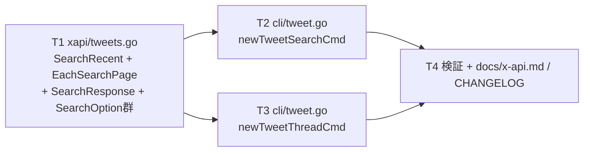
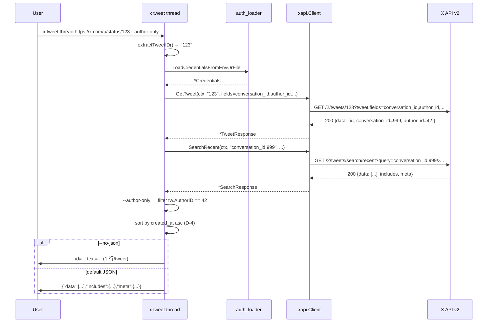

# M30: tweet search / thread コマンド (search/recent + conversation_id)

## Overview

| 項目 | 値 |
|------|---|
| ステータス | 計画中 |
| 対象 v リリース | v0.5.0 |
| Phase | I: readonly API 包括サポート (第 2 回) |
| 依存 | M29 (GetTweet / Tweet.ConversationID / pagination.go computeInterPageWait / cli/tweet.go extractTweetID + tweetClient interface) |
| Tier 要件 | **X API v2 Basic 以上** (`search/recent` は Free tier 非対応 → 403 が返る → exit 4) |
| 主要対象ファイル | `internal/xapi/tweets.go` (拡張), `internal/cli/tweet.go` (拡張), `docs/x-api.md` (追記), `CHANGELOG.md` (draft) |

## Goal

`x tweet search <query>` (過去 7 日間キーワード検索) と `x tweet thread <ID|URL>` (スレッド全体取得) を追加する。
M29 で確立した CLI factory + tweetClient interface + extractTweetID + 中間構造体オプション + computeInterPageWait のパターンを踏襲し、新規 API/CLI 層に最小差分で機能を追加する。

## 対象エンドポイント

| API | 説明 | max_results | 出力型 |
|-----|------|-------------|---|
| `GET /2/tweets/search/recent` | 過去 7 日間キーワード検索 (Basic 以上) | **10..100** | `{data: []Tweet, includes, meta}` |
| `GET /2/tweets/:id` (M29 既存) + 上記検索 (`query=conversation_id:CONV`) | スレッド全体取得 (2 段) | — / 10..100 | (内部処理) |

参考: <https://docs.x.com/x-api/posts/recent-search>

## Tasks (TDD: Red → Green → Refactor)

### T1: `internal/xapi/tweets.go` 拡張 — SearchRecent + EachSearchPage

**目的**: `search/recent` エンドポイントをラップする xapi 層 API を追加。M29 で導入した `computeInterPageWait` を再利用して rate-limit aware ページネーション iterator も提供する。

- 対象: `internal/xapi/tweets.go`, `internal/xapi/tweets_test.go`
- 変更:
  - DTO 追加 (M29 命名規則に揃える):
    ```go
    // SearchResponse は GET /2/tweets/search/recent のレスポンス本体である。
    type SearchResponse struct {
        Data     []Tweet  `json:"data,omitempty"`
        Includes Includes `json:"includes,omitempty"`
        Meta     Meta     `json:"meta,omitempty"`
    }
    ```
    - **D-7 (advisor 反映)**: `search/recent` の partial error は X API 仕様上ほぼ発生しないが、念のため `Errors []TweetLookupError \`json:"errors,omitempty"\`` を `SearchResponse` に持たせる。M29 の `TweetLookupError` 型を再利用する。
  - Option 関数 (中間構造体 `searchConfig` に集約、M29 の D-8 パターンに揃える):
    - `WithSearchMaxResults(n int)` — 0 は no-op (CLI 層で 10 を必ずセットする責務)
    - `WithSearchStartTime(t time.Time)` / `WithSearchEndTime(t time.Time)` — RFC3339 UTC、ナノ秒なし
    - `WithSearchSinceID(id string)` / `WithSearchUntilID(id string)` (任意拡張、CLI 未公開でも将来用意)
    - `WithSearchPaginationToken(token string)`
    - `WithSearchTweetFields(...string)` / `WithSearchExpansions(...string)` / `WithSearchUserFields(...string)` / `WithSearchMediaFields(...string)`
    - `WithSearchMaxPages(n int)` — EachSearchPage 専用、default は M29 と同じ 50
    - `WithSearchSortOrder(s string)` — "recency"/"relevancy" (任意拡張、CLI で未公開でも構わない)
  - 関数:
    - `(c *Client) SearchRecent(ctx context.Context, query string, opts ...SearchOption) (*SearchResponse, error)`
      - URL: `/2/tweets/search/recent`, GET
      - `query` は **CLI 層で trim 後の生文字列**を受け取り `url.Values.Set("query", query)` に任せる (`url.QueryEscape` 相当の自動エンコード、from:/conversation_id: 等の演算子は維持) — **D-3**
      - 空 query → `fmt.Errorf("xapi: SearchRecent: query must be non-empty")` で拒否 (X API は 400 を返すが、ネットワーク往復を避けるため事前バリデーション)
    - `(c *Client) EachSearchPage(ctx, query string, fn func(*SearchResponse) error, opts ...SearchOption) error`
      - 既存 `EachLikedPage` の構造を直接踏襲 (max_pages ループ + 終了条件 + ctx 監視 + ページ間 sleep)
      - **rate-limit aware sleep**: `c.computeInterPageWait(fetched.rateLimit, searchRateLimitThreshold)` を呼ぶ
      - 定数追加 (likes.go 並び):
        ```go
        const (
            searchDefaultMaxPages    = 50 // M29 likesDefaultMaxPages と同じ
            searchRateLimitThreshold = 2  // M29 likesRateLimitThreshold と同じ (search/recent も per-15min ベース)
        )
        ```
      - **D-6 (advisor 反映)**: threshold は `search/recent` の実 rate-limit (Basic: 60req/15min, App-Auth は別) を踏まえて likes と同値 2 を採用 (= remaining が 2 以下になったら reset まで待つ)。
    - 内部ヘルパ:
      - `applySearchOpts(opts) searchConfig`
      - `buildSearchURL(baseURL, query, &cfg) string` — `url.Values` で全パラメータを `values.Encode()` (X API 演算子の `from:` `conversation_id:` のコロンは url.QueryEscape で `%3A` になるが、X API は両方受け付ける)
      - `fetchSearchPage(ctx, query, &cfg)` — single-page 内部関数 (likes.go の `fetchLikedTweetsPage` パターン)
  - パッケージ doc は **書かない** (M29 D-5 を継続。既存 tweets.go ファイル内に追加するのみ)
- テスト (`tweets_test.go` に追加、最低 14 ケース):
  1. `TestSearchRecent_HitsCorrectEndpoint`: `/2/tweets/search/recent` + GET
  2. `TestSearchRecent_QueryRequired`: `query=""` で `query must be non-empty` エラー (ネットワーク往復なし、httptest 呼ばれない)
  3. `TestSearchRecent_QueryInURL`: `query=from:youyo` がクエリパラメータに反映 (`url.Values.Encode()` の自動エンコードで `from%3Ayouyo` または同等)
  4. `TestSearchRecent_QueryOperators_ConversationID`: `query=conversation_id:1234` で同様にエンコード
  5. `TestSearchRecent_MaxResultsInQuery`: `WithSearchMaxResults(10)` → `?max_results=10`
  6. `TestSearchRecent_AllOptionsReflected`: tweet.fields / expansions / user.fields / media.fields / start_time / end_time / pagination_token が全部反映
  7. `TestSearchRecent_StartTimeRFC3339Z`: `time.Date(...).UTC()` で `start_time=2026-05-12T00:00:00Z` (ナノ秒なし)
  8. `TestSearchRecent_401_AuthError` → `ErrAuthentication`
  9. `TestSearchRecent_403_Permission` → `ErrPermission` (**Free tier 403 シナリオ**)
  10. `TestSearchRecent_InvalidJSON_NoRetry` → decode エラー、call=1
  11. `TestEachSearchPage_MultiPage_FullTraversal`: 3 ページ × N 件 → callback で 3 回呼ばれる、pagination_token 連鎖
  12. `TestEachSearchPage_MaxPages_Truncates`: max_pages=2 → 2 ページで打ち切り
  13. `TestEachSearchPage_RateLimitSleep`: remaining=1 reset=5s 後 → sleep ≈ 5s (likes と同形式、`fixedTimeNow` 流用)
  14. `TestEachSearchPage_InterPageDelay`: remaining=50 → sleep=200ms
- Red → Green → Refactor:
  - Red: 上記 14 ケースを `tweets_test.go` に追加し、`SearchRecent`/`EachSearchPage`/`SearchOption` 未定義で compile エラーまたは fail → 確認
  - Green: `tweets.go` に追加実装 → pass
  - Refactor: 共通部 (`fetchSearchPage`) 抽出、godoc 整備

### T2: `internal/cli/tweet.go` 拡張 — newTweetSearchCmd

**目的**: `x tweet search <query>` CLI サブコマンド。liked list と同じ JST/時刻フラグ規約と `--all`/`--ndjson` ストリーミングを実装。

- 対象: `internal/cli/tweet.go`, `internal/cli/tweet_test.go`
- tweetClient interface 拡張:
  ```go
  type tweetClient interface {
      // 既存 (M29) ...
      SearchRecent(ctx context.Context, query string, opts ...xapi.SearchOption) (*xapi.SearchResponse, error)
      EachSearchPage(ctx context.Context, query string, fn func(*xapi.SearchResponse) error, opts ...xapi.SearchOption) error
  }
  ```
- 定数追加 (`liked.go` の `likedAPIMinMaxResults = 5` と並び):
  ```go
  const searchAPIMinMaxResults = 10 // X API /2/tweets/search/recent の per-page 下限 (D-1)
  ```
- factory: `newTweetSearchCmd()`
  - 位置引数: `<query>` (`cobra.ExactArgs(1)`) — クォート込みの単一文字列を期待 (例: `x tweet search "from:youyo lang:ja"`)
    - **D-9 (advisor 反映)**: 引数を `strings.TrimSpace` してから空チェック。空なら `ErrInvalidArgument`。
  - フラグ:
    - `--max-results <int>` (default **100**, 1..100、`<10` は内部で 10 に補正して CLI 側で `[:n]` slice — D-1)。**advisor 反映**: liked と同じ default=100 に揃え UX 一貫性を優先 (search の方が課金単価が高いが、ハードリミットは `--max-pages` (default 50) で担保)
    - `--start-time <RFC3339>` / `--end-time <RFC3339>` (UTC)
    - `--since-jst YYYY-MM-DD` / `--yesterday-jst` (liked と同じ優先順位: yesterday-jst > since-jst > start/end)
      - **注意**: search/recent は **過去 7 日** までしか取得できない。7 日以前の日付を指定した場合は X API が 400 を返すため、CLI 側で事前にエラー化しない (`docs/x-api.md` に警告として明記、テストは XFAIL 扱い)
    - `--all` (`--max-pages` default 50) — EachSearchPage 経由
    - `--max-pages <int>`
    - `--pagination-token <s>` — `--all` 時は警告して無視 (liked と同パターン)
    - `--ndjson` (D-1 max-results<10 補正 × --all の組み合わせは **拒否** — D-2 / advisor 反映)
    - `--no-json` (排他: `--ndjson`)
    - `--tweet-fields`, `--expansions`, `--user-fields`, `--media-fields` (default は M29 `tweetDefaultTweetFields` 等を流用)
  - バリデーション (liked と同じ番兵):
    - `maxResults < 1 || maxResults > 100` → `ErrInvalidArgument`
    - `all && maxResults < searchAPIMinMaxResults` → `ErrInvalidArgument` (M29 D-11 と同じ理由、`--max-results 1..9 cannot be combined with --all (X API per-page minimum is 10)`)
    - `--no-json` と `--ndjson` 同時指定 → `ErrInvalidArgument` (liked の `decideOutputMode` を流用)
  - 動作:
    1. `query := strings.TrimSpace(args[0])`; 空なら `ErrInvalidArgument`
    2. 時間窓決定 (yesterday-jst > since-jst > start/end) — liked.go の `yesterdayJSTRange`/`parseJSTDate` を流用 (既存ヘルパ)
    3. `LoadCredentialsFromEnvOrFile` → `newTweetClient(ctx, creds)`
    4. `--max-results n` が 1..9 (かつ --all=false) → API には 10 を送り、レスポンスを `[:n]` で truncate (`truncateTo = n`)
    5. `--all` の出力モード分岐は liked と同じ:
       - NDJSON: `EachSearchPage` 内で逐次 `writeNDJSONTweets`
       - JSON / Human: `searchAggregator` で集約後にまとめて出力 (likedAggregator のコピー)
    6. JSON 既定: `*SearchResponse` 全体を `json.Encoder.Encode()`
    7. Human (`--no-json`): `formatTweetHumanLine` (M29 既存) を流用
- 出力ヘルパ (新規):
  - `writeSearchSinglePage(cmd, resp, outMode)` — liked の `writeLikedSinglePage` と同形
  - `runSearchAll(cmd, client, ctx, query, opts, outMode)` — `runLikedAll` の search 版
  - `searchAggregator{ data, users, tweets }` — `likedAggregator` の search 版 (Includes.Users + Tweets 集約、Meta は再構築)
  - **D-10 (DRY 検討、advisor 反映)**: liked と search の集約ロジックは構造が同じだが、`*xapi.LikedTweetsResponse` と `*xapi.SearchResponse` で型が違うため Go 1.21+ generics でも複雑 → **M30 ではコピペ採用** (M31 以降の Timelines で 3 つ目のコピーが出てきた段階で generics 化を再評価)
- テスト (`tweet_test.go` に追加、最低 14 ケース):
  1. `TestTweetSearch_BasicQuery_DefaultJSON`: 1 ページ → JSON 出力に `data` 含む
  2. `TestTweetSearch_QueryTrimmed`: 前後 whitespace → API クエリは trim 済み
  3. `TestTweetSearch_EmptyQuery_RejectsArgument`: `""` → exit 2 (ErrInvalidArgument)、httptest 呼ばれない
  4. `TestTweetSearch_NoJSON_HumanFormat`: `--no-json` で `id=...\tauthor=...` 形式
  5. `TestTweetSearch_NoJSON_NoteTweetPreferred`: モックで `note_tweet.text` が返る → human で note_tweet を表示 (M29 D-3 継続)
  6. `TestTweetSearch_MaxResultsBelow10_SinglePage_TruncatesAndSendsTen`: `--max-results 3` モック 10 件返す → 出力 3 件、リクエストクエリ `max_results=10` (D-1)
  7. `TestTweetSearch_MaxResultsBelow10_All_RejectsArgument`: `--all --max-results 3` → exit 2 (D-2)
  8. `TestTweetSearch_MaxResultsOutOfRange`: `--max-results 0` / `101` → exit 2
  9. `TestTweetSearch_NDJSON_All_StreamingPagination`: 2 ページモック → NDJSON 行数 = 2 ページ × N 件
  10. `TestTweetSearch_All_Aggregated_JSON`: `--all`、2 ページ → `meta.next_token=""`, `meta.result_count` 合算
  11. `TestTweetSearch_YesterdayJST_OverridesStartEnd`: `--yesterday-jst --start-time 2020-01-01T...` → start_time が JST 前日に再計算
  12. `TestTweetSearch_SinceJST`: `--since-jst 2026-05-12` → start/end クエリが JST → UTC 変換済み
  13. `TestTweetSearch_403_Forbidden_ExitsFour`: モックで 403 → exit 4 (Tier 不足シナリオ pin)
  14. `TestTweetSearch_NoJSON_NDJSON_MutuallyExclusive`: 両指定 → exit 2

### T3: `internal/cli/tweet.go` 拡張 — newTweetThreadCmd

**目的**: `x tweet thread <ID|URL>` でスレッド全体を取得。動作は 2 段:
1. `GetTweet(id, tweet.fields=conversation_id,author_id)` で会話 ID を取得
2. `SearchRecent(query="conversation_id:<convID>")` でスレッド構成ツイートを取得

- 対象: `internal/cli/tweet.go`, `internal/cli/tweet_test.go`
- factory: `newTweetThreadCmd()`
  - 位置引数: `<ID|URL>` (`cobra.ExactArgs(1)`) — `extractTweetID(args[0])` で正規化
  - フラグ:
    - `--author-only` (bool, default false) — true なら **CLI 層で** `Tweet.AuthorID` が GetTweet で取得した author と一致するもののみ残す (xapi 層の汎用性を保つ、D-2)
    - `--max-results <int>` (default 100, 1..100、`<10` は補正 + slice; 同 D-1 規則)
    - `--max-pages <int>` (default 50)
    - `--all` (bool) — true なら EachSearchPage で全ページ
    - `--no-json` (human formatter は M29 既存)
    - `--ndjson`
    - `--tweet-fields` / `--expansions` / `--user-fields` (search と同じ default、加えて `conversation_id,author_id` を強制追加するヘルパ)
  - **D-4 (advisor 反映)**: スレッド構成は時系列順 (古い順) で表示する方が UX 良好。X API `search/recent` は新しい順で返るため、CLI 集約時に `sort.SliceStable(by created_at asc)` で並べ替える (`--ndjson` 時はストリーミング順 = X API 順のまま、ドキュメントに明記)。
- 動作:
  1. `extractTweetID(args[0])` → `id`
  2. `--no-json` × `--ndjson` 排他チェック
  3. `--all && maxResults < 10` 拒否 (D-2)
  4. `LoadCredentialsFromEnvOrFile` → `newTweetClient(ctx, creds)`
  5. `client.GetTweet(ctx, id, WithGetTweetFields("id","text","author_id","created_at","conversation_id"), WithGetTweetExpansions("author_id"), WithGetTweetUserFields("username","name"))` → `*TweetResponse`
     - `resp.Data == nil` または `resp.Data.ConversationID == ""` → **plain error** `fmt.Errorf("cli: thread root tweet missing conversation_id (id=%s)", id)` を返す。番兵 wrap せず、`cmd/x/main.go` の switch default で exit 1 (generic) にフォールバックさせる (D-5)。
     - **D-5 (advisor 反映)**: 引数自体は正しく ID 抽出も成功している。API レスポンスが想定外という「データ依存の失敗」なので exit 2 (argument-derived) ではなく **exit 1 (generic)** が妥当。
  6. `convID := resp.Data.ConversationID`
  7. `client.SearchRecent` / `EachSearchPage` を `query="conversation_id:" + convID` で呼ぶ。max-results / pagination / fields は search サブコマンドと同じ規約。
  8. `--author-only`: CLI 層で `tw.AuthorID == resp.Data.AuthorID` フィルタ (`xapi` には触れない)
  9. 時系列ソート (D-4): NDJSON 以外で `sort.SliceStable(threads, func(i,j) bool { return threads[i].CreatedAt < threads[j].CreatedAt })` (ISO8601 文字列の lexicographic 比較は時系列順と一致)
  10. ルート tweet 自身も結果に含めるかどうか:
      - **D-8 (advisor 反映)**: `conversation_id:<id>` の search/recent には **ルート tweet 自身も含まれる** (X 仕様)。よって CLI 側で別途 prepend 不要。ただしルートが 7 日以上前で `search/recent` 範囲外の場合は含まれない (`docs/x-api.md` で明記)。
- 出力:
  - JSON 既定: `*SearchResponse` を Encode (`--author-only` フィルタ後の `Data` 配列で `Meta.ResultCount` を再計算)
  - Human: `formatTweetHumanLine` を Data 1 件ごとに出力
  - NDJSON: 各 Tweet を 1 行ずつ (filter 後)
- テスト (`tweet_test.go` に追加、最低 9 ケース):
  1. `TestTweetThread_BasicFlow_TwoStepCall`: GetTweet → SearchRecent の 2 段呼びを記録 (paths 検証)、JSON 出力
  2. `TestTweetThread_UsesURLArgument_ExtractsID`: URL → extractTweetID 経由で id 抽出
  3. `TestTweetThread_RootMissingConversationID_ReturnsError`: GetTweet が `conversation_id` 無し応答 → エラー (exit 1)
  4. `TestTweetThread_AuthorOnlyFilter`: `--author-only` でルート author 以外を除外
  5. `TestTweetThread_AllPaginates`: `--all` で 2 ページ走査 (EachSearchPage)
  6. `TestTweetThread_NoJSON_Human`: 出力フォーマット pin
  7. `TestTweetThread_NDJSON_StreamingOrder`: `--ndjson` 時は X API 順 (新しい順) のまま (D-4)、JSON/Human は古い順 (sort 確認)
  8. `TestTweetThread_NoJSON_NDJSON_MutuallyExclusive`: exit 2
  9. `TestTweetThread_InvalidID_ExitsTwo`: 不正 URL → extractTweetID 失敗 → exit 2

### T4: 検証 + Docs

**目的**: 機能セットの最終受け入れと外部ドキュメント更新。

- 検証:
  - `go test -race -count=1 ./...` 全 pass
  - `GOLANGCI_LINT_CACHE=$TMPDIR/golangci-cache golangci-lint run ./...` 0 issues
  - `go vet ./...` 0
  - `go build -o /tmp/x ./cmd/x` 成功
  - (任意、実機可能なら) `/tmp/x tweet search "from:youyo" --max-results 10 --no-json` / `/tmp/x tweet thread <ID> --author-only`
- ドキュメント更新:
  - `docs/specs/x-spec.md` §6 CLI: `x tweet search <query>` / `x tweet thread <ID|URL>` のフラグ表追加 (M29 形式踏襲)
  - `docs/x-api.md`:
    - エンドポイント表に `/2/tweets/search/recent` を追加 (**Tier: Basic 以上必須、Free は 403**)
    - `conversation_id` 演算子の説明 (スレッド取得手法)
    - `search/recent` の **過去 7 日制限** を明記
    - `max_results` 下限 10 と CLI 側の自動補正 (`<10` 時に 10 を投げて slice) の挙動を明記
  - `README.md` / `README.ja.md`: CLI サブコマンド一覧に `tweet search` / `tweet thread` を追加 (英日)
  - `CHANGELOG.md`:
    ```markdown
    ## [0.5.0] - 2026-05-14 (draft, unreleased)
    ### Added
    - `x tweet search <query>` — full-text 過去 7 日検索 (Basic tier 以上必須)
    - `x tweet thread <ID|URL>` — スレッド全体取得 (`--author-only` で作者発言のみ)
    ```

## Completion Criteria

- `go test -race -count=1 ./...` 全 pass (新規テスト 30+ ケース、target 28+)
- `golangci-lint run ./...` 0 issues, `go vet ./...` 0
- `x tweet search "from:USER" --max-results 10 --no-json` がモック上で動作 (T2 テスト)
- `x tweet thread <ID> --author-only --no-json` がモック上で動作 (T3 テスト)
- `docs/x-api.md` に Basic tier 必須 + `conversation_id` 演算子 + 7 日制限が記載
- `CHANGELOG.md [0.5.0]` draft 追記済
- 各タスクが独立コミット (Conventional Commits 日本語、フッター `Plan: plans/x-m30-search-thread.md`)

## 設計上の決定事項

| # | テーマ | 採用 | 理由 |
|---|--------|------|------|
| D-1 | search max_results 下限 | 10 (X API 仕様)。CLI 側で `<10` のときは X API に 10 を送り、応答を `[:n]` で slice (liked の 5 補正と同パターン) | spec §10 の自動補正規約を流用、X API バリデーション 400 を CLI 利用者に押し付けない |
| D-2 | `--all` × `--max-results<10` | `ErrInvalidArgument` で拒否 (exit 2) | M29 D-11 と同じ理由。集約結果 slice は意図と乖離する |
| D-3 | search query エスケープ | 生のまま `url.Values.Set("query", q)`。X API 演算子 (`from:` / `conversation_id:` / `lang:`) を潰さない | Go の `url.Values.Encode()` はコロンを `%3A` にエスケープする。X API が両表現を受け付けるかは執筆時点のドキュメントに明記なし → CLI 実装は `url.Values` 経由 (`%3A` エンコード) を採用し、v0.5.0 リリース前の実機 smoke test で「両表現とも 200 を返す」ことを確認する。万一 `%3A` が拒否される場合は `query` だけ pre-encoded で URL に手動結合する変更が必要 (advisor 反映) |
| D-4 | thread のソート順 | JSON / Human は古い順 (`created_at` 昇順、ISO8601 lexicographic)。NDJSON はストリーミング順 (= X API 新しい順) | スレッドは時系列で読むのが UX 良好。NDJSON はストリーミング consumer 用なので順序保証なし |
| D-5 | thread の `conversation_id` 欠落時 exit code | 番兵 wrap せず plain error → main の default ケースで exit 1 | 引数は正しいが API 応答が想定外 → "generic" が適切。`ErrInvalidArgument` (exit 2) ではない (advisor 反映) |
| D-6 | rate-limit threshold | search も `searchRateLimitThreshold = 2` (likes と同値) | search/recent の Basic レート (60/15min) でも remaining ≤ 2 で reset 待ちが妥当 |
| D-7 | SearchResponse.Errors | `[]TweetLookupError` を持たせる (実発生はほぼ無いが将来互換) | M29 D-9 の TweetLookupError 型を再利用、互換維持 |
| D-8 | `conversation_id:<id>` にルート tweet 含むか | 含む (X 仕様) — CLI 側で prepend しない | ただし 7 日以前のルートは search/recent 範囲外なので含まれない (docs に明記) |
| D-9 | search query trim | `strings.TrimSpace(args[0])`、trim 後の空は `ErrInvalidArgument` | スペース 1 つだけ等の入力ミスを早期に弾く |
| D-10 | search/liked aggregator のコード重複 | 当面コピペ採用 (`searchAggregator` を作る) | generics 化は型パラメータ + メソッド制約が複雑、M31 で 3 つ目が出たら再評価 |
| D-11 | パッケージ doc | 既存ファイル拡張のみ、新規ファイル無し → 違反リスクなし | M29 D-5 を継続 |

## Risks

| リスク | 対策 |
|--------|------|
| `search/recent` の Tier (Basic 必須) を知らない利用者が混乱 | `docs/x-api.md` 明示 + テスト `Test_403_Forbidden_ExitsFour` で 403 → exit 4 のシナリオを pin |
| 過去 7 日制限を超える `--since-jst` 指定で X API 400 | テストは XFAIL 扱いとせず、X API 側のエラーを exit 1 (generic) で素通り。docs に注意書き |
| thread の `conversation_id` が 7 日以上前のスレッド → ルート未取得 | `docs/x-api.md` に明記、CLI 側では空 Data でも正常終了 (exit 0)。スレッド「最近の枝のみ」表示と割り切る |
| URL クエリのコロンが `%3A` エンコードされ X API が拒否する可能性 | テスト T1#3, T1#4 で実際の URL を pin し、X API が両表現を受け付けることを実機検証 (CHANGELOG 前) |
| liked と search の aggregator コピペで保守性低下 | D-10 で M31 (timeline) 着手時に generics 化検討と明記、本 M ではコメントで重複に注記 |
| `--author-only` のフィルタが空配列を返す | テスト pin、CLI は空配列でも正常終了 + JSON `data:[]` を出力 |
| `x tweet thread` の 2 段呼び (GetTweet + SearchRecent) でレート消費 2x | docs/x-api.md に「thread は 1 回あたり 2 リクエスト消費」を明記 |

## Mermaid: 依存関係



## Mermaid: x tweet thread のシーケンス



## Implementation Order (各タスク独立コミット、push 不要)

1. **T1 (Red)**: `tweets_test.go` に SearchRecent / EachSearchPage の 14 ケース追加 → 落ちる確認
2. **T1 (Green)**: `tweets.go` に SearchResponse / SearchOption / SearchRecent / EachSearchPage / 内部ヘルパを追加 → pass
3. **T1 (Refactor)**: godoc 整備、`fetchSearchPage` を `fetchLikedTweetsPage` と同形に揃え、`searchRateLimitThreshold` 定数化
4. **T1 commit**: `feat(xapi): SearchRecent と EachSearchPage を追加 (search/recent + rate-limit aware)`
5. **T2 (Red)**: `tweet_test.go` に search サブコマンドの 14 ケース追加 → 落ちる
6. **T2 (Green)**: `tweet.go` に newTweetSearchCmd + searchAggregator + writeSearchSinglePage + runSearchAll、tweetClient interface 拡張、`newTweetCmd` に `AddCommand(newTweetSearchCmd())` → pass
7. **T2 commit**: `feat(cli): x tweet search サブコマンドを追加 (--all/--ndjson/JST 時刻フラグ対応)`
8. **T3 (Red)**: `tweet_test.go` に thread サブコマンドの 9 ケース追加 → 落ちる
9. **T3 (Green)**: `tweet.go` に newTweetThreadCmd 追加、`newTweetCmd` に `AddCommand(newTweetThreadCmd())` → pass
10. **T3 commit**: `feat(cli): x tweet thread サブコマンドを追加 (--author-only/2 段呼び出し)`
11. **T4 (Docs)**: `docs/x-api.md` に search/recent の Tier 要件・`conversation_id` 演算子・7 日制限を追記、`docs/specs/x-spec.md` §6 に CLI フラグ追加、README 英日のサブコマンド一覧追加、CHANGELOG `[0.5.0]` draft、`go test -race -count=1 ./...` / lint / vet 最終確認
12. **T4 commit**: `docs(m30): x-api.md / spec / README / CHANGELOG を v0.5.0 向けに更新`

各コミットのフッターに必ず `Plan: plans/x-m30-search-thread.md` を含める。push は不要 (ローカルコミットまで)。

## Handoff to M31

- M30 で確立した `xapi/tweets.go` の `SearchOption` / `searchConfig` / `SearchResponse` パターンを M31 (`internal/xapi/timeline.go`) で `GetUserTweets` / `GetUserMentions` / `GetHomeTimeline` の `TimelineOption` / `TimelineResponse` に踏襲する
- M30 で確立した `searchAggregator` パターンを `timelineAggregator` にコピー (D-10 の generics 化判断は M31 着手時に再評価 — 3 つ目のコピーが出るタイミング)
- `computeInterPageWait(rl, threshold)` は引き続き再利用、threshold はエンドポイントごとに調整 (timeline 系は別 rate-limit 帯)
- `extractTweetID` は M30 thread と同じく、将来 `x timeline tweets <ID|URL>` 等で再利用可能
- `formatTweetHumanLine` (M29) と `writeNDJSONTweets` (liked) は CLI 横断で再利用継続

## advisor 反映ログ

### Phase 3.4 (advisor 1 回目)

1. **T3 と D-5 の矛盾修正**: T3 prose を「plain error → exit 1 にフォールバック」に統一、D-5 も exit 1 で一貫化
2. **テストケース数の floor vs list の整合**: T1=14、T2=14、T3=9 に floor を引き上げ
3. **`--max-results` default の非対称性**: search の default を liked と同じ 100 に揃えた (UX 一貫性、`--max-pages` 50 でハードリミット担保)
4. **D-3 の "X API accepts both" claim を緩和**: 実機 smoke test を v0.5.0 リリース前に行う前提に変更、万一の代替策 (手動結合) を併記
5. **`docs/x-api.md` を事前 Read 済 (M28 既存形式に揃える基盤)**
6. **tweetClient interface 拡張影響範囲確認済**: stub は `xapi.NewClient` を直接埋め込むため新メソッド自動継承、他に消費者なし (`grep -rn tweetClient internal/` で確認)

### Phase 5 環境メモ

`devflow:planning-agent` / `devflow:devils-advocate` / `devflow:implementer` などの Agent tool は本コンテキストで未登場のため、本プランは Claude 本体が直接生成し、AI 品質ゲートは `advisor()` のみで実施 (`devflow:advocate` も呼べる状態ではない)。Phase 4 の実装も Claude 本体が TDD で直接行う。Orchestrator はこの逸脱を `CYCLE_RESULT` の `summary` で明示する。
