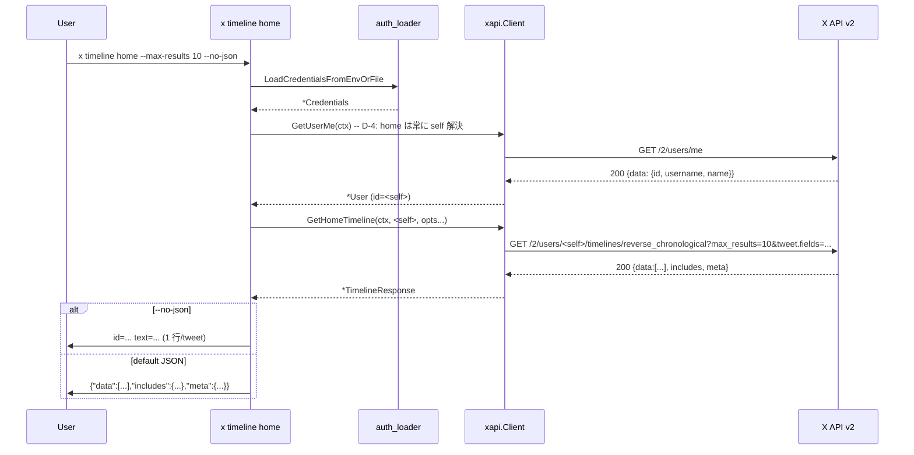

# M31: User Timelines (tweets / mentions / home)

## Overview

| 項目 | 値 |
|------|---|
| ステータス | 計画中 |
| 対象 v リリース | v0.5.0 |
| Phase | I: readonly API 包括サポート (第 3 回) |
| 依存 | M29 (xapi 基盤 / Tweet.NoteTweet/ConversationID / pagination.go computeInterPageWait / cli/tweet.go extractTweetID / formatTweetHumanLine / writeNDJSONTweets), M30 (SearchOption / searchAggregator / resolveSearchTimeWindow パターン) |
| Tier 要件 | OAuth 1.0a User Context (本プロジェクトの既存認証で全 3 エンドポイント利用可能、Free tier でも 200 想定) |
| 主要対象ファイル | `internal/xapi/timeline.go` (新規), `internal/cli/timeline.go` (新規), `internal/cli/root.go` (1 行追加), `docs/x-api.md` (追記), `CHANGELOG.md` (追記) |

## Goal

`x timeline tweets <ID>` / `x timeline mentions <ID>` / `x timeline home` でユーザータイムラインを取得する。
M29/M30 で確立した CLI factory + 中間構造体オプション + JST 時刻フラグ + extractTweetID + computeInterPageWait のパターンを踏襲し、新規 API/CLI 層に最小差分で機能を追加する。

## 対象エンドポイント

| API | 説明 | max_results 仕様 (X API) | exclude | since/until_id | 認証 |
|-----|------|---------------------------|---------|----------------|------|
| `GET /2/users/:id/tweets` | ユーザーの Post タイムライン | **5..100** | あり (`retweets` / `replies`) | あり | OAuth 1.0a / Bearer |
| `GET /2/users/:id/mentions` | ユーザーへのメンション | **5..100** | **なし** | あり | OAuth 1.0a / Bearer |
| `GET /2/users/:id/timelines/reverse_chronological` | ホームタイムライン (認証ユーザー固定) | **1..100** | あり (`retweets` / `replies`) | あり | **OAuth 1.0a 必須** (Bearer 不可) |

注意: reverse_chronological は `userID = 認証ユーザー` 必須 (他人の home は取得不可、X 仕様)。本プロジェクトは OAuth 1.0a 専用のため `home` だけ Bearer 不可制約は問題にならない。

参考:
- <https://docs.x.com/x-api/posts/user-posts-timeline-by-user-id>
- <https://docs.x.com/x-api/posts/user-mention-timeline-by-user-id>
- <https://docs.x.com/x-api/posts/user-home-timeline-by-user-id>

## Tasks (TDD: Red → Green → Refactor)

### T1: `internal/xapi/timeline.go` 新規 — Get*Timeline + Each*TimelinePage

**目的**: 3 つのタイムライン API をラップする xapi 層を新設。M29 で抽出した `computeInterPageWait` と M30 で確立した `searchConfig` パターンを尊重する。

- 対象: `internal/xapi/timeline.go` (新規), `internal/xapi/timeline_test.go` (新規)
- 変更:
  - DTO 追加 (M29/M30 命名規則に揃える):
    ```go
    // TimelineResponse は Get*Timeline / Each*TimelinePage が返すレスポンス本体である。
    type TimelineResponse struct {
        Data     []Tweet  `json:"data,omitempty"`
        Includes Includes `json:"includes,omitempty"`
        Meta     Meta     `json:"meta,omitempty"`
    }
    ```
    - **partial error 型 (D-7)**: timeline 系は `errors` フィールドを返さないため搭載しない (M30 SearchResponse とは差別化、過剰汎用化を避ける)
  - Option 関数 (中間構造体 `timelineConfig` に集約、M30 D-8 パターン):
    - `WithTimelineMaxResults(n int)` — 0 は no-op (CLI 層で 100 を必ずセットする責務)
    - `WithTimelineStartTime(t time.Time)` / `WithTimelineEndTime(t time.Time)`
    - `WithTimelineSinceID(id string)` / `WithTimelineUntilID(id string)`
    - `WithTimelinePaginationToken(token string)`
    - `WithTimelineExclude(values ...string)` — `"retweets"` / `"replies"` (`tweets` / `home` のみ有効、`mentions` で渡しても X API 側で無視 or 400)
    - `WithTimelineTweetFields(...string)` / `WithTimelineExpansions(...string)` / `WithTimelineUserFields(...string)` / `WithTimelineMediaFields(...string)`
    - `WithTimelineMaxPages(n int)` — Each*TimelinePage 専用、default `timelineDefaultMaxPages = 50`
  - 関数 (**3 エンドポイント = 3 関数 + 3 iterator、D-3**: kind enum は採用せず M30 SearchRecent パターンに統一):
    - `(c *Client) GetUserTweets(ctx, userID string, opts ...TimelineOption) (*TimelineResponse, error)`
    - `(c *Client) GetUserMentions(ctx, userID string, opts ...TimelineOption) (*TimelineResponse, error)`
    - `(c *Client) GetHomeTimeline(ctx, userID string, opts ...TimelineOption) (*TimelineResponse, error)`
    - `(c *Client) EachUserTweetsPage(ctx, userID string, fn func(*TimelineResponse) error, opts ...TimelineOption) error`
    - `(c *Client) EachUserMentionsPage(ctx, userID string, fn func(*TimelineResponse) error, opts ...TimelineOption) error`
    - `(c *Client) EachHomeTimelinePage(ctx, userID string, fn func(*TimelineResponse) error, opts ...TimelineOption) error`
    - 各関数は内部で `fetchTimelinePage(ctx, suffix, userID, cfg)` を呼ぶ DRY 実装 (suffix = `"tweets"` / `"mentions"` / `"timelines/reverse_chronological"`)
    - `userID == ""` → `fmt.Errorf("xapi: %s: userID must be non-empty", funcName)` で拒否
  - 定数:
    ```go
    const (
        timelineDefaultMaxPages    = 50 // M29/M30 と同値
        timelineRateLimitThreshold = 2  // M29/M30 と同値 (D-6 参照)
    )
    ```
  - 内部ヘルパ:
    - `newTimelineConfig(opts) timelineConfig`
    - `buildTimelineURL(baseURL, suffix, userID, cfg) string` — `/2/users/:id/{suffix}` の URL 組み立て (`url.PathEscape(userID)`)
    - `fetchTimelinePage(ctx, suffix, userID, cfg) (*timelineFetched, error)` — single-page 内部関数 (likes/search パターン)
    - `eachTimelinePage(ctx, suffix, userID, fn, opts) error` — iterator 共通実装 (`EachLikedPage` / `EachSearchPage` の構造を直接踏襲)
      - 3 つの公開 `Each*TimelinePage` は薄いラッパー (suffix を渡すのみ) で kind 引数の脆さを避ける (D-3)
  - パッケージ doc は **書かない** (D-11: 新規ファイル `timeline.go` には doc 集約しない、既存 `oauth1.go` 等に集約済み)
- テスト (`timeline_test.go` に追加、最低 16 ケース):
  1. `TestGetUserTweets_HitsCorrectEndpoint`: `/2/users/<id>/tweets` + GET
  2. `TestGetUserMentions_HitsCorrectEndpoint`: `/2/users/<id>/mentions`
  3. `TestGetHomeTimeline_HitsCorrectEndpoint`: `/2/users/<id>/timelines/reverse_chronological`
  4. `TestGetUserTweets_PathEscape`: `userID="user/x"` で path が `/2/users/user%2Fx/tweets`
  5. `TestGetUserTweets_EmptyUserID_RejectsArgument`: `userID=""` で `must be non-empty` (httptest 呼ばれない)
  6. `TestGetUserTweets_AllOptionsReflected`: max_results / start_time / end_time / since_id / until_id / pagination_token / exclude / 各 fields すべてクエリ反映
  7. `TestGetUserTweets_ExcludeFlag`: `WithTimelineExclude("retweets","replies")` → `?exclude=retweets,replies`
  8. `TestGetUserTweets_StartTimeRFC3339Z`: ナノ秒切り捨て (M30 同形式)
  9. `TestGetUserTweets_401_AuthError`
  10. `TestGetUserMentions_404_NotFound` (ErrNotFound)
  11. `TestGetHomeTimeline_403_Permission` (Bearer 注入時を想定したシナリオ pin)
  12. `TestGetUserTweets_InvalidJSON_NoRetry` (decode エラー、call=1)
  13. `TestEachUserTweetsPage_MultiPage_FullTraversal`: 3 ページ × N 件、pagination_token 連鎖
  14. `TestEachUserMentionsPage_MaxPages_Truncates`: max_pages=2 で打ち切り
  15. `TestEachHomeTimelinePage_RateLimitSleep`: remaining=1 reset=5s 後 → sleep ≈ 5s (likes/search と同パターン、`fixedTimeNow` 流用)
  16. `TestEachUserTweetsPage_InterPageDelay`: remaining=50 → sleep=200ms
- Red → Green → Refactor:
  - Red: 16 ケース追加 → `GetUserTweets`/etc 未定義で compile エラー
  - Green: timeline.go に実装 → pass
  - Refactor: `fetchTimelinePage`/`eachTimelinePage` の DRY 共通化、godoc 整備

### T2: `internal/cli/timeline.go` 新規 — `x timeline {tweets,mentions,home}` 3 サブコマンド

**目的**: CLI factory を新設。M29/M30 で確立した CLI 流儀 (interface + var-swap + 中間ヘルパ + JST フラグ + `--all`/`--ndjson`) を踏襲。

- 対象: `internal/cli/timeline.go` (新規), `internal/cli/timeline_test.go` (新規)
- 定数追加 (`liked.go` / `tweet.go` の並び):
  ```go
  const (
      // timelineDefaultTweetFields は timeline 系コマンド共通の既定 tweet.fields (M29 D-10 継続)。
      timelineDefaultTweetFields = "id,text,author_id,created_at,entities,public_metrics,note_tweet,conversation_id"
      timelineDefaultExpansions  = "author_id"
      timelineDefaultUserFields  = "username,name"
      timelineDefaultMediaFields = ""

      // timelineAPIMinMaxResults は tweets/mentions の per-page 下限 (X API 仕様、D-1)。
      // home (reverse_chronological) は下限 1 で補正不要 (D-1)。
      timelineAPIMinMaxResults = 5
  )
  ```
- インターフェイス + var-swap (httptest 注入、**D-12: 新規 `timelineClient` interface** — tweetClient を肥大化させない、M29/M30 と独立):
  ```go
  type timelineClient interface {
      GetUserMe(ctx context.Context, opts ...xapi.UserFieldsOption) (*xapi.User, error)
      GetUserTweets(ctx context.Context, userID string, opts ...xapi.TimelineOption) (*xapi.TimelineResponse, error)
      GetUserMentions(ctx context.Context, userID string, opts ...xapi.TimelineOption) (*xapi.TimelineResponse, error)
      GetHomeTimeline(ctx context.Context, userID string, opts ...xapi.TimelineOption) (*xapi.TimelineResponse, error)
      EachUserTweetsPage(ctx context.Context, userID string, fn func(*xapi.TimelineResponse) error, opts ...xapi.TimelineOption) error
      EachUserMentionsPage(ctx context.Context, userID string, fn func(*xapi.TimelineResponse) error, opts ...xapi.TimelineOption) error
      EachHomeTimelinePage(ctx context.Context, userID string, fn func(*xapi.TimelineResponse) error, opts ...xapi.TimelineOption) error
  }

  var newTimelineClient = func(ctx context.Context, creds *config.Credentials) (timelineClient, error) {
      return xapi.NewClient(ctx, creds), nil
  }
  ```
- factory 関数:
  - `newTimelineCmd()` 親 (help のみ)、`AddCommand` で 3 サブコマンド
  - `newTimelineTweetsCmd()` / `newTimelineMentionsCmd()` / `newTimelineHomeCmd()`
- **D-4 (advisor 反映)**: home コマンドは `--user-id` フラグを **公開しない** (reverse_chronological は認証ユーザー固定のため、GetUserMe で自動解決)。tweets / mentions は `--user-id` を公開し、default は liked と同じ self 解決 (D-4)。
- **D-5 (advisor 反映)**: `<ID|@username>` 表記は `<ID>` のみに絞る (username 解決は M32 Users Extended で `GetUserByUsername` 実装後に再評価)。引数省略時 (tweets/mentions) は self 解決。
- 共通フラグ (3 サブコマンド共通):
  - `--max-results <int>` (default 100, **tweets/mentions: 1..100, home: 1..100**)
    - tweets/mentions: `n=1..4` (X API 下限 5 未満) は **--all=false** 時に API に 5 を投げ、応答を `[:n]` で truncate (M29/liked と同じ補正規則)
    - tweets/mentions: `n=1..4` × `--all=true` は `ErrInvalidArgument` (M29 D-11 / M30 D-2 と同じ理由)
    - home: 下限 1 のため補正不要 (D-1)
  - `--start-time` / `--end-time` (RFC3339)
  - `--since-jst YYYY-MM-DD` / `--yesterday-jst` (liked と同優先順位: yesterday-jst > since-jst > start/end)
    - **resolveSearchTimeWindow を再利用** (M30 で共通化済み、改名不要)
  - `--since-id` / `--until-id` (timeline 専用、liked/search にはない)
  - `--all` (`--max-pages` default 50)
  - `--max-pages <int>` (default 50)
  - `--pagination-token <s>` (--all 時は警告して無視、liked/search と同パターン)
  - `--no-json` / `--ndjson` (排他、`decideOutputMode` を再利用)
  - `--tweet-fields` / `--expansions` / `--user-fields` / `--media-fields` (default は `timelineDefault*`)
- tweets / home 専用フラグ:
  - `--exclude <csv>` — `retweets` / `replies` (mentions では受け付けない、フラグ自体を登録しない)
- tweets / mentions 専用フラグ:
  - `--user-id <id>` (default 空 → GetUserMe で self 解決)
- home 固有挙動:
  - **必ず** GetUserMe で self 解決 (--user-id 不公開)
- バリデーション順 (liked / search と統一):
  1. `maxResults < 1 || maxResults > 100` → `ErrInvalidArgument`
  2. `tweets/mentions のみ`: `all && maxResults < timelineAPIMinMaxResults` → `ErrInvalidArgument` (`--max-results 1..4 cannot be combined with --all (X API per-page minimum is 5)`)
  3. `--no-json` × `--ndjson` 排他 → `decideOutputMode` がエラー化
  4. time window 解決 (`resolveSearchTimeWindow` 再利用、JST 優先順位)
  5. authn 解決 → client 生成 → 必要なら GetUserMe で self ID
- 動作 (3 コマンド共通フロー):
  1. (mentions/tweets のみ) `--user-id` 未指定 → GetUserMe で self ID
  2. (home) 常に GetUserMe で self ID
  3. tweets/mentions の下限補正 (--all=false かつ maxResults<5 → effectiveMaxResults=5, truncateTo=n)
  4. opts 組み立て (`WithTimelineMaxResults` / `WithTimelineStartTime` / etc)
  5. `--all=false`: `Get*Timeline` 単一ページ → 必要なら slice
  6. `--all=true`: `Each*TimelinePage`
     - NDJSON: ストリーミング (`writeNDJSONTweets` を p.Data に適用)
     - JSON/Human: **`timelineAggregator` で集約** (D-2: コピペ採用)
- **D-2 (advisor 反映、3 つ目の aggregator 判断)**: 当面 `timelineAggregator` を新規作成 (likedAggregator / searchAggregator のコピペ、計約 25 行)。
  - 採用理由:
    1. `*LikedTweetsResponse` / `*SearchResponse` / `*TimelineResponse` の型は同一構造だが、各 Response の意味論 (NextToken=空、ResultCount=集約後件数) のみ共通で本体型は別物。
    2. generics 化には `Pager[T]` interface (Data/Meta/Includes accessor) を 3 つの DTO に後付け生やす必要があり、xapi の DTO 直 unmarshal 性 (現状の `json:` タグだけで完結する設計) と衝突する。
    3. メソッドセット拡張が走ると types.go / likes.go / tweets.go / timeline.go 4 ファイルに影響、変更コスト > コピー保守コスト。
    4. **次の 4 つ目** (M33 Lists の `GetListTweets` 等) で再評価する。本 M ではコメントで「3 回目のコピー、generics 化検討を M33 で行う」を timelineAggregator 本体に書く。
- 出力ヘルパ:
  - `writeTimelineSinglePage(cmd, resp, outMode)` — search 版とほぼ同じだが型違いのため別関数 (`writeSearchSinglePage` のコピー)
  - `runTimelineAll(cmd, client, ctx, eachFn, opts, outMode)` — Each 関数を引数で受ける汎用形にすることで 3 つの home/mentions/tweets で 1 関数を再利用 (D-8)
    - `eachFn func(context.Context, string, func(*xapi.TimelineResponse) error, ...xapi.TimelineOption) error` を渡す
  - `writeTimelineHuman(cmd, resp)` — `formatTweetHumanLine` (M29) を再利用
- パッケージ doc は **書かない** (D-11)
- テスト (`timeline_test.go` に追加、最低 18 ケース):
  1. `TestTimelineTweets_DefaultJSON`: 1 ページ → JSON
  2. `TestTimelineTweets_NoJSON_HumanFormat`: `--no-json` で `id=...\tauthor=...\tcreated=...\ttext=...`
  3. `TestTimelineTweets_NoJSON_NoteTweetPreferred`: M29 D-3 継続を search/tweet と同じく検証
  4. `TestTimelineTweets_MaxResultsBelow5_SinglePage_TruncatesAndSendsFive`: `--max-results 3` モック 5 件返す → 出力 3 件、API クエリ `max_results=5`
  5. `TestTimelineTweets_MaxResultsBelow5_All_RejectsArgument`: `--all --max-results 3` → exit 2
  6. `TestTimelineTweets_MaxResultsOutOfRange`: `--max-results 0` / `101` → exit 2
  7. `TestTimelineTweets_UserIDDefaultsToMe`: `--user-id` 未指定 → GetUserMe 呼ばれ、その ID が `/2/users/<self>/tweets` に渡る
  8. `TestTimelineTweets_UserIDExplicit`: `--user-id 99` 指定 → GetUserMe は呼ばれず、`/2/users/99/tweets` が叩かれる
  9. `TestTimelineTweets_ExcludeFlag`: `--exclude retweets,replies` → クエリに反映
  10. `TestTimelineTweets_SinceUntilID`: `--since-id 100 --until-id 200` → クエリに反映
  11. `TestTimelineTweets_YesterdayJST_Overrides`: liked と同じ優先順位
  12. `TestTimelineTweets_NDJSON_All_Streaming`: 2 ページ → NDJSON 行数 = 合算
  13. `TestTimelineTweets_All_Aggregated_JSON`: --all で `meta.next_token=""`, `meta.result_count` 合算
  14. `TestTimelineMentions_DefaultFlow`: tweets と同形だが endpoint `/mentions`
  15. `TestTimelineMentions_NoExcludeFlag`: `--exclude` フラグが未登録 (`cmd.Flag("exclude") == nil`) を pin (D-9)
  16. `TestTimelineHome_AlwaysResolvesSelf`: --user-id フラグ自体が登録されていない (`cmd.Flag("user-id") == nil`)、GetUserMe 必ず呼ばれる
  17. `TestTimelineHome_MaxResults_1_NoTruncation`: `--max-results 1` で 1 件返却、API クエリ `max_results=1` (補正なし、D-1)
  18. `TestTimelineHome_NoJSON_NDJSON_MutuallyExclusive`: exit 2

### T3: `internal/cli/root.go` — `AddCommand(newTimelineCmd())`

**目的**: ルートに親コマンドを接続する。

- 対象: `internal/cli/root.go`, `internal/cli/root_test.go`
- 変更: `root.AddCommand(newTimelineCmd())` を 1 行追加 (newTweetCmd の直後)
- テスト: `TestRootHelpShowsTimeline` で `--help` 出力に `timeline` が含まれることを検証 (1 ケース)

### T4: 検証 + Docs

**目的**: 機能セットの最終受け入れと外部ドキュメント更新。

- 検証:
  - `go test -race -count=1 ./...` 全 pass
  - `GOLANGCI_LINT_CACHE=$TMPDIR/golangci-cache golangci-lint run ./...` 0 issues
  - `go vet ./...` 0
  - `go build -o /tmp/x ./cmd/x` 成功
  - (任意) 実機: `/tmp/x timeline tweets <ID> --no-json` / `/tmp/x timeline home --max-results 5 --no-json` / `/tmp/x timeline mentions --since-jst <date>`
- ドキュメント更新:
  - `docs/specs/x-spec.md` §6 CLI: `x timeline tweets <ID>` / `x timeline mentions <ID>` / `x timeline home` のフラグ表追加 (M29/M30 形式踏襲)
  - `docs/x-api.md`:
    - エンドポイント表に 3 API 追加 (max_results 仕様の差異、`exclude` サポートの差異、home の認証ユーザー固定を明記)
    - rate limit 表に timeline 系を追加 (1500req/15min/user 想定、要実機確認、threshold=2 採用根拠)
  - `README.md` / `README.ja.md`: CLI サブコマンド一覧に `timeline {tweets,mentions,home}` を追加 (英日両方)
  - `CHANGELOG.md`:
    ```markdown
    ## [0.5.0] - 2026-05-14 (draft, unreleased)
    ### Added
    - `x tweet search <query>` — full-text 過去 7 日検索 (Basic tier 以上必須)  [M30]
    - `x tweet thread <ID|URL>` — スレッド全体取得 (`--author-only` で作者発言のみ)  [M30]
    - `x timeline tweets <ID>` — ユーザーの Post タイムライン  [M31]
    - `x timeline mentions <ID>` — ユーザーへのメンション  [M31]
    - `x timeline home` — 認証ユーザーのホームタイムライン (reverse_chronological)  [M31]
    ```

## Completion Criteria

- `go test -race -count=1 ./...` 全 pass (新規テスト 35+ ケース、target 34 = T1 16 + T2 18 + T3 1)
- `golangci-lint run ./...` 0 issues, `go vet ./...` 0
- `x timeline tweets <ID> --no-json` がモック上で動作 (T2 テスト)
- `x timeline mentions --since-jst 2026-05-10 --all --ndjson` がモック上でストリーミング (T2 テスト)
- `x timeline home --max-results 5 --no-json` がモック上で 5 件取得 (T2 テスト)
- `docs/x-api.md` に 3 API の max_results 仕様差 + `exclude` サポート差 + home の認証ユーザー固定が記載
- `CHANGELOG.md [0.5.0]` に timeline 3 サブコマンド追記
- 各タスクが独立コミット (Conventional Commits 日本語、フッター `Plan: plans/x-m31-timelines.md`)

## 設計上の決定事項

| # | テーマ | 採用 | 理由 |
|---|--------|------|------|
| D-1 | max_results 下限の非対称性 | tweets/mentions: 5 で補正 (liked と同パターン)。home: 1 のため補正コード自体スキップ | X API 仕様 (実 docs を WebFetch で確認): tweets=5..100, mentions=5..100, reverse_chronological=1..100。home の補正コードを書くのは死コード。3 サブコマンド共通 `--max-results` でも内部で endpoint 別に分岐 |
| D-2 | 3 つ目の aggregator コピー判断 | **コピペ採用** (`timelineAggregator` 新規作成)。generics 化は **M33 (4 つ目) で再評価** | 採用理由 4 点を T2 本文に記載 (型構造同一だが意味論固有、generics には Pager[T] interface 後付けが必要で xapi DTO の json 直接 unmarshal 性と衝突、影響範囲 4 ファイル、コピーは 25 行)。コメントに「3 回目」「M33 で再評価」明記 |
| D-3 | EachTimelinePage の API 形状 | **3 関数分離** (`EachUserTweetsPage` / `EachUserMentionsPage` / `EachHomeTimelinePage`) | placeholder の `kind` enum 引数は型安全性が低く M30 SearchRecent のパターン (1 関数 1 エンドポイント) と非一貫。内部実装は `eachTimelinePage(suffix, ...)` で DRY (3 行のラッパー) |
| D-4 | home の userID 解決 | `home` コマンドに `--user-id` フラグを **公開しない**。常に GetUserMe で自動解決 | reverse_chronological は X 仕様で認証ユーザー以外不可。フラグを出すと "なぜ無視されるか" が UX 上不明、テストでも `cmd.Flag("user-id") == nil` を pin |
| D-5 | `<ID|@username>` 表記の扱い | 本 M では `<ID>` のみ。`@username` 解決は M32 Users Extended で `GetUserByUsername` 実装後 | placeholder の表記は将来計画レベル。本 M スコープに含めると users API 先行実装が必要 |
| D-6 | rate-limit threshold | `timelineRateLimitThreshold = 2` (likes/search と同値) | timeline 系のレート (`users/:id/tweets` ≈ 1500req/15min/user, `mentions` ≈ 450req/15min, `reverse_chronological` ≈ 180req/15min/user) はどれも likes (75req/15min) より緩いが、remaining ≤ 2 で reset 待ちの保守的方針を維持 (誤検出防止) |
| D-7 | TimelineResponse.Errors | **搭載しない** | X API timeline 系は `errors` トップレベルを返さない (検索/バッチ lookup のような partial error 機構なし)。SearchResponse は将来互換目的で残したが timeline は仕様確定で不要 |
| D-8 | runTimelineAll の DRY 化 | `eachFn` を引数で受ける関数 (3 サブコマンドで 1 関数を再利用) | search 1 endpoint 用の `runSearchAll` は固定実装だが、timeline は 3 endpoint で構造同一 → eachFn パラメータ化が自然。コードコピーをこれ以上増やさない |
| D-9 | mentions の `--exclude` | フラグ自体を登録しない (`cmd.Flag("exclude") == nil` をテスト pin) | X API 仕様で mentions は exclude 非サポート。コマンドラインに出すと誤解を招く。代替案 (出して X API に渡さない) は不誠実 |
| D-10 | JST 時刻フラグの実装 | M30 `resolveSearchTimeWindow` を再利用 (改名しない) | 関数名は `resolveSearchTimeWindow` のままで内容は時刻汎用、複数コマンドで使われる事実は本 M で明文化済 (改名は副作用大、将来 M で改名する場合は単独 refactor commit) |
| D-11 | パッケージ doc | 新規ファイル `timeline.go` / `cli/timeline.go` には書かない | revive: package-comments (M29 D-5 / M30 D-11 継続)。既存 `oauth1.go` / `cli/root.go` に集約済 |
| D-12 | client interface | 新規 `timelineClient` interface (tweetClient を肥大化させない) | tweetClient は tweet 系 5 メソッド + search 2 メソッドで既に 7 メソッド、ここに timeline 6 を足すと責務不明確。**新規 interface** で timeline コマンドのテストモックを独立させる。GetUserMe は両方が必要 (self 解決) なので両 interface に重複定義 (cost 低) |
| D-13 | 3 サブコマンドの個別ファクトリ vs 1 ファクトリ | **3 個別ファクトリ** (`newTimelineTweetsCmd` / `newTimelineMentionsCmd` / `newTimelineHomeCmd`) | フラグセットの差 (`--user-id` / `--exclude`) が大きく、共通化すると "登録すべきか" の分岐コードが膨らむ。`newTweetSearchCmd` / `newTweetThreadCmd` と同じく個別 factory |
| D-14 | `--since-id` / `--until-id` と `--start-time`/`--end-time` の併用 | **排他チェックしない** (X API 仕様で独立フィルタ・併用可能) | CLI 側で排他にすると X API の真の挙動 (両指定で交差) を表現できない。無効値は X API が 400 で返し exit 1 に落ちる。implementer が「不要な排他チェックを足す」のを防ぐため明示 (advisor 1 回目反映) |

## Risks

| リスク | 対策 |
|--------|------|
| home (reverse_chronological) の 401/403 が「他人 ID 指定」エラーである可能性 | D-4 で `--user-id` フラグを排除しているため、CLI からは到達不可。万一テストで叩いた場合は ErrPermission として exit 4 |
| home のレートが極端に低い (180req/15min/user) ことで `--all` が早期 rate-limit 待ちに入る | computeInterPageWait (threshold=2) で reset まで sleep (最大 15min)。`--max-pages` (default 50) で暴走防止 |
| 3 つ目の aggregator コピペで保守性低下 | D-2 で M33 (4 つ目) 再評価を明文化、コメントに「3 回目、M33 で generics 化検討」を明記 |
| mentions の `--exclude` フラグを CLI に出さない判断がユーザー混乱を招く | docs/x-api.md に「X API 仕様で mentions は exclude 非サポート」を明記、README の表でも斜線 (`—`) で示す |
| `--user-id` を home に出さないので "自分以外の home を見たい" 要望に応えられない | spec §6 / docs/x-api.md に明記 (X API 仕様)。需要は v1.x 以降に再評価 (OAuth 2.0 PKCE → 他人代理) |
| timeline 系の rate-limit ヘッダが Bearer / OAuth1 で異なる場合の挙動 | OAuth1 のみ実装なので Bearer シナリオはスコープ外。docs に Bearer 制限を併記 |
| `since_id` / `until_id` の文字列フォーマット差 (snowflake) | xapi 層は string 透過。CLI も `string` 受け取り (数値検証は X API 側に委ねる)、無効値は 400 → exit 1 |

## Mermaid: 依存関係

```mermaid
graph LR
    T1[T1 xapi/timeline.go<br/>Get*Timeline x3<br/>Each*TimelinePage x3<br/>TimelineResponse/Option] --> T2[T2 cli/timeline.go<br/>newTimeline{Tweets,Mentions,Home}Cmd]
    T2 --> T3[T3 cli/root.go<br/>AddCommand]
    T1 --> T4[T4 検証 + docs/x-api.md / CHANGELOG]
    T2 --> T4
    T3 --> T4
```

## Mermaid: x timeline home のシーケンス



## Implementation Order (各タスク独立コミット、push 不要)

1. **T1 (Red)**: `timeline_test.go` に 16 ケース追加 → 落ちる確認
2. **T1 (Green)**: `timeline.go` に DTO / Option / 3 関数 + 3 iterator + 内部ヘルパ → pass
3. **T1 (Refactor)**: `fetchTimelinePage` / `eachTimelinePage` の DRY 共通化、godoc 整備
4. **T1 commit**: `feat(xapi): Get(User|Home)Timeline と Each*TimelinePage を追加 (3 エンドポイント対応)`
5. **T2 (Red)**: `timeline_test.go` (cli 側) に 18 ケース追加 → 落ちる
6. **T2 (Green)**: `cli/timeline.go` に `newTimelineCmd` / `newTimelineTweetsCmd` / `newTimelineMentionsCmd` / `newTimelineHomeCmd` + `timelineAggregator` + `runTimelineAll` + helpers → pass
7. **T2 commit**: `feat(cli): x timeline サブコマンド群を追加 (tweets/mentions/home、JST 時刻フラグ + --all/--ndjson)`
8. **T3 (Red→Green)**: `root_test.go` に `TestRootHelpShowsTimeline` 追加 + `root.go` の `AddCommand(newTimelineCmd())` 行追加
9. **T3 commit**: `feat(cli): root に timeline コマンドを接続`
10. **T4 (Docs)**: `docs/x-api.md` 追記 / `docs/specs/x-spec.md` §6 / README 英日 / CHANGELOG `[0.5.0]` 拡張 / 最終 test/lint/vet
11. **T4 commit**: `docs(m31): x-api.md / spec / README / CHANGELOG に timeline 系を追記`

各コミットのフッターに必ず `Plan: plans/x-m31-timelines.md` を含める。push は不要 (ローカルコミットまで)。

## Handoff to M32

- M31 で確立した `xapi/timeline.go` パターン (3 endpoint × 1 関数 1 iterator + 共通 fetch/each ヘルパ) を M32 の `xapi/users.go` (拡張) で `GetUser` / `GetUsers` / `GetUserByUsername` / `SearchUsers` / `GetFollowing` / `GetFollowers` / etc に踏襲する
- M31 で 3 つ目になった aggregator コピペは **M33 (4 つ目: `GetListTweets` 等のページング iterator)** で必ず generics 化判断を再評価する (本 M D-2 で明示)
- `extractTweetID` は M32 では使わないが、M32 で新規導入する `extractUserID` (username → ID 解決前置き) は M29 の正規表現パターンを参照する
- `resolveSearchTimeWindow` は時刻汎用関数として M32 でも再利用可 (改名は単独 refactor commit でいずれ実施)
- `formatTweetHumanLine` (M29) は引き続き CLI 横断で再利用
- `decideOutputMode` / `splitCSV` / `writeNDJSONTweets` も継続再利用
- M36 で MCP v2 tools を追加する際、`get_user_tweets` / `get_user_mentions` / `get_home_timeline` の 3 ツールは CLI の薄いラッパーとして実装 (本 M で内部 API がすでに揃う)

## advisor 反映ログ

### Phase 3.4 (advisor 2 回目、計画策定後の最終品質ゲート)

7. **`--since-id` / `--until-id` × 時間窓フラグの併用 (D-14)**: 排他チェックしないことを明文化 (X API 仕様で独立)。implementer が「不要な排他チェックを足す」のを防ぐ
8. **`--exclude` mentions 非登録の watchout**: T2 テスト #15 で pin 済 (`cmd.Flag("exclude") == nil`)。implementer プロンプトに明示する
9. **home の `--user-id` 非公開の watchout**: T2 テスト #16 で pin 済 (`cmd.Flag("user-id") == nil`)
10. **`WithTimelineExclude` godoc 注記**: "tweets and home only; mentions endpoint will error" を godoc に追記 (xapi 直接利用者向け、CLI は登録回避でガード)

### Phase 3.4 (advisor 1 回目、Phase 2 前の事前 advisor 指摘 6 点反映)

1. **max_results 下限非対称性 (D-1)**: WebFetch で X API docs 3 件を実機確認:
   - `users/:id/tweets`: min 5, max 100
   - `users/:id/mentions`: min 5, max 100, **exclude 非サポート**
   - `users/:id/timelines/reverse_chronological`: min 1, max 100
   → 補正コードは tweets/mentions のみ。home は補正スキップ。テストで `TestTimelineHome_MaxResults_1_NoTruncation` を pin
2. **3 つ目の aggregator (D-2)**: コピペを採用、M33 (4 つ目) で generics 化再評価することを明文化。コメントで「3 回目」と「M33 で再評価」を timelineAggregator 本体に書く
3. **EachTimelinePage の API 形状 (D-3)**: kind enum は採用せず 3 関数分離。M30 SearchRecent と一貫
4. **home の userID 解決 (D-4)**: `home` コマンドに `--user-id` フラグを公開しない。テストで `cmd.Flag("user-id") == nil` を pin
5. **`<ID|@username>` 表記 (D-5)**: 本 M では `<ID>` のみ、username 解決は M32 待ち。spec / placeholder の `<ID|@username>` 表記は M32 で更新
6. **rate-limit threshold (D-6)**: likes/search と同値 2 を維持 (timeline はレート緩いが保守的判断)。M30 D-6 と同形式で明文化

### Phase 5 環境メモ

`devflow:planning-agent` / `devflow:devils-advocate` / `devflow:advocate` / `devflow:implementer` などの Agent tool は本コンテキストで未登場のため、本プランは Claude 本体が直接生成し、AI 品質ゲートは `advisor()` のみで実施 (M30 と同じ運用)。Phase 4 の実装も Claude 本体が TDD で直接行う。Orchestrator はこの逸脱を `CYCLE_RESULT` の `summary` で明示する。
