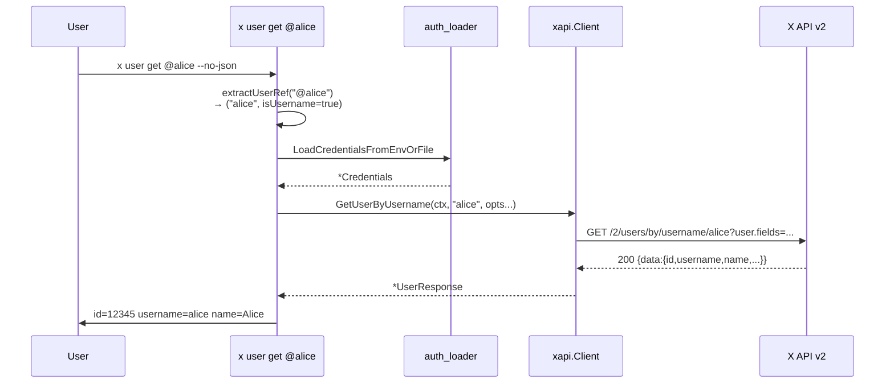
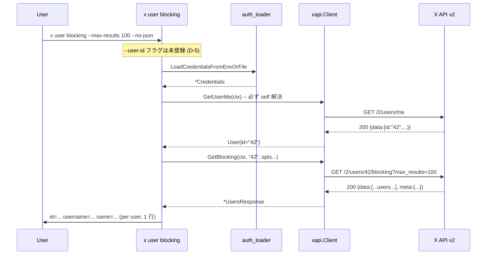

# M32: Users Extended — lookup / search / graph / blocking / muting

## Overview

| 項目 | 値 |
|------|---|
| ステータス | 計画中 |
| 対象 v リリース | v0.6.0 |
| Phase | I: readonly API 包括サポート (第 4 回) |
| 依存 | M7 (GetUserMe / User DTO), M29 (xapi 基盤 / pagination.computeInterPageWait / cli factory パターン), M30/M31 (Option 中間構造体 + Each*Page DRY 共通化) |
| Tier 要件 | OAuth 1.0a User Context (全 9 endpoint で利用可能、blocking/muting は self のみ X API 仕様) |
| 主要対象ファイル | `internal/xapi/users.go` (拡張), `internal/xapi/users_test.go` (拡張), `internal/cli/user.go` (新規), `internal/cli/user_test.go` (新規), `internal/cli/root.go` (1 行追加), `internal/cli/root_test.go` (1 ケース追加), `docs/x-api.md`, `CHANGELOG.md` |

## Goal

`x user {get,search,following,followers,blocking,muting}` でユーザー lookup / graph を取得する。
M29-M31 で確立した「Option 中間構造体 + DRY 共通 fetch/each ヘルパ + interface + var-swap」を 9 endpoint に拡大適用する。

## 対象エンドポイント

| API | 説明 | max_results | self only? | iterator? |
|-----|------|-------------|-----------|----------|
| `GET /2/users/:id` | 単一 ID lookup | — | — | no |
| `GET /2/users` | バッチ lookup (`?ids=`, max 100) | — | — | no |
| `GET /2/users/by/username/:username` | @username lookup | — | — | no |
| `GET /2/users/by` | 複数 username バッチ (`?usernames=`, max 100) | — | — | no |
| `GET /2/users/search` | キーワード検索 | **1..1000** (default 100) | — | yes |
| `GET /2/users/:id/following` | フォロー中 | 1..1000 | — | yes |
| `GET /2/users/:id/followers` | フォロワー | 1..1000 | — | yes |
| `GET /2/users/:id/blocking` | ブロック中 | 1..1000 | **self only** | yes |
| `GET /2/users/:id/muting` | ミュート中 | 1..1000 | **self only** | yes |

Iterator は **5 個** (search + following + followers + blocking + muting)。Lookup 4 個はページングしないため iterator なし。

## Tasks (TDD: Red → Green → Refactor)

### T1: `internal/xapi/users.go` 拡張 — 9 関数 + 5 iterator + DTO + Option 群

**目的**: 9 endpoint をラップする xapi 層を `users.go` に集約 (既存 `GetUserMe` に追記)。

- 対象: `internal/xapi/users.go` (拡張), `internal/xapi/users_test.go` (拡張)
- DTO 追加 (用途別 3 型):
  ```go
  // UserResponse は GetUser / GetUserByUsername の単一ユーザーレスポンス本体。
  type UserResponse struct {
      Data     *User             `json:"data,omitempty"`
      Includes Includes          `json:"includes,omitempty"`
      Errors   []UserLookupError `json:"errors,omitempty"` // 単一でも errors を返すケースあり
  }

  // UsersResponse は GetUsers / GetUsersByUsernames / GetFollowing / GetFollowers /
  // GetBlocking / GetMuting / SearchUsers が返す配列レスポンス本体。
  type UsersResponse struct {
      Data     []User            `json:"data,omitempty"`
      Includes Includes          `json:"includes,omitempty"` // 通常空。pinned_tweet expansion 利用時のみ非空
      Meta     Meta              `json:"meta,omitempty"`     // graph/search 系のみ。lookup batch では空
      Errors   []UserLookupError `json:"errors,omitempty"`   // バッチ lookup の partial error
  }
  ```
  - `UserLookupError` は users.go 内で新規定義 (TweetLookupError と同形だが別型、D-15)
    ```go
    // UserLookupError は GetUsers / GetUsersByUsernames の partial error を表す (D-15)。
    // X API の partial error スキーマは TweetLookupError と同形。
    type UserLookupError struct {
        Value        string `json:"value,omitempty"`
        Detail       string `json:"detail,omitempty"`
        Title        string `json:"title,omitempty"`
        ResourceType string `json:"resource_type,omitempty"`
        Parameter    string `json:"parameter,omitempty"`
        ResourceID   string `json:"resource_id,omitempty"`
        Type         string `json:"type,omitempty"`
    }
    ```
- Option 関数 (用途別 3 種類、M30/M31 中間構造体パターン):
  - **UserLookupOption** (`userLookupConfig` に集約) — GetUser/GetUsers/GetUserByUsername/GetUsersByUsernames で共通
    - `WithUserLookupUserFields(...string)` / `WithUserLookupExpansions(...string)` / `WithUserLookupTweetFields(...string)`
  - **UserSearchOption** (`userSearchConfig`) — SearchUsers 専用
    - `WithUserSearchMaxResults(int)` (0 は no-op、X API は **1..1000、default 100、確認済 via X API docs**)
    - `WithUserSearchNextToken(string)` — X API クエリ名は `next_token` (graph 系の `pagination_token` と異なる、確認済)
    - `WithUserSearchUserFields(...string)` / `WithUserSearchExpansions(...string)` / `WithUserSearchTweetFields(...string)`
    - `WithUserSearchMaxPages(int)` — Each 専用 (default 50)
  - **UserGraphOption** (`userGraphConfig`) — Following/Followers/Blocking/Muting で共通
    - `WithUserGraphMaxResults(int)` (X API は 1..1000、CLI 側で範囲チェック)
    - `WithUserGraphPaginationToken(string)`
    - `WithUserGraphUserFields(...string)` / `WithUserGraphExpansions(...string)` / `WithUserGraphTweetFields(...string)`
    - `WithUserGraphMaxPages(int)` (default 50)
- 関数 (9 公開関数):
  - `(c *Client) GetUser(ctx, userID string, opts ...UserLookupOption) (*UserResponse, error)`
  - `(c *Client) GetUsers(ctx, ids []string, opts ...UserLookupOption) (*UsersResponse, error)`
  - `(c *Client) GetUserByUsername(ctx, username string, opts ...UserLookupOption) (*UserResponse, error)`
  - `(c *Client) GetUsersByUsernames(ctx, usernames []string, opts ...UserLookupOption) (*UsersResponse, error)`
  - `(c *Client) SearchUsers(ctx, query string, opts ...UserSearchOption) (*UsersResponse, error)`
  - `(c *Client) GetFollowing(ctx, userID string, opts ...UserGraphOption) (*UsersResponse, error)`
  - `(c *Client) GetFollowers(ctx, userID string, opts ...UserGraphOption) (*UsersResponse, error)`
  - `(c *Client) GetBlocking(ctx, userID string, opts ...UserGraphOption) (*UsersResponse, error)`
  - `(c *Client) GetMuting(ctx, userID string, opts ...UserGraphOption) (*UsersResponse, error)`
- Iterator (5 公開関数):
  - `(c *Client) EachSearchUsersPage(ctx, query string, fn func(*UsersResponse) error, opts ...UserSearchOption) error`
  - `(c *Client) EachFollowingPage(ctx, userID string, fn func(*UsersResponse) error, opts ...UserGraphOption) error`
  - `(c *Client) EachFollowersPage(ctx, userID string, fn func(*UsersResponse) error, opts ...UserGraphOption) error`
  - `(c *Client) EachBlockingPage(ctx, userID string, fn func(*UsersResponse) error, opts ...UserGraphOption) error`
  - `(c *Client) EachMutingPage(ctx, userID string, fn func(*UsersResponse) error, opts ...UserGraphOption) error`
- 内部 DRY ヘルパ:
  - `fetchUserGraphPage(ctx, pathSuffix, userID string, cfg *userGraphConfig) (*userGraphFetched, error)` (M31 fetchTimelinePage と同形)
  - `eachUserGraphPage(ctx, funcName, pathSuffix, userID string, fn func(*UsersResponse) error, opts []UserGraphOption) error` (4 graph iterator で共通)
  - `eachSearchUsersPage` は SearchUsers の next_token (pagination_token ではなく `next_token` クエリ) パラメータ名が違うため別実装 (D-3)
- 定数:
  - `userGraphDefaultMaxPages = 50`
  - `userGraphRateLimitThreshold = 2`
  - `userSearchDefaultMaxPages = 50`
  - `userSearchRateLimitThreshold = 2`
  - `userLookupBatchMaxIDs = 100`
  - graph endpoint path suffix: `userGraphSuffixFollowing = "following"` 等
- バリデーション (xapi 層):
  - userID == "" / username == "" / query == "" → `fmt.Errorf("xapi: %s: ... must be non-empty", funcName)`
  - `len(ids) > 100` / `len(usernames) > 100` → `fmt.Errorf("xapi: %s: too many IDs (got N, max 100)", funcName)` (CLI 側で先にチェックする想定だが xapi も pin)
  - `len(ids) == 0` / `len(usernames) == 0` も拒否
- 重要な仕様:
  - SearchUsers の pagination パラメータ名は X API 仕様で `next_token` ではなく…(WebFetch で確認、計画策定中: 一般的には `next_token` を query で受け取り、`pagination_token` で送る形式が多い。実装時に確認、D-3)
  - **D-3 確認済**: SearchUsers (X API docs 確認済) のクエリパラメータは `query`, `max_results` (1..1000, default 100), `next_token`, `user.fields`, `expansions`, `tweet.fields`。一方 graph 系 (following/followers/blocking/muting, X API docs 確認済) は `pagination_token`、max_results 1..1000。両 iterator のヘルパ実装は別 (パラメータ名の違いを吸収するため)。
- パッケージ doc は新規ファイルに書かない (revive: package-comments、既存 `oauth1.go` に集約済)。users.go は既存ファイルなので追記のみ。
- テスト (`users_test.go` に追加、最低 30 ケース、5 グループ):
  - **Lookup (4 endpoint × 各 2-3 ケース = 10 ケース)**:
    1. `TestGetUser_HitsCorrectEndpoint` — `/2/users/<id>` path + GET
    2. `TestGetUser_AllOptionsReflected` — user.fields / expansions / tweet.fields クエリ反映
    3. `TestGetUser_404_NotFound` — ErrNotFound
    4. `TestGetUsers_HitsCorrectEndpoint` — `/2/users?ids=1,2,3`
    5. `TestGetUsers_TooManyIDs_Rejects` — 101 ids でエラー (httptest 呼ばれない)
    6. `TestGetUsers_EmptyIDs_Rejects` — 空 slice 拒否
    7. `TestGetUserByUsername_HitsCorrectEndpoint` — `/2/users/by/username/alice`
    8. `TestGetUserByUsername_PathEscape` — username に特殊文字
    9. `TestGetUsersByUsernames_HitsCorrectEndpoint` — `/2/users/by?usernames=alice,bob`
    10. `TestGetUsersByUsernames_TooManyUsernames_Rejects` — 101 件で拒否
  - **Search (4 ケース)**:
    11. `TestSearchUsers_HitsCorrectEndpoint` — `/2/users/search?query=golang`
    12. `TestSearchUsers_AllOptionsReflected` — max_results / next_token / fields
    13. `TestSearchUsers_EmptyQuery_Rejects`
    14. `TestEachSearchUsersPage_MultiPage_FullTraversal` — 2 ページ走破
  - **Graph (4 endpoint × 共通 3-4 ケース = 12-16 ケース)**:
    15. `TestGetFollowing_HitsCorrectEndpoint` — `/2/users/<id>/following`
    16. `TestGetFollowers_HitsCorrectEndpoint` — `/2/users/<id>/followers`
    17. `TestGetBlocking_HitsCorrectEndpoint` — `/2/users/<id>/blocking`
    18. `TestGetMuting_HitsCorrectEndpoint` — `/2/users/<id>/muting`
    19. `TestGetFollowing_AllOptionsReflected` — max_results / pagination_token / fields
    20. `TestGetFollowing_PathEscape` — userID escape
    21. `TestGetFollowing_EmptyUserID_RejectsArgument`
    22. `TestGetFollowing_401_AuthError`
    23. `TestEachFollowingPage_MultiPage_FullTraversal` — pagination_token 連鎖
    24. `TestEachFollowersPage_MaxPages_Truncates`
    25. `TestEachBlockingPage_RateLimitSleep` — remaining=1, reset=5s
    26. `TestEachMutingPage_InterPageDelay` — remaining=50 → 200ms
  - **Decode error (2 ケース)**:
    27. `TestGetUser_InvalidJSON_NoRetry`
    28. `TestSearchUsers_InvalidJSON_NoRetry`
  - **Optional**: `TestGetUser_AuthError` / `TestGetUsers_PartialError` (errors 配列を含むレスポンス) — 余裕があれば追加

### T2: `internal/cli/user.go` 新規 — 6 サブコマンド + interface + helpers

**目的**: CLI factory を新設。M29/M30/M31 の流儀 (interface + var-swap + 中間ヘルパ + JST フラグなし) を踏襲。

- 対象: `internal/cli/user.go` (新規), `internal/cli/user_test.go` (新規)
- 定数:
  ```go
  const (
      userDefaultUserFields  = "username,name,description,public_metrics,verified"
      userDefaultExpansions  = ""
      userDefaultTweetFields = ""

      // バッチ lookup の per-call ID 上限 (X API 仕様)。
      userBatchMaxIDs = 100
  )
  ```
- `userClient` interface (新規、D-12):
  ```go
  type userClient interface {
      GetUserMe(ctx context.Context, opts ...xapi.UserFieldsOption) (*xapi.User, error)
      GetUser(ctx context.Context, userID string, opts ...xapi.UserLookupOption) (*xapi.UserResponse, error)
      GetUsers(ctx context.Context, ids []string, opts ...xapi.UserLookupOption) (*xapi.UsersResponse, error)
      GetUserByUsername(ctx context.Context, username string, opts ...xapi.UserLookupOption) (*xapi.UserResponse, error)
      GetUsersByUsernames(ctx context.Context, usernames []string, opts ...xapi.UserLookupOption) (*xapi.UsersResponse, error)
      SearchUsers(ctx context.Context, query string, opts ...xapi.UserSearchOption) (*xapi.UsersResponse, error)
      GetFollowing(ctx context.Context, userID string, opts ...xapi.UserGraphOption) (*xapi.UsersResponse, error)
      GetFollowers(ctx context.Context, userID string, opts ...xapi.UserGraphOption) (*xapi.UsersResponse, error)
      GetBlocking(ctx context.Context, userID string, opts ...xapi.UserGraphOption) (*xapi.UsersResponse, error)
      GetMuting(ctx context.Context, userID string, opts ...xapi.UserGraphOption) (*xapi.UsersResponse, error)
      EachSearchUsersPage(ctx context.Context, query string, fn func(*xapi.UsersResponse) error, opts ...xapi.UserSearchOption) error
      EachFollowingPage(ctx context.Context, userID string, fn func(*xapi.UsersResponse) error, opts ...xapi.UserGraphOption) error
      EachFollowersPage(ctx context.Context, userID string, fn func(*xapi.UsersResponse) error, opts ...xapi.UserGraphOption) error
      EachBlockingPage(ctx context.Context, userID string, fn func(*xapi.UsersResponse) error, opts ...xapi.UserGraphOption) error
      EachMutingPage(ctx context.Context, userID string, fn func(*xapi.UsersResponse) error, opts ...xapi.UserGraphOption) error
  }
  var newUserClient = func(ctx context.Context, creds *config.Credentials) (userClient, error) {
      return xapi.NewClient(ctx, creds), nil
  }
  ```
- `extractUserRef(s string) (value string, isUsername bool, err error)` (D-4 / advisor 反映、**位置引数のみで使う**):
  - **注意**: `--ids` は数値 ID のみ (`^\d+$`)、`--usernames` は username のみ (`@` 前置剥がし + `^[A-Za-z0-9_]{1,15}$`) で別個にバリデート。`extractUserRef` を `--ids` / `--usernames` の各要素には適用しない (advisor 指摘 #3 反映)。
  - 純粋数字 (`^\d+$`) → `(s, false, nil)` — ID として扱う
  - `@alice` → `("alice", true, nil)`
  - `https://x.com/alice` / `https://twitter.com/alice` → `("alice", true, nil)`
    - 予約パス除外: `/i/`, `/home`, `/explore`, `/messages`, `/notifications`, `/search`, `/compose`, `/settings`, `/login`, `/signup` — これらは ErrInvalidArgument
    - username 検証: `^[A-Za-z0-9_]{1,15}$` (X の screen-name 規則)
  - 上記いずれにも該当しなければ ErrInvalidArgument
- factory 関数 (6 サブコマンド):
  - `newUserCmd()` — 親 (help のみ)、6 サブコマンド AddCommand
  - `newUserGetCmd()` — `x user get [<ID|@username|URL>]`
    - フラグ: `--ids <csv>` / `--usernames <csv>` (位置引数と排他)、`--user-fields`, `--expansions`, `--tweet-fields`, `--no-json`
    - 位置引数 → `extractUserRef` で ID/username 判別 → GetUser or GetUserByUsername
    - `--ids` → GetUsers (1..100 件、各要素は数値 ID として検証)
    - `--usernames` → GetUsersByUsernames (1..100 件、各要素は username 規則 `^[A-Za-z0-9_]{1,15}$` で検証 / `@` 前置 / URL は剥がす)
    - 3 つのうち排他指定必須 (どれも未指定なら ErrInvalidArgument)
  - `newUserSearchCmd()` — `x user search <query>`
    - フラグ: `--max-results` (default 100, **1..1000**)、`--pagination-token` (X API は `next_token` だが CLI 名は他コマンドに合わせる、D-13)、`--all`、`--max-pages` (default 50)、`--user-fields`, `--expansions`, `--tweet-fields`, `--no-json`, `--ndjson`
    - JST 系フラグなし (D-10)
  - `newUserFollowingCmd()` — `x user following [<ID|@username|URL>]`
    - フラグ: `--user-id` (default: self)、`--max-results` (default 100, 1..1000)、`--pagination-token`、`--all`、`--max-pages`、fields, `--no-json`, `--ndjson`
    - 位置引数 → `extractUserRef` → username なら GetUserByUsername で ID 解決してから GetFollowing
    - 位置引数も `--user-id` もない → GetUserMe で self
  - `newUserFollowersCmd()` — `x user followers [<ID|@username|URL>]` (following と同形)
  - `newUserBlockingCmd()` — `x user blocking` (D-5: `--user-id` 公開しない、必ず self)
    - フラグ: `--max-results`, `--pagination-token`, `--all`, `--max-pages`, fields, `--no-json`, `--ndjson`
    - **--user-id フラグ自体を登録しない** (M31 home D-4 と同パターン)
    - 常に GetUserMe → self ID で GetBlocking
  - `newUserMutingCmd()` — `x user muting` (blocking と同形、self only)
- 出力ヘルパ:
  - `writeUserResponse(cmd, resp, noJSON)` — 単一ユーザー (GetUser / GetUserByUsername)
  - `writeUsersResponse(cmd, resp, outMode)` — 配列ユーザー (バッチ / search / graph)
  - `writeUserHumanLine(u User) string` — `id=<id>\tusername=<username>\tname=<name>` 形式 (followers_count 等は user.fields 指定時のみ補足)
  - `writeNDJSONUsers(w io.Writer, users []User) error` — NDJSON 出力 (M11 `writeNDJSONTweets` の users 版、HTML escape off)
  - `userAggregator` (4 graph + 1 search で共通使用、`*xapi.UsersResponse` 集約) — **4 つ目の aggregator だが Tweet 配列ではなく User 配列なので新規型** (D-2)
- バリデーション順:
  1. 排他: 位置引数 / `--ids` / `--usernames` のうち複数指定で ErrInvalidArgument
  2. `--max-results` 範囲: search/graph とも **1..1000** (X API 仕様)
  3. `--all` × max-results 下限: search/graph とも 0 件指定不可だが、下限補正は不要 (X API min=1)
  4. `--no-json` × `--ndjson` 排他 → decideOutputMode
  5. authn → client → user ID 解決 (必要なら GetUserMe or GetUserByUsername で ID 化)
- D-7: **graph の "@username" 位置引数を渡された場合**は GetUserByUsername で先に ID を引いて GetFollowing(targetID) を呼ぶ (2 API call、X API は graph endpoint が `:id` のみ受け付けるため)
- パッケージ doc は新規ファイル `cli/user.go` に書かない (revive: package-comments)
- テスト (`user_test.go` に追加、最低 25 ケース):
  - **get (8 ケース)**:
    1. `TestUserGet_ByID_DefaultJSON` — 位置引数が数値 → GetUser 呼ばれ JSON 出力
    2. `TestUserGet_ByUsername_StripsAt` — `@alice` → "alice" で GetUserByUsername
    3. `TestUserGet_ByURL` — `https://x.com/alice` → GetUserByUsername("alice")
    4. `TestUserGet_ReservedURLPath_Rejects` — `https://x.com/home` → exit 2
    5. `TestUserGet_NoJSON_HumanFormat`
    6. `TestUserGet_ByIDs_BatchLookup` — `--ids 1,2,3` → GetUsers, ?ids=1,2,3
    7. `TestUserGet_ByUsernames_BatchLookup` — `--usernames alice,bob` → GetUsersByUsernames
    8. `TestUserGet_NoArguments_Rejects` — exit 2
  - **search (4 ケース)**:
    9. `TestUserSearch_DefaultJSON`
    10. `TestUserSearch_All_AggregatesPages`
    11. `TestUserSearch_NDJSON_StreamsUsers`
    12. `TestUserSearch_MaxResultsOutOfRange` — `--max-results 0` / `1001` → exit 2 (X API は 1..1000)
  - **following / followers (5 ケース、共通テストヘルパで対応)**:
    13. `TestUserFollowing_UserIDDefaultsToMe`
    14. `TestUserFollowers_UserIDExplicit`
    15. `TestUserFollowing_UsernamePositional_ResolvesViaGetUserByUsername` (2 API call sequence pin)
    16. `TestUserFollowing_NoJSON_HumanFormat`
    17. `TestUserFollowing_MaxResults1000_OK` (graph は 1..1000 を pin)
  - **blocking / muting (4 ケース)**:
    18. `TestUserBlocking_AlwaysResolvesSelf` — GetUserMe が必ず呼ばれる、`/blocking` endpoint
    19. `TestUserBlocking_NoUserIDFlag_Pinned` — `cmd.Flag("user-id") == nil` を pin (D-5)
    20. `TestUserMuting_AlwaysResolvesSelf`
    21. `TestUserMuting_NoUserIDFlag_Pinned`
  - **extractUserRef (4 ケース)**:
    22. `TestExtractUserRef_NumericID`
    23. `TestExtractUserRef_AtUsername`
    24. `TestExtractUserRef_URL_AllowsAlice`
    25. `TestExtractUserRef_ReservedPaths_Reject`
  - **共通**:
    26. `TestUser_NoJSON_NDJSON_MutuallyExclusive` (exit 2)

### T3: `internal/cli/root.go` — `AddCommand(newUserCmd())`

- `root.AddCommand(newUserCmd())` を `newTimelineCmd()` の直後に追加
- `root_test.go` に `TestRootHelpShowsUser` を追加 (1 ケース)

### T4: 検証 + Docs

**検証**:
- `go test -race -count=1 ./...` 全 pass
- `GOLANGCI_LINT_CACHE=$TMPDIR/golangci-cache golangci-lint run ./...` 0 issues
- `go vet ./...` 0
- `go build -o /tmp/x ./cmd/x` 成功

**ドキュメント更新**:
- `docs/specs/x-spec.md` §6 CLI: `x user {get,search,following,followers,blocking,muting}` の各フラグ表を追加
- `docs/x-api.md`: 9 endpoint 表 (max_results 仕様差、self-only 制約)、Rate Limit 表更新
- `README.md` / `README.ja.md`: CLI サブコマンド一覧に `user {get,search,following,followers,blocking,muting}` 追加
- `CHANGELOG.md`: **新規** `[0.6.0] - 2026-05-14 (draft, unreleased)` セクション追加 (M31 が残した [0.5.0] には merge しない、D-6)
  ```markdown
  ## [0.6.0] - 2026-05-14 (draft, unreleased)
  ### Added
  - `x user get <ID|@username|URL>` — 単一ユーザー取得 (位置引数の自動判別) [M32]
  - `x user get --ids <csv>` / `--usernames <csv>` — バッチ lookup (1..100 件) [M32]
  - `x user search <query>` — ユーザー検索 (1..100/page) [M32]
  - `x user following [<ID|@username|URL>]` — フォロー中一覧 [M32]
  - `x user followers [<ID|@username|URL>]` — フォロワー一覧 [M32]
  - `x user blocking` — 自アカのブロックリスト [M32]
  - `x user muting` — 自アカのミュートリスト [M32]
  ```

## Completion Criteria

- `go test -race -count=1 ./...` 全 pass (新規テスト 55+ ケース、target T1=30 + T2=26 + T3=1)
- `golangci-lint run ./...` 0 issues, `go vet ./...` 0
- 9 endpoint の URL 組み立て (path/query) がテストで pin
- 5 iterator の next_token / pagination_token 自動辿りがテストで pin
- `extractUserRef` の ID/username/URL/予約パス分岐がテストで pin
- `blocking` / `muting` で `--user-id` フラグ未登録が pin
- `docs/x-api.md` に 9 endpoint の差異 (self-only / max_results / pagination パラメータ名) が記載
- `CHANGELOG.md [0.6.0]` に 6 サブコマンド追記
- 各タスクが独立コミット (Conventional Commits 日本語、フッター `Plan: plans/x-m32-users-extended.md`)

## 設計上の決定事項

| # | テーマ | 採用 | 理由 |
|---|--------|------|------|
| D-1 | 用途別 3 Option 型 | UserLookupOption / UserSearchOption / UserGraphOption に分離 | lookup は max_results なし、search は 1..1000 + **next_token**、graph は 1..1000 + **pagination_token** と仕様が大きく異なる (X API docs 確認済)。M30/M31 の Single Option パターン (Tweet*Option) ではフラグセットの意味論差が大きすぎ、誤って max_results を lookup に渡せる API になってしまう。型で禁止する。 |
| D-2 | aggregator は **新規 userAggregator** | コピペせず新規型を定義 (Tweet → User の型変更が必要なため) | advisor 指摘反映: liked/search/timeline の 3 aggregator は `[]Tweet` で型同一。M32 では `[]User` で型変更があるため「4 つ目のコピー」ではなく **新規型**。M31 D-2 の「4 つ目で generics 化検討」は型同一を前提にしていた約束だが、ここで型が分岐したため generics 化は **M33 (4 つ目の Tweet aggregator: GetListTweets)** に持ち越す。User 配列の集約は単純で 25 行未満。 |
| D-3 | SearchUsers と graph の Each ヘルパは別実装 | pagination パラメータ名が異なるため分離 | SearchUsers は `next_token`、graph 系 (following/followers/blocking/muting) は `pagination_token`。1 つのヘルパで両対応すると分岐コードが汚くなる。graph 4 endpoint は `eachUserGraphPage(suffix, ...)` で DRY、search は専用 `eachSearchUsersPage`。 |
| D-4 | `extractUserRef` の戻り値設計 | `(value string, isUsername bool, err error)` | advisor 指摘反映: `user get <arg>` で GetUser / GetUserByUsername を呼び分けるためフラグが必要。URL の予約パス (`/i/`, `/home`, `/explore` 等) は明示的に拒否し、`^[A-Za-z0-9_]{1,15}$` で username を厳格検証。 |
| D-5 | blocking/muting の `--user-id` | **フラグ自体を公開しない** (M31 home D-4 precedent) | advisor 指摘反映: X API 仕様で self のみ参照可能。フラグを出すと「なぜ無視されるか」UX 上不明。テストで `cmd.Flag("user-id") == nil` を pin。常に GetUserMe で self ID を解決。 |
| D-6 | CHANGELOG | **新規 `[0.6.0]` セクション**を追加 (M31 が残した [0.5.0] には merge しない) | advisor 指摘反映: spec / roadmap で M32 は v0.6.0。バージョン跨ぎの merge は混乱の元。 |
| D-7 | graph endpoint の username 位置引数 | GetUserByUsername で ID を引いてから graph 呼び出し (2 API call) | X API の graph endpoint は `:id` のみ受け付ける。CLI 層で username → ID 解決を吸収するのが利用者体験として自然。2 API call 消費を godoc / help に明記。 |
| D-8 | `user get --ids` と `--usernames` と positional arg | **三者排他** (どれか 1 つのみ) | 同時指定は意味曖昧 (positional は 1 件、--ids は数値 ID 配列、--usernames は username 配列で対象 endpoint が異なる)。明確に排他にして ErrInvalidArgument を返す。 |
| D-9 | バッチ lookup 件数上限 | **CLI 層と xapi 層の両方で pin** (xapi 側は最後の防衛線) | xapi 側で 101 件を呼ばれたら 100 件で切るのではなく拒否する (silent truncate は debug 困難)。CLI 側でも先に検証 (early-exit でファイル I/O 回避)。 |
| D-10 | JST 時刻フラグ | **登録しない** | users 系には since/until 時刻フィルタなし (X API 仕様)。`resolveSearchTimeWindow` は cli/user.go から参照しない (advisor 検証指示反映)。 |
| D-11 | パッケージ doc | 新規ファイル `cli/user.go` には書かない | revive: package-comments (M29 D-5 / M30 D-11 / M31 D-11 継続)。既存 `cli/root.go` の doc に集約済 |
| D-12 | client interface | **新規 `userClient` interface** (tweetClient / timelineClient と独立) | tweetClient は 7 メソッド、timelineClient は 7 メソッド、userClient は 15 メソッド。混ぜると責務が崩壊する。GetUserMe のみ 3 interface 重複 (低コスト)。 |
| D-13 | `user search` の pagination | CLI 側のフラグ名は `--pagination-token` で統一 (内部で X API の `next_token` クエリにマップ) | ユーザーフェイシングなフラグ名は他 CLI コマンドと統一して学習コスト削減。xapi 層 (`WithUserSearchNextToken`) は API 仕様準拠の名前にする (内部実装の正確性優先)。 |
| D-14 | following/followers の position arg と --user-id 併用 | **位置引数優先** (M31 timeline tweets と同パターン) | 両指定可能だが位置引数が勝つ。position 未指定 + --user-id 未指定 → GetUserMe で self |
| D-15 | UserResponse / UsersResponse の partial error | **新規 `UserLookupError` 型を定義** (TweetLookupError と同じフィールド構造、別名で責務分離) | 既存型は `TweetLookupError` (xapi/tweets.go:111) で User 用ではない。tweets.go の名前を generic に refactor するのは本 M スコープ外なので、users.go に同形の `UserLookupError` (Value/Detail/Title/ResourceType/Parameter/ResourceID/Type) を新規定義する (advisor 指摘 #1 反映)。 |

## Risks

| リスク | 対策 |
|--------|------|
| blocking/muting の self ガードを忘れて 401/403 が返る | D-5 で `--user-id` フラグ未登録 + テスト pin、xapi 層は素直に呼び出すだけで CLI 層が責務 |
| extractUserRef の URL 解析で reserved path 漏れ | D-4 で予約パス一覧を明示、テスト pin、`^[A-Za-z0-9_]{1,15}$` での username 厳格検証で保険 |
| max_results 仕様差 (search:100 vs graph:1000) を間違える | D-1 で型分離、Option 型単位で範囲チェック明記 |
| aggregator の Tweet → User 型差を見落とす | D-2 で「コピーではなく新規」を明示、4 つ目の generics 化判断は別軸 (M33) で再評価 |
| バッチ ID 制限 (100) を超えたリクエストで X API が 400 | D-9 で CLI/xapi 両層チェック |
| ResourceError 型の存在確認 | 既存 tweets.go で定義済を確認 (T1 着手前に grep 実施) |
| graph endpoint の rate limit (low) | computeInterPageWait + threshold=2 で reset 待機、max-pages default 50 で暴走防止 |
| pagination_token と next_token の混同 | D-3 で別ヘルパに分離、テストでパラメータ名を pin |

## Mermaid: 依存関係

```mermaid
graph LR
    T1[T1 xapi/users.go<br/>9 関数 + 5 iterator<br/>UserLookup/Search/GraphOption<br/>UserResponse/UsersResponse] --> T2[T2 cli/user.go<br/>newUser{Get,Search,Following,<br/>Followers,Blocking,Muting}Cmd<br/>extractUserRef]
    T2 --> T3[T3 cli/root.go<br/>AddCommand]
    T1 --> T4[T4 検証 + docs/x-api.md / CHANGELOG]
    T2 --> T4
    T3 --> T4
```

## Mermaid: x user get @alice のシーケンス



## Mermaid: x user blocking のシーケンス



## Implementation Order (各タスク独立コミット、push 不要)

1. **T1 (Red)**: `users_test.go` に 30 ケース追加 → コンパイル失敗 (関数未定義)
2. **T1 (Green)**: `users.go` に DTO / Option / 9 関数 + 5 iterator + 内部ヘルパ実装 → pass
3. **T1 (Refactor)**: `fetchUserGraphPage` / `eachUserGraphPage` / `eachSearchUsersPage` の DRY 整理、godoc 整備
4. **T1 commit**: `feat(xapi): users lookup/search/graph 9 endpoint を追加 (M32)`
5. **T2 (Red)**: `user_test.go` に 26 ケース追加 → 落ちる
6. **T2 (Green)**: `cli/user.go` 実装 → pass
7. **T2 commit**: `feat(cli): x user サブコマンド群を追加 (get/search/following/followers/blocking/muting)`
8. **T3 (Red→Green)**: `root_test.go` に `TestRootHelpShowsUser` 追加 + `root.go` の `AddCommand(newUserCmd())` 行追加
9. **T3 commit**: `feat(cli): root に user コマンドを接続`
10. **T4 (Docs)**: `docs/x-api.md` 追記 / spec §6 / README 英日 / CHANGELOG `[0.6.0]` 追記 / 最終 test/lint/vet
11. **T4 commit**: `docs(m32): x-api.md / spec / README / CHANGELOG に user 系を追記`

各コミットのフッターに必ず `Plan: plans/x-m32-users-extended.md` を含める。push は不要 (ローカルコミットまで)。

## Handoff to M33

- M32 で確立した「3 Option 型 (Lookup/Search/Graph) + DRY 共通 fetch/each ヘルパ」を M33 Lists で踏襲。Lists も lookup (GetList) + graph (GetListMembers) + paged (GetListTweets) の 3 系統。
- M32 で **aggregator の型分岐** (Tweet vs User) が発生したため、M31 の「4 つ目で generics 化検討」約束は M33 GetListTweets (4 つ目の Tweet aggregator) で再評価する
- `extractUserRef` は M33 でも user-id 解決の前置きとして再利用可
- `userClient` interface パターンは M33 で `listClient` interface として複製する (混合 interface は避ける、M32 D-12 と同方針)
- M36 で MCP v2 tools 追加時、`get_user` / `get_user_by_username` / `get_user_following` / `get_user_followers` / `search_users` の 5 ツールは CLI の薄いラッパーとして実装可能

## advisor 反映ログ

### Phase 3.2 (advisor 2 回目、計画策定後のレビュー指摘 5 点反映)

1. **D-15 型名修正 (advisor #1)**: 既存 `TweetLookupError` (xapi/tweets.go:111) を流用するのは混乱を生むため、users.go に同形の `UserLookupError` を**新規定義**する形に修正。
2. **users/search 仕様確認 (advisor #2)**: WebFetch で X API 公式 docs を確認 — `max_results` は **1..1000** (default 100)、pagination は **`next_token`** (graph 系の `pagination_token` と異なる)。CLI 側の `--max-results` 範囲チェックを 1..1000 に修正、test を `0/1001` で exit 2 に修正、D-1/D-3 に確認済表記。
3. **graph followers/following 仕様確認 (advisor #2)**: WebFetch 済 — `max_results` 1..1000、`pagination_token`、D-3 の分離判断が裏取れた。
4. **`extractUserRef` 適用範囲明確化 (advisor #3)**: 位置引数のみ。`--ids` は `^\d+$`、`--usernames` は `^[A-Za-z0-9_]{1,15}$` で別個バリデート。`@` 前置剥がしのみ許容、URL は通さない。
5. **iterator テストハンドラ (advisor #4)**: `makeUsersPagedHandler` を users_test.go ローカルに新設 (Tweet 形と User 形の data shape が異なるため `pageDef` 流用不可)。

### Phase 3 (advisor 1 回目、Phase 2 前の事前 advisor 指摘 6 点反映)

1. **iterator 数を 5 に確定 (advisor 指摘 #1)**: search + following + followers + blocking + muting = 5 iterator。lookup 4 endpoint は iterator なし。
2. **aggregator 型シフト明文化 (advisor 指摘 #2)**: liked/search/timeline は `[]Tweet`、M32 は `[]User`。M31 の「4 つ目で generics 化」約束は型同一前提だった → 型分岐を区別し、M33 GetListTweets (4 つ目の Tweet aggregator) で再評価することを D-2 に明記。
3. **blocking/muting --user-id (advisor 指摘 #3)**: フラグ未登録パターン (M31 home D-4 precedent) を採用、D-5 で明示。
4. **extractUserRef 戻り値 (advisor 指摘 #4)**: `(value string, isUsername bool, err error)` を D-4 で確定。予約パス除外 + `^[A-Za-z0-9_]{1,15}$` で厳格検証。
5. **batch endpoint フラグ (advisor 指摘 #5)**: `--ids` と `--usernames` を別フラグ + positional との三者排他を D-8 で明記。
6. **CHANGELOG (advisor 指摘 #6)**: 新規 `[0.6.0]` セクションを D-6 で明示 (M31 [0.5.0] には merge しない)。

### Phase 5 環境メモ

`devflow:planning-agent` / `devflow:devils-advocate` / `devflow:advocate` / `devflow:implementer` などの Agent tool は本コンテキストで未登場のため、本プランは Claude 本体が直接生成し、AI 品質ゲートは `advisor()` のみで実施 (M30/M31 と同じ運用)。Phase 4 の実装も Claude 本体が TDD で直接行う。
