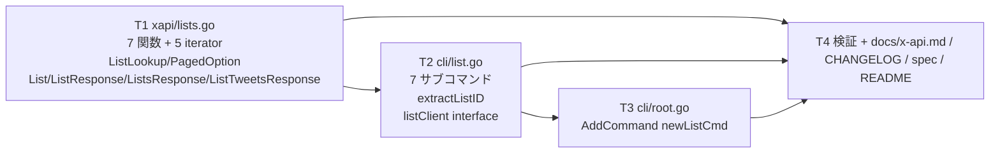
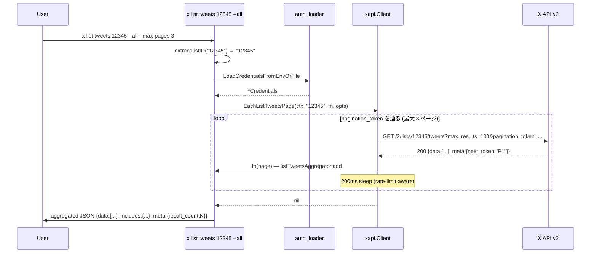
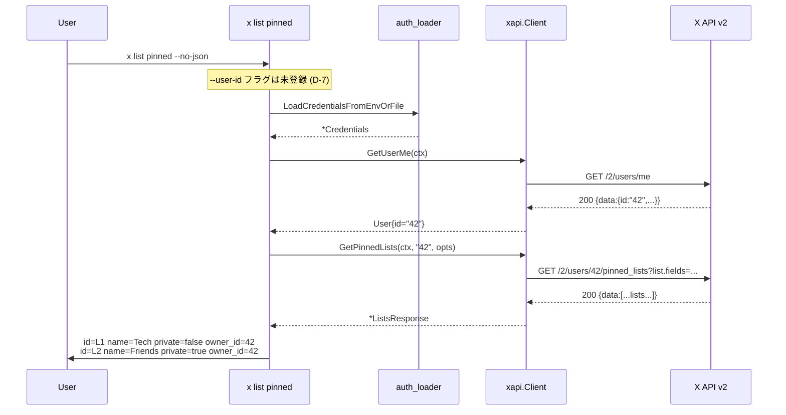

# M33: Lists — lookup / tweets / members / owned / followed / memberships / pinned

## Overview

| 項目 | 値 |
|------|---|
| ステータス | 着手中 |
| 対象 v リリース | v0.6.0 |
| Phase | I: readonly API 包括サポート (第 5 回) |
| 依存 | M29 (Tweet DTO / Includes / computeInterPageWait), M31 (TimelineResponse iterator パターン), M32 (3 Option 型 + DRY 共通 + extractUserRef + userClient interface) |
| Tier 要件 | OAuth 1.0a User Context (全 7 endpoint で利用可能、pinned_lists も OAuth1.0a 必須なので問題なし) |
| 主要対象ファイル | `internal/xapi/lists.go` (新規), `internal/xapi/lists_test.go` (新規), `internal/cli/list.go` (新規), `internal/cli/list_test.go` (新規), `internal/cli/root.go` (1 行追加), `internal/cli/root_test.go` (1 ケース追加), `docs/x-api.md`, `CHANGELOG.md` |

## Goal

`x list {get,tweets,members,owned,followed,memberships,pinned}` で X List 情報を取得する。
M32 で確立した「3 Option 型分離 + DRY 共通 fetch/each + interface + var-swap」パターンを 7 endpoint に適用する。

## 対象エンドポイント (X API v2 公式 docs で WebFetch 確認済)

| API | 説明 | max_results | pagination | iterator? |
|-----|------|-------------|------------|----------|
| `GET /2/lists/:id` | List 詳細 | — | — | no |
| `GET /2/lists/:id/tweets` | List のツイート | 1..100 (default 100) | `pagination_token` | yes |
| `GET /2/lists/:id/members` | List メンバー (User 配列) | 1..100 (default 100) | `pagination_token` | yes |
| `GET /2/users/:id/owned_lists` | 所有 List 一覧 | 1..100 (default 100) | `pagination_token` | yes |
| `GET /2/users/:id/list_memberships` | 参加 List 一覧 | 1..100 (default 100) | `pagination_token` | yes |
| `GET /2/users/:id/followed_lists` | フォロー中 List 一覧 | 1..100 (default 100) | `pagination_token` | yes |
| `GET /2/users/:id/pinned_lists` | ピン留め List 一覧 | — | — | no |

**Iterator は 5 個** (tweets / members / owned / memberships / followed)。
全 paged endpoint で **pagination_token 統一** (M32 search の `next_token` のような例外なし)。
`/2/users/:id/pinned_lists` は **self only** (X API 仕様、認証ユーザー本人のピン留めのみ取得可能)。

## Tasks (TDD: Red → Green → Refactor)

### T1: `internal/xapi/lists.go` 新規 — DTO + Option 型 + 7 関数 + 5 iterator

**目的**: 7 endpoint をラップする xapi 層を `lists.go` に集約する。

- 対象: `internal/xapi/lists.go` (新規), `internal/xapi/lists_test.go` (新規)
- **DTO 追加 (新規)**:
  ```go
  // List は X API v2 の List オブジェクトを表す DTO である (M33)。
  //
  // 必須フィールド (id / name) は X API がデフォルトで返却する。
  // それ以外 (Private / Description / OwnerID / MemberCount / FollowerCount / CreatedAt) は
  // `list.fields` クエリパラメータで明示的に要求した場合のみ返却される。
  type List struct {
      ID            string `json:"id"`
      Name          string `json:"name"`
      Private       bool   `json:"private,omitempty"`
      Description   string `json:"description,omitempty"`
      OwnerID       string `json:"owner_id,omitempty"`
      MemberCount   int    `json:"member_count,omitempty"`
      FollowerCount int    `json:"follower_count,omitempty"`
      CreatedAt     string `json:"created_at,omitempty"`
  }

  // ListResponse は GetList の単一 List レスポンス本体 (M33)。
  type ListResponse struct {
      Data     *List    `json:"data,omitempty"`
      Includes Includes `json:"includes,omitempty"` // expansions=owner_id で users が詰まる
  }

  // ListsResponse は GetOwnedLists / GetListMemberships / GetFollowedLists / GetPinnedLists が返す
  // List 配列レスポンス本体 (M33)。GetListMembers (User 配列) は UsersResponse、
  // GetListTweets (Tweet 配列) は ListTweetsResponse を用いる。
  type ListsResponse struct {
      Data     []List   `json:"data,omitempty"`
      Includes Includes `json:"includes,omitempty"`
      Meta     Meta     `json:"meta,omitempty"`
  }

  // ListTweetsResponse は GetListTweets が返す Tweet 配列レスポンス本体 (M33)。
  //
  // 型としては既存 TimelineResponse / LikedTweetsResponse とフィールド構成は同一だが、
  // 責務分離 (どの endpoint のレスポンスか) を明示するため別型として定義する。
  type ListTweetsResponse struct {
      Data     []Tweet  `json:"data,omitempty"`
      Includes Includes `json:"includes,omitempty"`
      Meta     Meta     `json:"meta,omitempty"`
  }
  ```
  - `GetListMembers` のレスポンス型は **既存 `UsersResponse` (M32) を再利用する** (D-4)。
- **Option 型 (2 種類に分離、M32 D-1 パターン継承)**:
  - **`ListLookupOption`** (`listLookupConfig`) — `GetList` 専用 (max_results なし)
    - `WithListLookupListFields(...string)` / `WithListLookupExpansions(...string)` / `WithListLookupUserFields(...string)`
  - **`ListPagedOption`** (`listPagedConfig`) — paged 5 endpoint で共通 (pagination_token + max_results)
    - `WithListPagedMaxResults(int)` (0 は no-op、1..100)
    - `WithListPagedPaginationToken(string)`
    - `WithListPagedListFields(...string)` / `WithListPagedUserFields(...string)` / `WithListPagedTweetFields(...string)` / `WithListPagedExpansions(...string)` / `WithListPagedMediaFields(...string)` (tweets endpoint で必要)
    - `WithListPagedMaxPages(int)` — Each 専用 (default 50)
  - `GetPinnedLists` も lookup 系 (paginate なし) だが、`list.fields` / `expansions` / `user.fields` のみ受け取る。**`ListLookupOption` を再利用する** (D-5)
- **定数**:
  ```go
  const (
      listPagedDefaultMaxPages     = 50
      listPagedRateLimitThreshold  = 2

      // path suffix
      listPagedSuffixTweets        = "tweets"  // /2/lists/:id/tweets
      listPagedSuffixMembers       = "members" // /2/lists/:id/members
      userListsSuffixOwned         = "owned_lists"
      userListsSuffixMemberships   = "list_memberships"
      userListsSuffixFollowed      = "followed_lists"
      userListsSuffixPinned        = "pinned_lists"
  )
  ```
- **7 公開関数**:
  - `(c *Client) GetList(ctx, listID string, opts ...ListLookupOption) (*ListResponse, error)`
  - `(c *Client) GetListTweets(ctx, listID string, opts ...ListPagedOption) (*ListTweetsResponse, error)`
  - `(c *Client) GetListMembers(ctx, listID string, opts ...ListPagedOption) (*UsersResponse, error)` — 既存 UsersResponse 再利用 (D-4)
  - `(c *Client) GetOwnedLists(ctx, userID string, opts ...ListPagedOption) (*ListsResponse, error)`
  - `(c *Client) GetListMemberships(ctx, userID string, opts ...ListPagedOption) (*ListsResponse, error)`
  - `(c *Client) GetFollowedLists(ctx, userID string, opts ...ListPagedOption) (*ListsResponse, error)`
  - `(c *Client) GetPinnedLists(ctx, userID string, opts ...ListLookupOption) (*ListsResponse, error)` — paged なしの ListsResponse
- **5 iterator**:
  - `(c *Client) EachListTweetsPage(ctx, listID, fn func(*ListTweetsResponse) error, opts ...ListPagedOption) error`
  - `(c *Client) EachListMembersPage(ctx, listID, fn func(*UsersResponse) error, opts ...ListPagedOption) error`
  - `(c *Client) EachOwnedListsPage(ctx, userID, fn func(*ListsResponse) error, opts ...ListPagedOption) error`
  - `(c *Client) EachListMembershipsPage(ctx, userID, fn func(*ListsResponse) error, opts ...ListPagedOption) error`
  - `(c *Client) EachFollowedListsPage(ctx, userID, fn func(*ListsResponse) error, opts ...ListPagedOption) error`
- **DRY 共通ヘルパ (3 種類、レスポンス型ごとに分離)**:
  - レスポンス型が `ListsResponse` (List 配列) のものは `(c *Client) fetchListsPage(ctx, path string, cfg *listPagedConfig, funcName string) (*listsPageFetched, error)` + `eachListsPagedPage(ctx, funcName string, pathBuilder func(*listPagedConfig) string, fn func(*ListsResponse) error, opts []ListPagedOption) error` で共有 (owned/memberships/followed の 3 endpoint)
  - レスポンス型が `UsersResponse` (User 配列) の members は専用 `fetchListMembersPage` (M32 graph と同じ shape だが path 違いのため別関数、または `eachUserGraphPage` を **テスト後に統合できるか再評価** — D-3)
  - レスポンス型が `ListTweetsResponse` (Tweet 配列) の tweets は専用 `fetchListTweetsPage`

  実装の簡潔化のため、**3 つの fetch/each ヘルパを別実装で書く** (D-3)。レスポンス型が異なるので generics 化しないと統合できず、本マイルストーンでは generics 採用は **見送る** (理由は D-2 参照)。
- **共通 URL ビルダ (1 個)**:
  - `buildListPagedURL(baseURL, path string, cfg *listPagedConfig) string` — paged 5 endpoint で共有 (max_results / pagination_token / list.fields / user.fields / tweet.fields / expansions / media.fields)
  - `buildListLookupURL(baseURL, path string, cfg *listLookupConfig) string` — GetList / GetPinnedLists で共有 (list.fields / expansions / user.fields のみ)
- **バリデーション**:
  - `listID == ""` / `userID == ""` → `fmt.Errorf("xapi: %s: listID/userID must be non-empty", funcName)`
  - max_results は no-op (CLI 側で 1..100 範囲チェック)
- **パッケージ doc**: 新規ファイル `lists.go` には書かない (revive: package-comments、既存 `oauth1.go` 等に集約済、D-11)
- **テスト** (`lists_test.go` 新規、最低 25 ケース、4 グループ):
  - **Lookup (2 endpoint × 2-3 ケース = 5 ケース)**:
    1. `TestGetList_HitsCorrectEndpoint` — `/2/lists/<id>` path + GET
    2. `TestGetList_AllOptionsReflected` — list.fields / expansions / user.fields クエリ反映
    3. `TestGetList_404_NotFound` — ErrNotFound
    4. `TestGetList_EmptyListID_RejectsArgument` (server not called)
    5. `TestGetList_InvalidJSON_NoRetry`
  - **List tweets/members (4 ケース)**:
    6. `TestGetListTweets_HitsCorrectEndpoint` — `/2/lists/<id>/tweets`
    7. `TestGetListTweets_AllOptionsReflected` — max_results / pagination_token / tweet.fields
    8. `TestGetListMembers_HitsCorrectEndpoint` — `/2/lists/<id>/members`
    9. `TestEachListTweetsPage_MultiPage_FullTraversal` — pagination_token 連鎖 2 ページ
  - **Owned/Memberships/Followed (8 ケース)**:
    10. `TestGetOwnedLists_HitsCorrectEndpoint`
    11. `TestGetListMemberships_HitsCorrectEndpoint`
    12. `TestGetFollowedLists_HitsCorrectEndpoint`
    13. `TestGetOwnedLists_AllOptionsReflected` (代表 1 つで充分)
    14. `TestEachOwnedListsPage_MultiPage_FullTraversal`
    15. `TestEachOwnedListsPage_MaxPagesTruncates`
    16. `TestEachOwnedListsPage_RateLimitSleep` — remaining=1 で sleep > 200ms
    17. `TestGetOwnedLists_EmptyUserID_RejectsArgument`
  - **Pinned (3 ケース)**:
    18. `TestGetPinnedLists_HitsCorrectEndpoint` — `/2/users/<id>/pinned_lists`
    19. `TestGetPinnedLists_AllOptionsReflected` (list.fields のみ反映)
    20. `TestGetPinnedLists_EmptyUserID_RejectsArgument`
  - **Decode error / path escape (4 ケース)**:
    21. `TestGetListTweets_PathEscape` (listID に特殊文字)
    22. `TestGetOwnedLists_PathEscape` (userID に特殊文字)
    23. `TestGetListTweets_InvalidJSON_NoRetry`
    24. `TestGetListMembers_InvalidJSON_NoRetry`
  - **Pagination param name pin (advisor 反映)**:
    25. `TestEachListMembersPage_PaginationParamName` — members endpoint で送信されるクエリ名が **`pagination_token`** であることを pin (X API docs に `next_token` 表記が混在するため明示)。
    26. `TestEachOwnedListsPage_PaginationParamName` — 同様に owned で `pagination_token` 送信を pin。
  - **Optional**:
    27. `TestEachListMembersPage_InterPageDelay` — remaining=50 → 200ms

### T2: `internal/cli/list.go` 新規 — 7 サブコマンド + listClient interface + extractListID

**目的**: CLI factory を新設。M32 の流儀 (interface + var-swap + 中間ヘルパ + 排他検証) を踏襲。

- 対象: `internal/cli/list.go` (新規), `internal/cli/list_test.go` (新規)
- **定数**:
  ```go
  const (
      listDefaultListFields   = "id,name,description,private,owner_id,member_count,follower_count"
      listDefaultUserFields   = "username,name"
      listDefaultTweetFields  = "id,text,author_id,created_at,entities,public_metrics,note_tweet,conversation_id"
      listDefaultExpansions   = ""  // GetList: "owner_id" を CLI 既定にすると未指定時の挙動が変わるため空
      listDefaultMediaFields  = ""

      // listMaxResultsCap は List 系 paged endpoint の per-page 上限 (X API 仕様、全 endpoint で 100)。
      listMaxResultsCap = 100
  )
  ```
- **`listClient` interface (新規、M32 D-12 パターン継承)**:
  ```go
  type listClient interface {
      GetUserMe(ctx context.Context, opts ...xapi.UserFieldsOption) (*xapi.User, error)
      GetUserByUsername(ctx context.Context, username string, opts ...xapi.UserLookupOption) (*xapi.UserResponse, error)
      GetList(ctx context.Context, listID string, opts ...xapi.ListLookupOption) (*xapi.ListResponse, error)
      GetListTweets(ctx context.Context, listID string, opts ...xapi.ListPagedOption) (*xapi.ListTweetsResponse, error)
      GetListMembers(ctx context.Context, listID string, opts ...xapi.ListPagedOption) (*xapi.UsersResponse, error)
      GetOwnedLists(ctx context.Context, userID string, opts ...xapi.ListPagedOption) (*xapi.ListsResponse, error)
      GetListMemberships(ctx context.Context, userID string, opts ...xapi.ListPagedOption) (*xapi.ListsResponse, error)
      GetFollowedLists(ctx context.Context, userID string, opts ...xapi.ListPagedOption) (*xapi.ListsResponse, error)
      GetPinnedLists(ctx context.Context, userID string, opts ...xapi.ListLookupOption) (*xapi.ListsResponse, error)
      EachListTweetsPage(ctx context.Context, listID string, fn func(*xapi.ListTweetsResponse) error, opts ...xapi.ListPagedOption) error
      EachListMembersPage(ctx context.Context, listID string, fn func(*xapi.UsersResponse) error, opts ...xapi.ListPagedOption) error
      EachOwnedListsPage(ctx context.Context, userID string, fn func(*xapi.ListsResponse) error, opts ...xapi.ListPagedOption) error
      EachListMembershipsPage(ctx context.Context, userID string, fn func(*xapi.ListsResponse) error, opts ...xapi.ListPagedOption) error
      EachFollowedListsPage(ctx context.Context, userID string, fn func(*xapi.ListsResponse) error, opts ...xapi.ListPagedOption) error
  }
  var newListClient = func(ctx context.Context, creds *config.Credentials) (listClient, error) {
      return xapi.NewClient(ctx, creds), nil
  }
  ```
- **`extractListID(s string) (string, error)`** (M32 `extractUserRef` パターン、D-6):
  - 純粋数字 (`^\d+$`) → `(s, nil)` — そのまま ID として扱う
  - URL: 固定 regex `^https?://(?:x|twitter)\.com/i/lists/(\d+)/?$` で match → `(captured, nil)`
  - 上記いずれにも該当しない → ErrInvalidArgument
  - `--ids` のような batch オプションは X API 仕様で存在しないため作らない
- **7 サブコマンド factory**:
  - `newListCmd()` — 親 (help のみ)、7 サブコマンド AddCommand
  - `newListGetCmd()` — `x list get <ID|URL>`
    - フラグ: `--list-fields`, `--expansions`, `--user-fields`, `--no-json`
    - 位置引数 → `extractListID` → GetList
  - `newListTweetsCmd()` — `x list tweets <ID|URL>`
    - フラグ: `--max-results` (default 100, 1..100), `--pagination-token`, `--all`, `--max-pages` (default 50), `--no-json`, `--ndjson`, `--tweet-fields`, `--expansions`, `--user-fields`, `--media-fields`
    - 出力: `--no-json` で `formatTweetHumanLine` (M29) 再利用
    - JST 系時刻フラグは登録しない (X API は List Tweets に start_time/end_time をサポートしない、D-9)
  - `newListMembersCmd()` — `x list members <ID|URL>`
    - フラグ: `--max-results` (default 100, 1..100), `--pagination-token`, `--all`, `--max-pages`, `--no-json`, `--ndjson`, `--user-fields`, `--expansions`, `--tweet-fields`
    - 出力: User 配列を `formatUserHumanLine` (M32) 再利用
  - `newListOwnedCmd()` — `x list owned [<ID|@username|URL>]`
    - フラグ: `--user-id` (default: self), `--max-results`, `--pagination-token`, `--all`, `--max-pages`, fields, `--no-json`, `--ndjson`
    - 位置引数 → M32 `extractUserRef` 再利用 → username なら GetUserByUsername で ID 解決
    - 位置引数も `--user-id` もない → GetUserMe で self
  - `newListFollowedCmd()` — `x list followed [<ID|@username|URL>]` (owned と同形)
  - `newListMembershipsCmd()` — `x list memberships [<ID|@username|URL>]` (owned と同形)
  - `newListPinnedCmd()` — `x list pinned`
    - **self only** (X API 仕様): `--user-id` フラグを公開しない (M32 D-5 パターン継承、D-7)
    - フラグ: `--list-fields`, `--expansions`, `--user-fields`, `--no-json`
    - 常に GetUserMe → self ID で GetPinnedLists
- **`listAggregator` (List 配列集約)** + **`listTweetsAggregator` (Tweet 配列集約、`timelineAggregator` の 4 つ目のコピー)**:
  - **D-2 aggregator generics 化判断**: M31 D-2 で「4 つ目で generics 化検討」と約束していたが、本 M33 では再評価し **見送る**。理由:
    1. M32 で `[]Tweet` (liked/search/timeline) と `[]User` (search-users/graph) で型分岐が既に発生済 (`userAggregator` を別型で定義)
    2. M33 ではさらに `[]List` (owned/memberships/followed/pinned) と `[]User` (members) と `[]Tweet` (list tweets) の 3 系統が増える
    3. **5 種類の型** (Tweet / User / List × 3 endpoint shape) に対する generics 化は Go 1.26 でも複雑化する (`aggregator[T any, R responseShape[T]]` のような 2 段 generics)
    4. 各 aggregator は 25 行程度の単純コピーで、メンテコスト > generics 化コストの判定
    5. **判断**: M33 で **`listsAggregator` (List 配列) と `listTweetsAggregator` (Tweet 配列) を新規定義**、members は M32 `userAggregator` を再利用
    6. 将来 M34 (Spaces 4 つ目の独自配列) で再度評価する余地は残す
- **バリデーション順**:
  1. 位置引数 / フラグの整合性
  2. `--max-results` 範囲 1..100
  3. `--no-json` × `--ndjson` 排他 → `decideOutputMode` (M11) 再利用
  4. authn → client → listID/userID 解決
- **パッケージ doc**: 新規ファイル `cli/list.go` には書かない (D-11)
- **テスト** (`list_test.go` 新規、最低 22 ケース):
  - **get (4 ケース)**:
    1. `TestListGet_ByID_DefaultJSON` — `/2/lists/42`
    2. `TestListGet_ByURL` — `https://x.com/i/lists/123` → `/2/lists/123`
    3. `TestListGet_NoJSON_HumanFormat`
    4. `TestListGet_InvalidID_Rejects` (exit 2)
  - **tweets (3 ケース)**:
    5. `TestListTweets_DefaultJSON` — `/2/lists/<id>/tweets?max_results=100`
    6. `TestListTweets_All_AggregatesPages` (2 ページ集約)
    7. `TestListTweets_NDJSON_Streams`
  - **members (2 ケース)**:
    8. `TestListMembers_DefaultJSON`
    9. `TestListMembers_NoJSON_HumanFormat` — User 形式 `id=... username=... name=...`
  - **owned / followed / memberships (5 ケース)**:
    10. `TestListOwned_UserIDDefaultsToMe` — `/2/users/me` → `/2/users/42/owned_lists`
    11. `TestListOwned_UserIDExplicit` — `--user-id 99` で GetUserMe 呼ばない
    12. `TestListOwned_UsernamePositional_ResolvesViaGetUserByUsername` (M32 D-7 パターン)
    13. `TestListFollowed_DefaultJSON`
    14. `TestListMemberships_DefaultJSON`
  - **pinned (3 ケース)**:
    15. `TestListPinned_AlwaysResolvesSelf` — GetUserMe → `/2/users/42/pinned_lists`
    16. `TestListPinned_NoUserIDFlag_Pinned` — `cmd.Flag("user-id") == nil`
    17. `TestListPinned_NoJSON_HumanFormat`
  - **共通 (5 ケース)**:
    18. `TestList_NoJSON_NDJSON_MutuallyExclusive`
    19. `TestListTweets_MaxResultsOutOfRange` (0 / 101 で exit 2)
    20. `TestExtractListID_Numeric`
    21. `TestExtractListID_URL`
    22. `TestExtractListID_Invalid_Rejects`

### T3: `internal/cli/root.go` — `AddCommand(newListCmd())`

- `root.AddCommand(newListCmd())` を `newUserCmd()` の直後に追加
- `root_test.go` に `TestRootHelpShowsList` を追加 (1 ケース)

### T4: 検証 + Docs

**検証**:
- `go test -race -count=1 ./...` 全 pass
- `GOLANGCI_LINT_CACHE=$TMPDIR/golangci-cache golangci-lint run ./...` 0 issues
- `go vet ./...` 0
- `go build -o /tmp/x ./cmd/x` 成功

**ドキュメント更新**:
- `docs/specs/x-spec.md` §6 CLI: `x list {get,tweets,members,owned,followed,memberships,pinned}` の各フラグ表を追加
- `docs/x-api.md`: 7 endpoint 表 (pagination_token 統一、self-only 制約、max_results 1..100)、Rate Limit 表更新
- `README.md` / `README.ja.md`: CLI サブコマンド一覧に `list ...` 追加
- `CHANGELOG.md`: 既存 `[0.6.0]` セクションに M33 追加項目を追記 (M32 で開始済の v0.6.0 サイクル内のため新規セクション不要、D-8)
  ```markdown
  ### Added
  - `x list get <ID|URL>` — List 詳細取得 (URL は https://x.com/i/lists/<ID> 形式) [M33]
  - `x list tweets <ID|URL>` — List ツイート一覧 (max_results 1..100, --all) [M33]
  - `x list members <ID|URL>` — List メンバー (User 配列) 一覧 [M33]
  - `x list owned [<ID|@username|URL>]` — 所有 List 一覧 [M33]
  - `x list memberships [<ID|@username|URL>]` — 参加 List 一覧 [M33]
  - `x list followed [<ID|@username|URL>]` — フォロー中 List 一覧 [M33]
  - `x list pinned` — ピン留め List 一覧 (self only) [M33]
  ```

## Completion Criteria

- `go test -race -count=1 ./...` 全 pass (新規テスト 45+ ケース、目標 T1=25 + T2=22 + T3=1)
- `golangci-lint run ./...` 0 issues, `go vet ./...` 0
- 7 endpoint の URL 組み立て (path/query) がテストで pin
- 5 iterator の `pagination_token` 自動辿りがテストで pin
- `extractListID` の数値 / URL / 不正分岐がテストで pin
- `pinned` で `--user-id` フラグ未登録 pin
- `docs/x-api.md` に 7 endpoint の仕様 (pagination_token / self-only) が記載
- `CHANGELOG.md [0.6.0]` に M33 サブコマンド追記
- 各タスクが独立コミット (Conventional Commits 日本語、フッター `Plan: plans/x-m33-lists.md`、push 不要)

## 設計上の決定事項

| # | テーマ | 採用 | 理由 |
|---|--------|------|------|
| D-1 | 用途別 2 Option 型 | `ListLookupOption` (lookup/pinned) / `ListPagedOption` (paged 5 endpoint) に分離 | M32 の 3 Option 型分離と同方針。lookup は max_results なし、paged は 1..100 + pagination_token。Pinned は paged ではないので Lookup 型を再利用 (D-5)。 |
| D-2 | aggregator generics 化 | **見送り (新規 listsAggregator / listTweetsAggregator を定義)** | M31 D-2 の「4 つ目で再評価」を本 M33 で実施した結果、M32 で型分岐 ([]User vs []Tweet) が発生済、M33 でさらに []List が加わり 3 系統 5 種類のレスポンスが存在。generics 化は Go 1.26 でも 2 段 generics (`aggregator[T, R]`) になり、各 aggregator が 25 行のコピーで済む利益とのバランスで見送り。将来 M34 で再評価。 |
| D-3 | DRY 共通 fetch ヘルパ | レスポンス型ごとに **3 種類** (ListsResponse / UsersResponse / ListTweetsResponse) を別実装 | 同上 D-2 の理由で generics 化しないと統合不可。M32 graph (UsersResponse) の `fetchUserGraphPage` は path/suffix 構造が異なる (`/2/users/:id/<suffix>` vs `/2/lists/:id/<suffix>` vs `/2/users/:id/<suffix>` for owned/memberships) ため別実装の方が読みやすい。 |
| D-4 | GetListMembers のレスポンス型 | **既存 `UsersResponse` (M32) を再利用** | List メンバーは User オブジェクトの配列で、構造は M32 で定義した UsersResponse と完全一致。新規型を増やさない (DRY)。 |
| D-5 | GetPinnedLists の Option 型 | **`ListLookupOption` を再利用** (paginate なしのため) | Pinned は paginate なし (X API 仕様確認済)。Lookup と同じく list.fields / expansions / user.fields のみ受け取るので、新規型を定義せず再利用する。 |
| D-6 | extractListID 設計 | `(value string, err error)` シグネチャ、数値 / `https://x.com/i/lists/<NUM>` URL のみ許可 | M32 `extractUserRef` の発想を踏襲。Lists は数値 ID のみ (username 同等の機能なし) なので boolean フラグ不要。URL は X の公式 List 共有形式 (`/i/lists/<NUM>`) のみ。 |
| D-7 | pinned の `--user-id` | **フラグ自体を公開しない** (M32 D-5 precedent) | X API 仕様で self のみ参照可能。フラグを出すと「なぜ無視されるか」UX 上不明。テストで `cmd.Flag("user-id") == nil` を pin。常に GetUserMe で self ID を解決。 |
| D-8 | CHANGELOG | 既存 `[0.6.0]` セクションに **追記** (M32 と同じバージョンサイクル) | M32 で `[0.6.0] (draft, unreleased)` を作成済。M33 は同 v0.6.0 リリース内のため新規セクション不要。 |
| D-9 | list tweets の JST 系時刻フラグ | **登録しない** | X API `/2/lists/:id/tweets` は start_time/end_time/since_id/until_id 等の時刻フィルタを **サポートしない** (docs 確認済)。timeline 系と異なるため統一せず、ペイロード上必要な分のみ登録。 |
| D-10 | owned/followed/memberships の username 位置引数 | M32 `extractUserRef` + 後段 GetUserByUsername で 2 API call (D-7 of M32 と同パターン) | username → ID 解決を CLI 層で吸収するのが UX として自然。1 API call 余分に消費するが godoc に明記。 |
| D-11 | パッケージ doc | 新規ファイル `xapi/lists.go` / `cli/list.go` には書かない | revive: package-comments (M29 D-5 / M30 D-11 / M31 D-11 / M32 D-11 継続)。既存 `oauth1.go` (xapi) / `root.go` (cli) に集約済 |
| D-12 | client interface | **新規 `listClient` interface** (tweetClient / timelineClient / userClient と独立) | userClient は 15 メソッド、listClient は 13 メソッド。混在させず責務分離。GetUserMe + GetUserByUsername は user/list 両方で重複だが低コスト (M32 D-12 と同方針)。 |
| D-13 | `GetUserByUsername` を listClient に含めるか | 含める (graph endpoints の username 位置引数解決のため) | owned/followed/memberships の位置引数で `@alice` を渡されたとき、`GetUserByUsername` を CLI 層で呼ぶ必要がある (D-10)。M32 と同じ責務分離。 |
| D-14 | List tweets の human 出力 | `formatTweetHumanLine` (M29) を再利用 | List Tweets は Tweet 配列で、既存 timeline / liked と同形。新規 formatter 不要。 |
| D-15 | List members の human 出力 | `formatUserHumanLine` (M32) を再利用 | List Members は User 配列で、M32 user 系と同形。新規 formatter 不要。 |
| D-16 | List 配列 (owned/memberships/followed/pinned) の human 出力 | 新規 `formatListHumanLine` を定義 | List は新規型 DTO のため、`id=<id>\tname=<name>\tprivate=<bool>\towner_id=<id>` 形式の human formatter を新規追加。 |

## Risks

| リスク | 対策 |
|--------|------|
| pinned_lists の self ガードを忘れて 401 が返る | D-7 で `--user-id` フラグ未登録 + テスト pin、xapi 層は素直に呼び出すだけで CLI 層が責務 |
| extractListID の URL 解析失敗 | D-6 で `i/lists/<NUM>` パターンを正確に判別、numericIDRE で末尾数値確認、テスト pin |
| max_results 範囲を 1..1000 と取り違える (M32 search graph の影響) | List 系は **1..100** (全 endpoint 統一、確認済)。constants `listMaxResultsCap = 100` で明示。 |
| aggregator generics 化を逆に推進してしまう | D-2 で見送り判断と理由を明記。M34 で再評価する余地のみ残す |
| 5 種類のレスポンス型 (ListsResponse / ListTweetsResponse / UsersResponse / ListResponse / aggregator 派生) の責務混乱 | D-4 (UsersResponse 再利用) / D-5 (Pinned は Lookup 型) で型を最小化。各 endpoint のレスポンス型を表で明示 (本計画書) |
| GetListMembers の pagination パラメータ名 (docs に next_token と pagination_token の両表記あり、advisor 指摘) | **実装時は他 paged endpoint と統一して `pagination_token` を採用** (X API 仕様で全 paged endpoint で統一されているという観察を優先)。テストでクエリ名を明示的に pin (テスト #25/#26)。本番呼び出しで 400 が返れば、`next_token` への切替を検討する明示的トリガとして残す。 |
| owned/followed/memberships の username 位置引数で 2 API call (rate limit 消費) | D-10 で godoc に明記、テストで `paths[0]=/2/users/by/username/...` → `paths[1]=/2/users/<id>/<suffix>` を pin |

## Mermaid: 依存関係



## Mermaid: `x list tweets <ID> --all` のシーケンス



## Mermaid: `x list pinned` のシーケンス



## Implementation Order (各タスク独立コミット、push 不要)

1. **T1 (Red)**: `lists_test.go` に 25 ケース追加 → コンパイル失敗 (関数未定義)
2. **T1 (Green)**: `lists.go` に DTO / Option / 7 関数 + 5 iterator + 内部ヘルパ実装 → pass
3. **T1 (Refactor)**: DRY ヘルパ整理、godoc 整備
4. **T1 commit**: `feat(xapi): lists lookup/paged 7 endpoint を追加 (M33)`
5. **T2 (Red)**: `list_test.go` に 22 ケース追加 → 落ちる
6. **T2 (Green)**: `cli/list.go` 実装 → pass
7. **T2 commit**: `feat(cli): x list サブコマンド群を追加 (get/tweets/members/owned/followed/memberships/pinned)`
8. **T3 (Red→Green)**: `root_test.go` に `TestRootHelpShowsList` 追加 + `root.go` の `AddCommand(newListCmd())` 行追加
9. **T3 commit**: `feat(cli): root に list コマンドを接続`
10. **T4 (Docs)**: `docs/x-api.md` 追記 / spec §6 / README 英日 / CHANGELOG `[0.6.0]` 追記 / 最終 test/lint/vet
11. **T4 commit**: `docs(m33): x-api.md / spec / README / CHANGELOG に list 系を追記`

各コミットのフッターに必ず `Plan: plans/x-m33-lists.md` を含める。push は不要 (ローカルコミットまで)。

## Handoff to M34 (Spaces + Trends)

- M33 で確立した「2 Option 型 (Lookup/Paged) + DRY 共通 + listClient interface + extractListID」を M34 で同形採用。Spaces は spaces search + spaces by ID lookup + space tweets/buyers/posts、Trends は trends by location の構造。
- **aggregator generics 化**: M34 で 5 つ目の独自配列 (Space / Trend 配列) が増える可能性。M33 D-2 で見送り判断を行い、M34 で再評価する余地のみ残した。
- `extractUserRef` (M32) は M33 で再利用済 (owned/followed/memberships の username 位置引数解決)。同様のユーティリティが必要なら M34 でも再利用可。
- M36 で MCP v2 tools 追加時、`get_list` / `get_list_tweets` / `get_list_members` の 3 ツールは CLI の薄いラッパーとして実装可能。
- 検証 (M32 完了時点): `go test -race -count=1 ./...` 全 pass / lint 0 / vet 0。M33 でも同水準を維持。

## advisor 反映ログ

### 計画策定後 (Phase 2)

(advisor 1 回目を Phase 2 完了時に実施予定)
