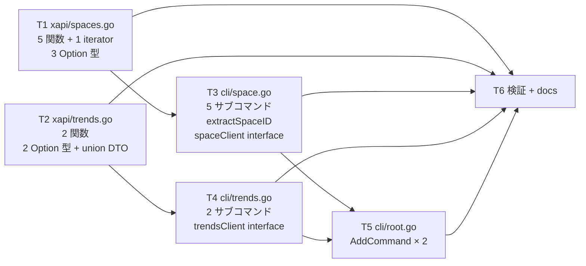
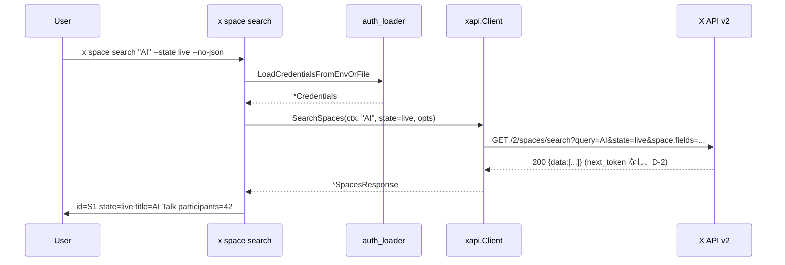
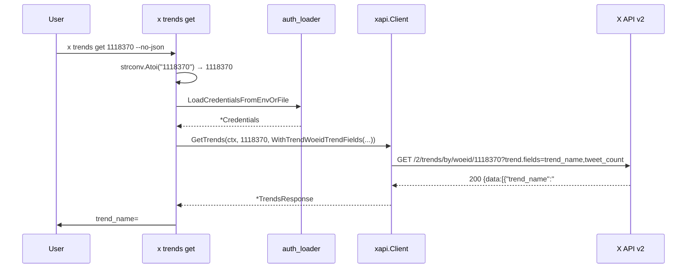

# M34: Spaces (lookup / search / by-creator / tweets) + Trends (woeid / personalized)

## Overview

| 項目 | 値 |
|------|---|
| ステータス | 着手中 |
| 対象 v リリース | v0.7.0 |
| Phase | I: readonly API 包括サポート (第 6 回) |
| 依存 | M29 (Tweet DTO / Includes / computeInterPageWait / fetchJSON), M32 (3 Option 型分離 + DRY), M33 (2 Option 型 + paged DRY + extractListID パターン + listClient interface) |
| Tier 要件 | OAuth 1.0a User Context (本 M34 範囲全 7 endpoint 対応、buyers のみ OAuth 2.0 PKCE 専用で除外) |
| 主要対象ファイル | `internal/xapi/spaces.go` / `spaces_test.go` / `trends.go` / `trends_test.go` (4 新規), `internal/cli/space.go` / `space_test.go` / `trends.go` / `trends_test.go` (4 新規), `internal/cli/root.go` / `root_test.go` (2 行 + 2 ケース追記), `docs/x-api.md`, `docs/specs/x-spec.md`, `README.md` / `README.ja.md`, `CHANGELOG.md` |
| 注意 | Spaces はアクティブな Space (live/scheduled) のみ取得可能 (終了済みは取得不可) |

## Goal

`x space {get,by-ids,search,by-creator,tweets}` でアクティブ Space を取得し、`x trends {get,personal}` でトレンドを確認できる。
M33 で確立した「用途別 Option 型分離 + DRY 共通 + extractXxxID + 専用 client interface + var-swap」パターンを踏襲しつつ、SearchSpaces のページング非対応・Trends 2 endpoint のパラメータ名差分を仕様に忠実に反映する。

## 対象エンドポイント (X API v2 公式 docs WebFetch 確認済 — 2026-05-15)

### Spaces (5 endpoint)

| API | 説明 | per-call | pagination | iterator? |
|-----|------|---------|------------|-----------|
| `GET /2/spaces/:id` | Space 詳細 | — | — | no |
| `GET /2/spaces` | 複数 Space バッチ (`?ids=`) | 1..100 | — | no |
| `GET /2/spaces/search` | キーワード検索 | 1..100 (default 100) | **non-paginated (検証済)** | no |
| `GET /2/spaces/by/creator_ids` | 作成者 ID 指定 (`?user_ids=`) | 1..100 | — | no |
| `GET /2/spaces/:id/tweets` | Space 内 Tweet | (X API 仕様で default、CLI も無指定で X API デフォルトに従う) | `pagination_token` | **yes** |

検証: `docs.x.com/x-api/spaces/search-spaces` OpenAPI 仕様で `meta.next_token` 不在を確認 (2026-05-15)。将来 X API が追加対応した場合に備え、`SpaceSearchOption` は分離して別型として定義し、後付けで `WithSpaceSearchNextToken` を追加できる余地を残す (advisor 指摘 #2 反映)。

除外: `GET /2/spaces/:id/buyers` (OAuth 2.0 PKCE 専用、本プロジェクト方針)。

### Trends (2 endpoint) — パラメータ名が異なる

| API | クエリパラメータ | fields 名 | fields 値 |
|-----|------------------|-----------|----------|
| `GET /2/trends/by/woeid/:id` | `max_trends` (1..50, default 20), `trend.fields` | `trend.fields` | `trend_name`, `tweet_count` |
| `GET /2/users/personalized_trends` | `personalized_trend.fields` のみ (max_results なし) | `personalized_trend.fields` | `category`, `post_count`, `trend_name`, `trending_since` |

検証: `docs.x.com/x-api/trends/get-trends-by-woeid` / `get-personalized-trends` (2026-05-15)。
- woeid endpoint は **`max_trends`** (≠ `max_results`)、上限 50 (≠ 100)、tweet_count を含む
- personalized endpoint は **fields 名が `personalized_trend.fields`** (≠ `trend.fields`)、tweet_count ではなく **`post_count`**、上限指定なし

→ **DTO とパラメータを 2 endpoint で分離する** (D-3, D-4 参照)。

WOEID 例: 東京=1118370 / 日本=23424856 / 全世界=1

## Tasks (TDD: Red → Green → Refactor)

### T1: `internal/xapi/spaces.go` 新規 — DTO + 3 Option 型 + 5 関数 + 1 iterator

**目的**: 5 endpoint をラップする xapi 層を spaces.go に集約する。

- 対象: `internal/xapi/spaces.go` (新規), `internal/xapi/spaces_test.go` (新規)
- **DTO 追加**:
  ```go
  // Space は X API v2 の Space オブジェクトを表す DTO である (M34)。
  // 必須 (id) は default 返却。残りは `space.fields` で要求した場合のみ。
  type Space struct {
      ID               string   `json:"id"`
      State            string   `json:"state,omitempty"` // "live" / "scheduled" / "ended"
      Title            string   `json:"title,omitempty"`
      HostIDs          []string `json:"host_ids,omitempty"`
      CreatorID        string   `json:"creator_id,omitempty"`
      CreatedAt        string   `json:"created_at,omitempty"`
      StartedAt        string   `json:"started_at,omitempty"`
      EndedAt          string   `json:"ended_at,omitempty"`
      UpdatedAt        string   `json:"updated_at,omitempty"`
      ScheduledStart   string   `json:"scheduled_start,omitempty"`
      InvitedUserIDs   []string `json:"invited_user_ids,omitempty"`
      SpeakerIDs       []string `json:"speaker_ids,omitempty"`
      TopicIDs         []string `json:"topic_ids,omitempty"`
      Lang             string   `json:"lang,omitempty"`
      IsTicketed       bool     `json:"is_ticketed,omitempty"`
      ParticipantCount int      `json:"participant_count,omitempty"`
      SubscriberCount  int      `json:"subscriber_count,omitempty"`
  }

  // SpaceResponse は GetSpace の単一レスポンス本体。
  type SpaceResponse struct {
      Data     *Space   `json:"data,omitempty"`
      Includes Includes `json:"includes,omitempty"`
  }

  // SpacesResponse は GetSpaces / SearchSpaces / GetSpacesByCreatorIDs の配列レスポンス。
  type SpacesResponse struct {
      Data     []Space  `json:"data,omitempty"`
      Includes Includes `json:"includes,omitempty"`
      Meta     Meta     `json:"meta,omitempty"`
  }

  // SpaceTweetsResponse は GetSpaceTweets の Tweet 配列レスポンス。
  // 既存 TimelineResponse 等と同形だが、責務分離のため別型とする。
  type SpaceTweetsResponse struct {
      Data     []Tweet  `json:"data,omitempty"`
      Includes Includes `json:"includes,omitempty"`
      Meta     Meta     `json:"meta,omitempty"`
  }
  ```
- **Option 型 (3 種類、advisor 指摘 #1 反映)**:
  - **`SpaceLookupOption`** (`spaceLookupConfig`) — `GetSpace` / `GetSpaces` / `GetSpacesByCreatorIDs` 共通 (search は含まない)
    - `WithSpaceLookupSpaceFields(...)` / `WithSpaceLookupExpansions(...)` / `WithSpaceLookupUserFields(...)` / `WithSpaceLookupTopicFields(...)`
    - max_results / state は持たない (誤用防止)
  - **`SpaceSearchOption`** (`spaceSearchConfig`) — `SearchSpaces` 専用
    - `WithSpaceSearchMaxResults(int)` (0 no-op、1..100、CLI 層でレンジチェック)
    - `WithSpaceSearchState(string)` (live/scheduled/all、空は無指定)
    - `WithSpaceSearchSpaceFields(...)` / `WithSpaceSearchExpansions(...)` / `WithSpaceSearchUserFields(...)` / `WithSpaceSearchTopicFields(...)`
    - 将来 next_token サポート時に `WithSpaceSearchNextToken` を追加できる構造
  - **`SpaceTweetsOption`** (`spaceTweetsConfig`) — `GetSpaceTweets` / `EachSpaceTweetsPage` 用
    - `WithSpaceTweetsMaxResults(int)` / `WithSpaceTweetsPaginationToken(string)`
    - `WithSpaceTweetsTweetFields(...)` / `WithSpaceTweetsUserFields(...)` / `WithSpaceTweetsExpansions(...)` / `WithSpaceTweetsMediaFields(...)`
    - `WithSpaceTweetsMaxPages(int)` (default 50)
- **定数**:
  ```go
  const (
      spaceTweetsDefaultMaxPages    = 50
      spaceTweetsRateLimitThreshold = 2
      spaceLookupBatchMaxIDs        = 100 // GetSpaces / GetSpacesByCreatorIDs
  )
  ```
- **5 公開関数 + 1 iterator**:
  - `(c *Client) GetSpace(ctx, spaceID string, opts ...SpaceLookupOption) (*SpaceResponse, error)`
  - `(c *Client) GetSpaces(ctx, spaceIDs []string, opts ...SpaceLookupOption) (*SpacesResponse, error)`
  - `(c *Client) SearchSpaces(ctx, query string, opts ...SpaceSearchOption) (*SpacesResponse, error)`
  - `(c *Client) GetSpacesByCreatorIDs(ctx, creatorIDs []string, opts ...SpaceLookupOption) (*SpacesResponse, error)`
  - `(c *Client) GetSpaceTweets(ctx, spaceID string, opts ...SpaceTweetsOption) (*SpaceTweetsResponse, error)`
  - `(c *Client) EachSpaceTweetsPage(ctx, spaceID, fn func(*SpaceTweetsResponse) error, opts ...SpaceTweetsOption) error`
- **DRY 共通ヘルパ**:
  - lookup 3 関数 (single/batch IDs/creator IDs) は `c.fetchJSON` を利用、URL 組み立ては `buildSpaceLookupURL`
  - search は `buildSpaceSearchURL` で別関数
  - tweets ページは `fetchSpaceTweetsPage` 内部関数 (M33 fetchListTweetsPage と同形)
- **URL ビルダ**:
  - `buildSpaceLookupURL(baseURL, path, batchKey, batchJoined string, cfg *spaceLookupConfig)`
  - `buildSpaceSearchURL(baseURL, query string, cfg *spaceSearchConfig)`
  - `buildSpaceTweetsURL(baseURL, path string, cfg *spaceTweetsConfig)`
- **バリデーション**:
  - 各空文字列・空スライス・上限超過の reject (`spaceLookupBatchMaxIDs = 100` 超過)
- **パッケージ doc**: 書かない (revive: package-comments 既存集約)
- **テスト** (`spaces_test.go` 新規、20 ケース):
  1. `TestGetSpace_HitsCorrectEndpoint` — `/2/spaces/<id>`
  2. `TestGetSpace_AllOptionsReflected` — space.fields / expansions / user.fields / topic.fields
  3. `TestGetSpace_EmptyID_RejectsArgument`
  4. `TestGetSpace_404_NotFound`
  5. `TestGetSpace_InvalidJSON_NoRetry`
  6. `TestGetSpaces_BatchIDs_HitsCorrectEndpoint` — `/2/spaces?ids=1,2,3`
  7. `TestGetSpaces_EmptyIDs_Rejects`
  8. `TestGetSpaces_TooManyIDs_Rejects` (> 100)
  9. `TestSearchSpaces_HitsCorrectEndpoint` — `/2/spaces/search?query=AI`
  10. `TestSearchSpaces_EmptyQuery_Rejects`
  11. `TestSearchSpaces_MaxResultsStateReflected`
  12. `TestSearchSpaces_QueryEscaped` — `query` にスペース等 (`url.Values.Set` 経由を pin)
  13. `TestGetSpacesByCreatorIDs_HitsCorrectEndpoint` — `/2/spaces/by/creator_ids?user_ids=...`
  14. `TestGetSpacesByCreatorIDs_EmptyIDs_Rejects`
  15. `TestGetSpacesByCreatorIDs_TooManyIDs_Rejects`
  16. `TestGetSpaceTweets_HitsCorrectEndpoint` — `/2/spaces/<id>/tweets`
  17. `TestGetSpaceTweets_AllOptionsReflected` — max_results / pagination_token / tweet.fields
  18. `TestGetSpaceTweets_PathEscape`
  19. `TestEachSpaceTweetsPage_MultiPage_FullTraversal` — pagination_token 連鎖 2 ページ
  20. `TestEachSpaceTweetsPage_PaginationParamName` — クエリ名が `pagination_token` であることを pin

### T2: `internal/xapi/trends.go` 新規 — DTO + 2 Option 型 + 2 関数

**目的**: 2 endpoint をラップする xapi 層を trends.go に集約する。
パラメータ名・上限・fields 値が 2 endpoint で異なるため、**Option 型を 2 分離** (advisor 指摘 #4 反映)。

- 対象: `internal/xapi/trends.go` (新規), `internal/xapi/trends_test.go` (新規)
- **DTO 追加** (2 endpoint 共通の **union DTO**):
  ```go
  // Trend は X API v2 の Trends endpoint が返すトレンドオブジェクトを表す DTO である (M34)。
  //
  // woeid endpoint は `trend_name` / `tweet_count` を返す。
  // personalized_trends endpoint は `trend_name` / `category` / `post_count` / `trending_since` を返す。
  //
  // 両者の union として 1 つの構造体に集約 (X API レスポンスを忠実に取り込む)。
  // 各 endpoint が返さないフィールドは omitempty で省略される (M34 D-3)。
  //
  // 注: TweetCount / PostCount は int + omitempty のため値が 0 のとき Marshal で省略される。
  // union DTO の trade-off として許容: woeid endpoint しか TweetCount を返さないので、
  // personalized endpoint が `tweet_count: 0` を emit しないことが意図的に重要。
  type Trend struct {
      TrendName     string `json:"trend_name,omitempty"`
      TweetCount    int    `json:"tweet_count,omitempty"`
      Category      string `json:"category,omitempty"`
      PostCount     int    `json:"post_count,omitempty"`
      TrendingSince string `json:"trending_since,omitempty"`
  }

  // TrendsResponse は GetTrends / GetPersonalizedTrends の配列レスポンス。
  type TrendsResponse struct {
      Data []Trend `json:"data,omitempty"`
  }
  ```
- **Option 型 (2 種類、advisor 指摘 #4 反映)**:
  - **`TrendWoeidOption`** (`trendWoeidConfig`) — `GetTrends` 専用
    - `WithTrendWoeidMaxTrends(int)` — 1..50, default 20 (X API 仕様、**`max_trends` パラメータ名**)
    - `WithTrendWoeidTrendFields(...string)` — `trend.fields` クエリパラメータ
  - **`TrendPersonalOption`** (`trendPersonalConfig`) — `GetPersonalizedTrends` 専用
    - `WithTrendPersonalFields(...string)` — **`personalized_trend.fields` パラメータ名** (≠ `trend.fields`)
- **2 公開関数**:
  - `(c *Client) GetTrends(ctx, woeid int, opts ...TrendWoeidOption) (*TrendsResponse, error)` — `GET /2/trends/by/woeid/:woeid`
    - woeid <= 0 → reject
  - `(c *Client) GetPersonalizedTrends(ctx, opts ...TrendPersonalOption) (*TrendsResponse, error)` — `GET /2/users/personalized_trends` (認証ユーザー固定、user_id 不要)
- **URL ビルダ**:
  - `buildTrendWoeidURL(baseURL string, woeid int, cfg *trendWoeidConfig)`
  - `buildTrendPersonalURL(baseURL string, cfg *trendPersonalConfig)`
- **テスト** (`trends_test.go` 新規、8 ケース):
  1. `TestGetTrends_HitsCorrectEndpoint` — `/2/trends/by/woeid/1118370`
  2. `TestGetTrends_MaxTrendsReflected` — クエリ名が **`max_trends`** であることを pin (≠ `max_results`)
  3. `TestGetTrends_TrendFieldsReflected` — `trend.fields=trend_name,tweet_count`
  4. `TestGetTrends_InvalidWoeid_Rejects` (0 / 負数)
  5. `TestGetTrends_404_NotFound`
  6. `TestGetTrends_InvalidJSON_NoRetry`
  7. `TestGetPersonalizedTrends_HitsCorrectEndpoint` — `/2/users/personalized_trends`
  8. `TestGetPersonalizedTrends_PersonalizedTrendFieldsReflected` — クエリ名が **`personalized_trend.fields`** であることを pin

### T3: `internal/cli/space.go` 新規 — 5 サブコマンド + spaceClient interface + extractSpaceID

- 対象: `internal/cli/space.go` (新規), `internal/cli/space_test.go` (新規)
- **定数**:
  ```go
  const (
      spaceDefaultSpaceFields = "id,state,title,host_ids,creator_id,started_at,participant_count,scheduled_start,lang"
      spaceDefaultUserFields  = "username,name"
      spaceDefaultTweetFields = "id,text,author_id,created_at,entities,public_metrics,note_tweet,conversation_id"
      spaceDefaultTopicFields = "id,name,description"
      spaceDefaultExpansions  = ""
      spaceDefaultMediaFields = ""

      spaceTweetsMaxResultsCap = 100
      spaceSearchMaxResultsCap = 100
      spaceBatchMaxIDs         = 100
  )
  ```
- **`spaceIDURLRE`**: `^https?://(?:x|twitter)\.com/i/spaces/([A-Za-z0-9]+)/?$`
- **`spaceClient` interface**:
  ```go
  type spaceClient interface {
      GetSpace(ctx context.Context, spaceID string, opts ...xapi.SpaceLookupOption) (*xapi.SpaceResponse, error)
      GetSpaces(ctx context.Context, ids []string, opts ...xapi.SpaceLookupOption) (*xapi.SpacesResponse, error)
      SearchSpaces(ctx context.Context, query string, opts ...xapi.SpaceSearchOption) (*xapi.SpacesResponse, error)
      GetSpacesByCreatorIDs(ctx context.Context, creatorIDs []string, opts ...xapi.SpaceLookupOption) (*xapi.SpacesResponse, error)
      GetSpaceTweets(ctx context.Context, spaceID string, opts ...xapi.SpaceTweetsOption) (*xapi.SpaceTweetsResponse, error)
      EachSpaceTweetsPage(ctx context.Context, spaceID string, fn func(*xapi.SpaceTweetsResponse) error, opts ...xapi.SpaceTweetsOption) error
  }
  var newSpaceClient = func(ctx context.Context, creds *config.Credentials) (spaceClient, error) {
      return xapi.NewClient(ctx, creds), nil
  }
  ```
- **`extractSpaceID(s string) (string, error)`** — `^[A-Za-z0-9]+$` または URL `https://(x|twitter).com/i/spaces/<alnum>`
- **5 サブコマンド factory**:
  - `newSpaceCmd()` — 親
  - `newSpaceGetCmd()` — `x space get <ID|URL>` (`cobra.ExactArgs(1)`)
    - フラグ: `--space-fields`, `--expansions`, `--user-fields`, `--topic-fields`, `--no-json`
  - `newSpaceByIDsCmd()` — `x space by-ids` (`cobra.NoArgs`, `--ids` 必須・`MarkFlagRequired`)
    - advisor 指摘 #5 反映
  - `newSpaceSearchCmd()` — `x space search <query>` (`cobra.ExactArgs(1)`)
    - フラグ: `--state` (空文字 default、live/scheduled/all を受ける), `--max-results` (1..100), space/user/topic fields, expansions, `--no-json`
    - 注: `--ndjson` / `--all` は **提供しない** (X API 仕様で next_token なし。D-2)
  - `newSpaceByCreatorCmd()` — `x space by-creator` (`cobra.NoArgs`, `--ids` 必須・`MarkFlagRequired`)
  - `newSpaceTweetsCmd()` — `x space tweets <ID|URL>` (`cobra.ExactArgs(1)`)
    - フラグ: `--max-results` (1..100), `--pagination-token`, `--all`, `--max-pages` (default 50), tweet/user/media fields, expansions, `--no-json`, `--ndjson`
- **aggregator**:
  - `spaceTweetsAggregator` (Tweet 配列)、M33 D-2 同方針でコピー
  - 検索系は paginate しないため aggregator 不要
- **human formatter**:
  - `formatSpaceHumanLine(s xapi.Space) string`: `id=... state=... title=... host_ids=... creator_id=... participants=...`
  - Space tweets human は既存 `formatTweetHumanLine` (M29) 再利用
- **バリデーション順**: 位置引数/フラグ → 範囲チェック → `decideOutputMode` → authn → client → ID 解決
- **パッケージ doc**: 書かない
- **テスト** (`space_test.go` 新規、20 ケース):
  1. `TestSpaceGet_ByID_DefaultJSON`
  2. `TestSpaceGet_ByURL`
  3. `TestSpaceGet_NoJSON_HumanFormat`
  4. `TestSpaceGet_InvalidID_Rejects` (exit 2)
  5. `TestSpaceByIDs_DefaultJSON_FlagIDs` — `--ids 1,2`
  6. `TestSpaceByIDs_EmptyIDs_Rejects` — 必須フラグ欠如で exit 2 (cobra）
  7. `TestSpaceSearch_DefaultJSON` — `/2/spaces/search?query=AI`
  8. `TestSpaceSearch_StateReflected` — `--state live`
  9. `TestSpaceSearch_MaxResultsReflected`
  10. `TestSpaceSearch_NoJSON_HumanFormat`
  11. `TestSpaceSearch_EmptyQuery_Rejects` (exit 2)
  12. `TestSpaceByCreator_DefaultJSON_FlagIDs` — `--ids U1,U2`
  13. `TestSpaceByCreator_EmptyIDs_Rejects`
  14. `TestSpaceTweets_DefaultJSON` — `/2/spaces/<id>/tweets`
  15. `TestSpaceTweets_All_AggregatesPages`
  16. `TestSpaceTweets_MaxResultsOutOfRange` (0 / 101 で exit 2)
  17. `TestSpaceTweets_NDJSON_Streams`
  18. `TestSpaceTweets_NoJSON_NDJSON_MutuallyExclusive`
  19. `TestExtractSpaceID_Alnum_URL_Invalid` (テーブル駆動)
  20. `TestSpaceSearch_All_NotSupportedFlag` — `--all` フラグが存在しないことを pin

### T4: `internal/cli/trends.go` 新規 — 2 サブコマンド + trendsClient interface

- 対象: `internal/cli/trends.go` (新規), `internal/cli/trends_test.go` (新規)
- **定数**:
  ```go
  const (
      trendsDefaultWoeidFields    = "trend_name,tweet_count"
      trendsDefaultPersonalFields = "trend_name,category,post_count,trending_since"
      trendsWoeidMaxTrendsCap     = 50 // X API 仕様
  )
  ```
- **`trendsClient` interface**:
  ```go
  type trendsClient interface {
      GetTrends(ctx context.Context, woeid int, opts ...xapi.TrendWoeidOption) (*xapi.TrendsResponse, error)
      GetPersonalizedTrends(ctx context.Context, opts ...xapi.TrendPersonalOption) (*xapi.TrendsResponse, error)
  }
  var newTrendsClient = func(ctx context.Context, creds *config.Credentials) (trendsClient, error) {
      return xapi.NewClient(ctx, creds), nil
  }
  ```
- **2 サブコマンド**:
  - `newTrendsCmd()` — 親
  - `newTrendsGetCmd()` — `x trends get <woeid>` (`cobra.ExactArgs(1)`)
    - 位置引数 `strconv.Atoi` → エラー時 exit 2 (`ErrInvalidArgument` wrap)
    - フラグ: `--max-trends` (1..50, default 0=no-op), `--trend-fields`, `--no-json`
    - Long doc に WOEID 例 (東京=1118370 / 日本=23424856 / 全世界=1)
  - `newTrendsPersonalCmd()` — `x trends personal` (`cobra.NoArgs`)
    - フラグ: `--personalized-trend-fields`, `--no-json`
    - `--user-id` フラグは未公開 (X API 認証ユーザー固定、D-7)
    - `--max-results` フラグも未公開 (X API 仕様で受け付けない、D-4 検証済)
- **human formatter**: `formatTrendHumanLine(t xapi.Trend) string` — 両 endpoint の union DTO を 1 関数で書く (`trend_name=... tweet_count=... post_count=... category=... trending_since=...`)
- **テスト** (`trends_test.go` 新規、8 ケース):
  1. `TestTrendsGet_DefaultJSON` — `/2/trends/by/woeid/1118370`
  2. `TestTrendsGet_MaxTrendsFlag` — クエリ `max_trends=10` を pin
  3. `TestTrendsGet_MaxTrendsOutOfRange` — 0 OK (no-op)、51 で exit 2
  4. `TestTrendsGet_NoJSON_HumanFormat`
  5. `TestTrendsGet_InvalidWoeid_Rejects` — `"abc"` で exit 2
  6. `TestTrendsGet_NegativeWoeid_Rejects` — `"-1"` で exit 2
  7. `TestTrendsPersonal_DefaultJSON` — `/2/users/personalized_trends`、`personalized_trend.fields=...` を pin
  8. `TestTrendsPersonal_NoJSON_HumanFormat`

### T5: `internal/cli/root.go` — AddCommand × 2 + 2 ケース

- `root.AddCommand(newSpaceCmd())` を `newListCmd()` の直後
- `root.AddCommand(newTrendsCmd())` を `newSpaceCmd()` の直後
- `root_test.go` に `TestRootHelpShowsSpace` / `TestRootHelpShowsTrends` 追加

### T6: 検証 + Docs

**検証**:
- `go test -race -count=1 ./...` 全 pass
- `GOLANGCI_LINT_CACHE=$TMPDIR/golangci-cache golangci-lint run ./...` 0 issues
- `go vet ./...` 0
- `go build -o /tmp/x ./cmd/x` 成功

**ドキュメント更新**:
- `docs/specs/x-spec.md` §6 CLI: `x space {get,by-ids,search,by-creator,tweets}` / `x trends {get,personal}` フラグ表
- `docs/x-api.md` §1.7 + Rate Limit 表に 7 endpoint 追加 (アクティブのみ・buyers 除外・SearchSpaces ページネーション非対応・Trends パラメータ名 2 種類を明示)
- `README.md` / `README.ja.md`: CLI 表に space / trends 行
- `CHANGELOG.md`: 新規 `[0.7.0]` セクション (M33 で `[0.6.0]` 完了想定)

## Completion Criteria

- `go test -race -count=1 ./...` 全 pass (新規 56+ ケース、目標 T1=20 + T2=8 + T3=20 + T4=8 + T5=2)
- `golangci-lint run ./...` 0 issues, `go vet ./...` 0
- 7 endpoint の URL 組み立てがテスト pin
- `EachSpaceTweetsPage` の pagination_token 自動辿りが pin
- Trends の `max_trends` / `personalized_trend.fields` パラメータ名差分が pin (テスト #2 / #7)
- `extractSpaceID` の英数字 / URL / 不正分岐 pin
- WOEID `<= 0` / 非数値 reject pin
- `docs/x-api.md` に 7 endpoint 仕様
- `CHANGELOG.md [0.7.0]` セクション新規追加
- 各タスクが独立コミット (Conventional Commits 日本語、フッター `Plan: plans/x-m34-spaces-trends.md`)

## 設計上の決定事項

| # | テーマ | 採用 | 理由 |
|---|--------|------|------|
| D-1 | Space Option 型分離 | **3 種類** (`SpaceLookupOption` / `SpaceSearchOption` / `SpaceTweetsOption`) | advisor 指摘 #1 反映。M32 の 3 Option 型分離パターンに揃え、誤用 (lookup に max_results 指定など) を型レベルで防止。SearchSpaces 専用フラグ (`state`, `max_results`) は Lookup 型に混在させない |
| D-2 | SearchSpaces のページネーション | **未対応** (検証済) | `docs.x.com/x-api/spaces/search-spaces` OpenAPI で `meta.next_token` 不在を確認 (2026-05-15)。`--all` / iterator も CLI で提供しない。将来 X API が next_token 追加時に備え、`SpaceSearchOption` を独立型として確保 |
| D-3 | Trend DTO のフィールド構成 | **union DTO** (`Trend{TrendName, TweetCount, Category, PostCount, TrendingSince}`) | 2 endpoint で返却フィールドが異なる (woeid: `trend_name`/`tweet_count`、personal: `trend_name`/`category`/`post_count`/`trending_since`)。union 1 構造体で omitempty 省略により正しく Marshal/Unmarshal される |
| D-4 | Trends Option 型分離 | **2 種類** (`TrendWoeidOption` / `TrendPersonalOption`) | advisor 指摘 #4 反映。パラメータ名 (`max_trends` vs なし)、fields 名 (`trend.fields` vs `personalized_trend.fields`) が 2 endpoint で異なる。型分離で誤用を防ぐ |
| D-5 | by-ids / by-creator の入力 | 位置引数なし + `--ids` 必須フラグ (`MarkFlagRequired`) | advisor 指摘 #5 反映。`cobra.NoArgs` + フラグ必須化で UX を明示。CSV を shell で quote しやすい |
| D-6 | search の `--all` / iterator | **提供しない** (D-2 同) | X API 非対応。max_results=100 で 1 回コール |
| D-7 | `personal` の `--user-id` | フラグ未公開 (X API 認証ユーザー固定) | M33 D-7 (pinned) と同パターン |
| D-8 | aggregator generics 化 | **見送り継続** (M33 D-2) | `spaceTweetsAggregator` をコピーで定義。M35 (DM Read) で再評価する余地のみ残す |
| D-9 | パッケージ doc | 新規ファイルには書かない | revive: package-comments (M29 D-5 〜 M33 D-11 継続) |
| D-10 | client interface | **`spaceClient` / `trendsClient` を分離** | M33 D-12 同パターン。責務分離 |
| D-11 | Space tweets の human 出力 | `formatTweetHumanLine` (M29) 再利用 | M33 D-14 同 |
| D-12 | Space 配列 human 出力 | 新規 `formatSpaceHumanLine` | 新規 DTO |
| D-13 | Trend 配列 human 出力 | 新規 `formatTrendHumanLine` (union DTO 用) | 新規 DTO、両 endpoint で 1 formatter |
| D-14 | search の `query` 受け渡し | `url.Values.Set("query", q)` (path 埋め込みではない) | X API 仕様 |
| D-15 | Space ID 形式 | 英数字混合 (`^[A-Za-z0-9]+$`) | base62 風の文字列 (例: `1OdJrXWaPVPGX`)。M33 List ID の `^\d+$` とは異なる |
| D-16 | WOEID バリデーション | `<= 0` を reject | 0 / 負数は X API 仕様で不正 |
| D-17 | `GetPersonalizedTrends` の userID 引数 | **取らない** | path に :id を含まず認証ヘッダ自動解決。M33 pinned と異なり GetUserMe も不要 |
| D-18 | woeid endpoint の `max_trends` | クエリ名そのまま採用 (`max_results` ではない) | X API 仕様忠実。テスト #2 で pin |
| D-19 | personal endpoint の `personalized_trend.fields` | クエリ名そのまま採用 (`trend.fields` ではない) | X API 仕様忠実。テスト #7 で pin |

## Risks

| リスク | 対策 |
|--------|------|
| Space ID 正規表現の緩さで誤判定 | URL マッチを先に試す + alnum マッチをフォールバック。テスト pin |
| Trends パラメータ名差分の取り違え (`max_trends` ↔ `max_results`, `trend.fields` ↔ `personalized_trend.fields`) | D-4 で Option 型分離 + テスト #2 / #7 で endpoint 別にクエリ名を pin |
| Trend DTO union による不要フィールド露出 | omitempty で X API 未返却フィールドは Marshal 時省略。テストで woeid / personal レスポンスを別個に decode |
| SearchSpaces に next_token がいずれ追加される可能性 | D-2 で Option 型を独立確保。`WithSpaceSearchNextToken` 追加で対応可能な構造 |
| WOEID `0` を有効値と誤認 | D-16 で reject、テスト pin |
| Spaces アクティブのみ取得可能の UX 問題 | docs / CLI Long に明示、404 はそのまま伝播 |
| `personalized_trends` の 401 がわかりにくい | xapi 層は path 固定、CLI 層も `--user-id` 出さない。`xapi.ErrAuthentication` がそのまま exit 3 |

## Mermaid: 依存関係



## Mermaid: `x space search "AI" --state live` のシーケンス



## Mermaid: `x trends get 1118370` のシーケンス



## Implementation Order

1. **T1 (Red)**: `spaces_test.go` 20 ケース → コンパイル失敗
2. **T1 (Green)**: `spaces.go` 実装 → pass
3. **T1 commit**: `feat(xapi): Spaces lookup/search/by-creator/tweets を追加 (M34)`
4. **T2 (Red→Green)**: `trends_test.go` 8 ケース + `trends.go` 実装
5. **T2 commit**: `feat(xapi): Trends (woeid / personalized) を追加 (M34)`
6. **T3 (Red→Green)**: `space_test.go` 20 ケース + `cli/space.go` 実装
7. **T3 commit**: `feat(cli): x space サブコマンド群を追加 (get/by-ids/search/by-creator/tweets)`
8. **T4 (Red→Green)**: `trends_test.go` 8 ケース + `cli/trends.go` 実装
9. **T4 commit**: `feat(cli): x trends サブコマンド群を追加 (get/personal)`
10. **T5 (Red→Green)**: `root_test.go` 2 ケース + `root.go` AddCommand
11. **T5 commit**: `feat(cli): root に space/trends コマンドを接続`
12. **T6 (Docs + 最終検証)**: docs/x-api.md / spec / README 英日 / CHANGELOG
13. **T6 commit**: `docs(m34): x-api.md / spec / README / CHANGELOG に space/trends を追記`

## Handoff to M35 (DM Read)

- M34 で確立した「用途別 Option 型分離 (Lookup/Search/Paged) + DRY 共通 + extractXxxID + 専用 client interface + var-swap」を M35 で踏襲
- aggregator generics 化: 8 つ目以降の独自配列 (DM Event 配列) が増える可能性。M33/M34 で見送り判断、M35 で再評価
- Space 系の **アクティブのみ取得可** UX 制約、Trends 2 endpoint の **パラメータ名差分** を docs と CLI Long に明示する手法を確立 → M35 DM の Pro tier 制約明示でも流用
- `extractListID` / `extractSpaceID` パターンは M35 の `extractDMConversationID` (`<user_a>-<user_b>` 形式) で再利用可
- WebFetch による X API docs 一次資料確認の流儀を確立 (D-2 / D-4 / D-18 / D-19)。M35 でも spec 確定前に必ず確認

## advisor 反映ログ

### 計画策定後 (Phase 2)

advisor 1 回目で以下 5 件の指摘を反映:
- **#1**: Option 型統合は設計スメル → 3 種類に分離 (D-1)
- **#2**: SearchSpaces の next_token 仕様を一次資料で検証 → docs.x.com で確認、D-2 に検証日と URL を明記
- **#3**: 計画書の重複 JSON タグ削除 → 第二ブロックのみ採用
- **#4**: Trends 2 endpoint のパラメータ違いを Option 型分離 → 2 種類に分離 (D-4)
- **#5**: by-ids/by-creator は `cobra.NoArgs` + `MarkFlagRequired` → D-5 に明記

追加発見 (WebFetch 一次資料):
- Trends woeid endpoint は `max_results` ではなく **`max_trends`** (上限 50)
- Personalized Trends は **`personalized_trend.fields`** で `tweet_count` ではなく **`post_count`** を返す
- → DTO union 化 (D-3) と Option 型 2 分離 (D-4) で対応

### 実装後 (Phase 4)

(実装完了時に実施予定)
