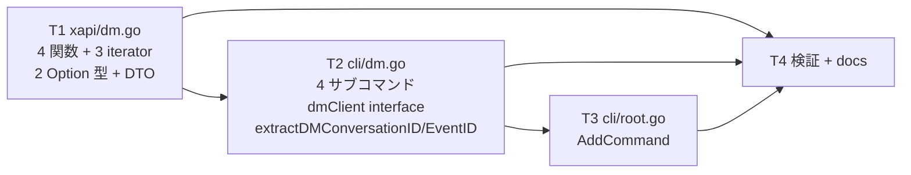
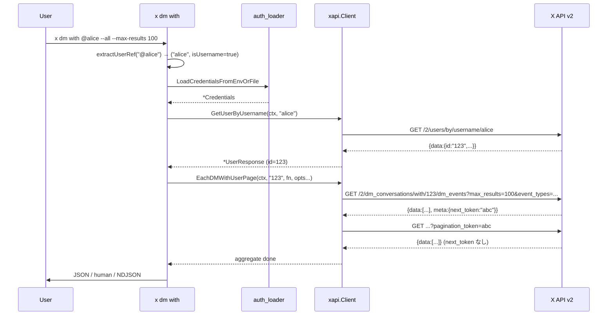

# M35: Direct Messages Read (Pro 推奨)

## Overview

| 項目 | 値 |
|------|---|
| ステータス | 着手中 |
| 対象 v リリース | v0.7.0 |
| Phase | I: readonly API 包括サポート (第 7 回) |
| 依存 | M29 (xapi Client / Tweet DTO / Includes), M32 (3 Option 型分離), M33 (paged DRY + extractXxxID), M34 (Lookup/Search/Paged 3 Option 分離 + spaceClient interface + var-swap) |
| Tier 要件 | OAuth 1.0a User Context で利用可能 (App の DM Read permission 必要)。**Basic tier は 1 回 / 24h 程度の厳しいレート制限。実用は Pro ($5,000/月) 以上を推奨** |
| 主要対象ファイル | `internal/xapi/dm.go` / `dm_test.go` (2 新規), `internal/cli/dm.go` / `dm_test.go` (2 新規), `internal/cli/root.go` / `root_test.go` (1 行 + 1 ケース), `docs/x-api.md`, `docs/specs/x-spec.md`, `README.md` / `README.ja.md`, `CHANGELOG.md` |
| 注意 | 取得可能なのは **直近 30 日以内** のイベントのみ |

## Goal

`x dm list` / `x dm get <eventID>` / `x dm conversation <convID>` / `x dm with <@username|ID>` で DM イベントを取得する。
M34 で確立した「用途別 Option 型分離 (Lookup / Paged) + DRY 共通 + extractXxxID + 専用 client interface + var-swap」を踏襲しつつ、**DM 固有の Pro tier 推奨制約・直近 30 日制限・event_types 配列パラメータ**を仕様に忠実に反映する。

## 対象エンドポイント (X API v2 公式 docs WebFetch 確認済 — 2026-05-15)

| API | 説明 | per-call | pagination | iterator? | 認証 |
|-----|------|---------|------------|-----------|------|
| `GET /2/dm_events` | 全 DM イベント (直近 30 日) | max_results 1..100 (default 100) | `pagination_token` | **yes** | OAuth1.0a User Context (DM read scope) |
| `GET /2/dm_events/:event_id` | 単一 DM イベント | — | — | no | 同上 |
| `GET /2/dm_conversations/:dm_conversation_id/dm_events` | 特定会話の DM イベント | max_results 1..100 (default 100) | `pagination_token` | **yes** | 同上 |
| `GET /2/dm_conversations/with/:participant_id/dm_events` | 特定ユーザーとの 1on1 DM | max_results 1..100 (default 100) | `pagination_token` | **yes** | 同上 |

検証 (2026-05-15 WebFetch):
- `docs.x.com/x-api/direct-messages/get-dm-events.md` → クエリパラメータ・レスポンス確認
- `docs.x.com/x-api/direct-messages/get-dm-event-by-id.md` → path: `^[0-9]{1,19}$`
- `docs.x.com/x-api/direct-messages/get-dm-events-for-a-dm-conversation.md` → conv path 版
- pagination は **`pagination_token`** (next_token ではなくクエリ名は token)
- `event_types` は **配列クエリパラメータ** で `MessageCreate` / `ParticipantsJoin` / `ParticipantsLeave` の 3 値。X API はデフォルトで 3 つ全てを返す
- `dm_event.fields`: `attachments`, `created_at`, `dm_conversation_id`, `entities`, `event_type`, `id`, `participant_ids`, `referenced_tweets`, `sender_id`, `text`
- `expansions`: `attachments.media_keys`, `participant_ids`, `referenced_tweets.id`, `sender_id`

## DM Event 共通レスポンスフィールド

```jsonc
{
  "id": "1580000000000000000",
  "event_type": "MessageCreate", // or "ParticipantsJoin" / "ParticipantsLeave"
  "text": "hello",                // MessageCreate のみ
  "sender_id": "123",             // MessageCreate のみ
  "dm_conversation_id": "123-456",
  "created_at": "2026-05-10T12:34:56.000Z",
  "attachments": { "media_keys": ["..."], "card_ids": ["..."] },
  "referenced_tweets": [{"id": "..."}],
  "participant_ids": ["123", "456"], // ParticipantsJoin/Leave 系
  "entities": { /* TweetEntities と同形 */ }
}
```

dm_conversation_id の典型形は `<user_a>-<user_b>` (1on1) または `group:<convID>` (グループ DM)。本実装では文字列のまま扱い、形式バリデーションは行わない (D-7)。

## Tasks (TDD: Red → Green → Refactor)

### T1: `internal/xapi/dm.go` 新規 — DTO + 2 Option 型 + 4 関数 + 3 iterator (+ `Includes.Media` 追加)

**目的**: 4 endpoint をラップする xapi 層を dm.go に集約する。**前提として `internal/xapi/types.go` に `Media` DTO と `Includes.Media []Media` を追加する (D-5)**。

- 対象: `internal/xapi/types.go` (Includes 拡張 + Media 型追加), `internal/xapi/types_test.go` (Media decode テスト 1 ケース追加), `internal/xapi/dm.go` (新規), `internal/xapi/dm_test.go` (新規)
- **types.go に追加**:
  ```go
  // Media は X API v2 の expansions=attachments.media_keys + media.fields で
  // 返される media オブジェクトを表す DTO である (M35)。
  // 各フィールドは media.fields で要求した場合のみ非空。
  type Media struct {
      MediaKey        string `json:"media_key"`
      Type            string `json:"type,omitempty"` // photo / video / animated_gif
      URL             string `json:"url,omitempty"`
      PreviewImageURL string `json:"preview_image_url,omitempty"`
      DurationMs      int    `json:"duration_ms,omitempty"`
      Width           int    `json:"width,omitempty"`
      Height          int    `json:"height,omitempty"`
      AltText         string `json:"alt_text,omitempty"`
  }
  ```
  そして `Includes` 構造体に `Media []Media \`json:"media,omitempty"\`` を追加。
- **DTO 追加**:
  ```go
  // DMAttachments は DM の添付情報 (media / card)。
  type DMAttachments struct {
      MediaKeys []string `json:"media_keys,omitempty"`
      CardIDs   []string `json:"card_ids,omitempty"`
  }

  // DMEvent は X API v2 の DM イベントを表す DTO。
  // event_type ごとに含まれるフィールドが異なるため全て omitempty。
  type DMEvent struct {
      ID               string            `json:"id"`
      EventType        string            `json:"event_type,omitempty"`
      Text             string            `json:"text,omitempty"`
      SenderID         string            `json:"sender_id,omitempty"`
      DMConversationID string            `json:"dm_conversation_id,omitempty"`
      CreatedAt        string            `json:"created_at,omitempty"`
      Attachments      *DMAttachments    `json:"attachments,omitempty"`
      ReferencedTweets []ReferencedTweet `json:"referenced_tweets,omitempty"`
      ParticipantIDs   []string          `json:"participant_ids,omitempty"`
      Entities         *TweetEntities    `json:"entities,omitempty"`
  }

  // DMEventResponse は単一 DM イベント (GetDMEvent) のレスポンス本体。
  type DMEventResponse struct {
      Data     *DMEvent `json:"data,omitempty"`
      Includes Includes `json:"includes,omitempty"`
  }

  // DMEventsResponse は paged 3 endpoint (GetDMEvents / GetDMConversation / GetDMWithUser) の配列レスポンス本体。
  type DMEventsResponse struct {
      Data     []DMEvent `json:"data,omitempty"`
      Includes Includes  `json:"includes,omitempty"`
      Meta     Meta      `json:"meta,omitempty"`
  }
  ```

- **Option 型 (2 種類、M34 D-1 パターン継承)**:
  - **`DMLookupOption`** (`dmLookupConfig`) — `GetDMEvent` 専用
    - `WithDMLookupDMEventFields(...)` / `WithDMLookupExpansions(...)` / `WithDMLookupUserFields(...)` / `WithDMLookupTweetFields(...)` / `WithDMLookupMediaFields(...)`
    - max_results / event_types / pagination は持たない (誤用防止)
  - **`DMPagedOption`** (`dmPagedConfig`) — paged 3 endpoint 共通
    - `WithDMPagedMaxResults(int)` (0=no-op、1..100、CLI 層でレンジチェック)
    - `WithDMPagedPaginationToken(string)`
    - `WithDMPagedEventTypes(...string)` — array クエリパラメータ。CSV (`event_types=MessageCreate,ParticipantsJoin`) で送る
    - `WithDMPagedDMEventFields(...)` / `WithDMPagedExpansions(...)` / `WithDMPagedUserFields(...)` / `WithDMPagedTweetFields(...)` / `WithDMPagedMediaFields(...)`
    - `WithDMPagedMaxPages(int)` (default 50, Each 専用)

- **定数**:
  ```go
  const (
      dmPagedDefaultMaxPages    = 50
      dmPagedRateLimitThreshold = 2
  )
  ```

- **4 公開関数 + 3 iterator**:
  - `(c *Client) GetDMEvent(ctx, eventID string, opts ...DMLookupOption) (*DMEventResponse, error)` — `/2/dm_events/:event_id` (path)
  - `(c *Client) GetDMEvents(ctx, opts ...DMPagedOption) (*DMEventsResponse, error)` — `/2/dm_events`
  - `(c *Client) EachDMEventsPage(ctx, fn, opts...) error`
  - `(c *Client) GetDMConversation(ctx, conversationID string, opts ...DMPagedOption) (*DMEventsResponse, error)` — `/2/dm_conversations/:id/dm_events`
  - `(c *Client) EachDMConversationPage(ctx, conversationID, fn, opts...) error`
  - `(c *Client) GetDMWithUser(ctx, participantID string, opts ...DMPagedOption) (*DMEventsResponse, error)` — `/2/dm_conversations/with/:participant_id/dm_events`
  - `(c *Client) EachDMWithUserPage(ctx, participantID, fn, opts...) error`

- **DRY 共通**:
  - paged 3 endpoint は内部 `fetchDMEventsPage(ctx, path, &cfg, funcName)` で URL ビルダ + decode を共通化
  - paged 3 iterator は内部 `eachDMEventsPaged(ctx, funcName, path, fn, opts)` で M33 `eachUserListsPage` と同形のループを共通化
  - Lookup は M34 `fetchJSON` を直接使う

- **URL ビルダ**:
  - `buildDMLookupURL(baseURL, path string, cfg *dmLookupConfig)` (single dm_events/:id)
  - `buildDMPagedURL(baseURL, path string, cfg *dmPagedConfig)` (paged 3 endpoint 共通)

- **バリデーション**:
  - `GetDMEvent`: `eventID == ""` reject
  - `GetDMConversation` / `EachDMConversationPage`: `conversationID == ""` reject
  - `GetDMWithUser` / `EachDMWithUserPage`: `participantID == ""` reject

- **event_types CSV 整形**: `len(cfg.eventTypes) > 0` 時に `values.Set("event_types", strings.Join(cfg.eventTypes, ","))` (X API 仕様の CSV array で渡す)

- **パッケージ doc**: 書かない (revive: package-comments 既存集約)

- **テスト** (`dm_test.go` 新規、最低 18 ケース):
  1. `TestGetDMEvents_HitsCorrectEndpoint` — path `/2/dm_events`
  2. `TestGetDMEvents_AllOptionsReflected` — max_results / pagination_token / event_types CSV / dm_event.fields / expansions / user.fields / tweet.fields / media.fields
  3. `TestGetDMEvents_EventTypesCSV` — `event_types=MessageCreate%2CParticipantsJoin` を pin
  4. `TestGetDMEvents_DecodesData` — レスポンス JSON decode (MessageCreate event + sender_id + dm_conversation_id)
  5. `TestGetDMEvents_404_NotFound` → ErrNotFound
  6. `TestGetDMEvents_InvalidJSON_NoRetry`
  7. `TestEachDMEventsPage_MultiPage_FullTraversal` — pagination_token 2 ページ
  8. `TestEachDMEventsPage_RespectsMaxPages` — `WithDMPagedMaxPages(1)` で 1 ページで終了
  9. `TestGetDMEvent_HitsCorrectEndpoint` — `/2/dm_events/123`
  10. `TestGetDMEvent_EmptyID_Rejects`
  11. `TestGetDMEvent_404_NotFound`
  12. `TestGetDMEvent_OptionsReflected` — dm_event.fields / expansions
  13. `TestGetDMConversation_HitsCorrectEndpoint` — `/2/dm_conversations/123-456/dm_events` (Path 中ハイフン保持)
  14. `TestGetDMConversation_EmptyID_Rejects`
  15. `TestEachDMConversationPage_MultiPage`
  16. `TestGetDMWithUser_HitsCorrectEndpoint` — `/2/dm_conversations/with/123/dm_events`
  17. `TestGetDMWithUser_EmptyID_Rejects`
  18. `TestEachDMWithUserPage_MultiPage`

### T2: `internal/cli/dm.go` 新規 — 4 サブコマンド + dmClient interface + extractDMConversationID + var-swap

- 対象: `internal/cli/dm.go` (新規), `internal/cli/dm_test.go` (新規)
- **定数**:
  ```go
  const (
      // dm_event.fields のデフォルト (全フィールドを抑えめに要求)
      dmDefaultDMEventFields = "id,event_type,text,sender_id,dm_conversation_id,created_at,attachments,referenced_tweets,participant_ids,entities"
      dmDefaultUserFields    = "username,name"
      dmDefaultTweetFields   = "id,text,author_id,created_at"
      dmDefaultMediaFields   = ""
      dmDefaultExpansions    = ""
      dmDefaultEventTypes    = ""

      dmMaxResultsCap = 100
  )
  ```

- **`dmConvIDRE`**: `^[A-Za-z0-9_:-]+$` — DM conversation ID は `<userA>-<userB>` 形式が典型だが、X API は `group:<id>` 等のバリアントも返すため緩い英数+`:_-`許容で受ける (D-7)。
- **`dmEventIDRE`**: `^\d{1,19}$` — DM event ID は数値 (X API docs 確認済)。

- **`dmClient` interface** (M34 D-10 パターン):
  ```go
  type dmClient interface {
      GetUserMe(ctx context.Context, opts ...xapi.UserFieldsOption) (*xapi.User, error)
      GetUserByUsername(ctx context.Context, username string, opts ...xapi.UserLookupOption) (*xapi.UserResponse, error)
      GetDMEvent(ctx context.Context, eventID string, opts ...xapi.DMLookupOption) (*xapi.DMEventResponse, error)
      GetDMEvents(ctx context.Context, opts ...xapi.DMPagedOption) (*xapi.DMEventsResponse, error)
      EachDMEventsPage(ctx context.Context, fn func(*xapi.DMEventsResponse) error, opts ...xapi.DMPagedOption) error
      GetDMConversation(ctx context.Context, conversationID string, opts ...xapi.DMPagedOption) (*xapi.DMEventsResponse, error)
      EachDMConversationPage(ctx context.Context, conversationID string, fn func(*xapi.DMEventsResponse) error, opts ...xapi.DMPagedOption) error
      GetDMWithUser(ctx context.Context, participantID string, opts ...xapi.DMPagedOption) (*xapi.DMEventsResponse, error)
      EachDMWithUserPage(ctx context.Context, participantID string, fn func(*xapi.DMEventsResponse) error, opts ...xapi.DMPagedOption) error
  }
  var newDMClient = func(ctx context.Context, creds *config.Credentials) (dmClient, error) {
      return xapi.NewClient(ctx, creds), nil
  }
  ```

- **`extractDMConversationID(s string) (string, error)`** — 緩い英数+ハイフン+コロン+アンダースコア。空文字 reject。
- **`extractDMEventID(s string) (string, error)`** — 数値のみ (`^\d{1,19}$`)。

- **4 サブコマンド factory**:
  - `newDMCmd()` — 親、Long に Pro tier 推奨と 30 日制限を明示
  - `newDMListCmd()` — `x dm list` (`cobra.NoArgs`)
    - フラグ: `--event-types` (`MessageCreate,ParticipantsJoin,ParticipantsLeave` の CSV、空=X API デフォルト), `--max-results` (1..100, default 100), `--pagination-token`, `--all`, `--max-pages` (50), `--no-json`, `--ndjson`, dm-event-fields / user-fields / tweet-fields / media-fields / expansions
    - human: `formatDMEventHumanLine`
  - `newDMGetCmd()` — `x dm get <eventID>` (`cobra.ExactArgs(1)`)
    - フラグ: `--no-json`, dm-event-fields / user-fields / tweet-fields / media-fields / expansions
  - `newDMConversationCmd()` — `x dm conversation <conversationID>` (`cobra.ExactArgs(1)`)
    - paged フラグ全部
  - `newDMWithCmd()` — `x dm with <ID|@username|URL>` (`cobra.ExactArgs(1)`)
    - 位置引数を `extractUserRef` で解釈 → `isUsername=true` の場合 `GetUserByUsername` で ID 解決
    - paged フラグ全部

- **aggregator**:
  - `dmEventsAggregator` 新規 (M33 D-2 / M34 D-8 と同方針、generics 化見送り)。Users と Tweets を Includes として保持

- **human formatter**:
  - `formatDMEventHumanLine(e xapi.DMEvent) string` — `id=... type=... conv=... sender=... created=... text=...` (改行/タブ正規化 + 80 ルーン truncate は既存 `normalizeAndTruncate` 系を再利用、なければ liked のロジックを参考に最小実装)

- **バリデーション順**: 位置引数/フラグ → event_types 値チェック (許可値外なら ErrInvalidArgument) → max_results 範囲チェック → `decideOutputMode` → authn → client → ID 解決

- **`validateEventTypes` ヘルパ**: 入力 CSV を split → 各要素を `MessageCreate` / `ParticipantsJoin` / `ParticipantsLeave` でホワイトリスト検証 → 不正なら `ErrInvalidArgument` wrap。

- **`newDMWithCmd` の username 解決**:
  - `extractUserRef(arg)` で `(value, isUsername, err)` を得る
  - `isUsername=true` なら `GetUserByUsername(ctx, value)` で ID 解決
  - 数値 ID の場合はそのまま採用

- **パッケージ doc**: 書かない

- **テスト** (`dm_test.go` 新規、最低 17 ケース):
  1. `TestDMList_DefaultJSON` — `/2/dm_events` を叩くこと、JSON 出力
  2. `TestDMList_EventTypesFlagReflected` — `--event-types MessageCreate,ParticipantsJoin` → `event_types=MessageCreate%2CParticipantsJoin`
  3. `TestDMList_EventTypesInvalidValue_Rejects` — `--event-types Foo` で exit 2
  4. `TestDMList_MaxResultsOutOfRange` — 0 / 101 で exit 2
  5. `TestDMList_All_AggregatesPages` — multi-page (pagination_token 2 ページ)
  6. `TestDMList_NDJSON_Streams` — NDJSON 1 行/event
  7. `TestDMList_NoJSON_HumanFormat`
  8. `TestDMList_NoJSON_NDJSON_MutuallyExclusive` (exit 2)
  9. `TestDMGet_HitsCorrectEndpoint` — `/2/dm_events/123`
  10. `TestDMGet_InvalidEventID_Rejects` — `abc` で exit 2 (数値以外)
  11. `TestDMGet_NoJSON_HumanFormat`
  12. `TestDMConversation_DefaultJSON` — `/2/dm_conversations/A-B/dm_events`
  13. `TestDMConversation_EmptyConvID_Rejects`
  14. `TestDMConversation_All_AggregatesPages`
  15. `TestDMWith_ByNumericID` — `123` をそのまま path
  16. `TestDMWith_ByUsername_ResolvesViaGetUserByUsername` — `@alice` で 2 段呼び出し
  17. `TestExtractDMConversationID_Table` — 数値 / `123-456` / `group:abc` / 空 / 不正

### T3: `internal/cli/root.go` — AddCommand + root_test 1 ケース

- `root.AddCommand(newDMCmd())` を `newTrendsCmd()` の直後に追加
- `root_test.go` に `TestRootHelpShowsDM` を追加

### T4: 検証 + Docs

**検証**:
- `go test -race -count=1 ./...` 全 pass
- `GOLANGCI_LINT_CACHE=$TMPDIR/golangci-cache golangci-lint run ./...` 0 issues
- `go vet ./...` 0
- `go build -o /tmp/x ./cmd/x` 成功
- 実機 `x dm list --no-json` は Pro 環境ユーザーが実施 (本マイルストーンでは httptest mock 検証のみ)

**ドキュメント更新**:
- `docs/specs/x-spec.md` §6 CLI: `x dm {list,get,conversation,with}` フラグ表
- `docs/x-api.md`: 新規 §1.8 (4 endpoint + Rate Limit 表追加 + **Basic tier 1 回/24h / Pro 推奨**と直近 30 日制限を明示)
- `README.md` / `README.ja.md`: CLI 表に dm 行
- `CHANGELOG.md`: `[0.7.0]` セクションに M35 を追記 (M34 で既に [0.7.0] draft 化済み)
- `plans/x-roadmap.md`: M35 ✅ 完了マーク + commit hash 追記

## Completion Criteria

- `go test -race -count=1 ./...` 全 pass (新規 35+ ケース、目標 T1=18 + T2=17 + T3=1)
- `golangci-lint run ./...` 0 issues, `go vet ./...` 0
- 4 endpoint の URL 組み立てがテスト pin
- `EachDMxxxPage` の pagination_token 自動辿りが pin
- `event_types` の CSV 形式エンコード + ホワイトリスト検証が pin
- `extractDMConversationID` / `extractDMEventID` の入力分岐 pin
- `docs/x-api.md` に DM endpoint と Basic tier 制限 (1 回/24h) / Pro 推奨が明記
- `CHANGELOG.md [0.7.0]` セクションに M35 が記録
- 各タスクが独立コミット (Conventional Commits 日本語、フッター `Plan: plans/x-m35-dm-read.md`)

## 設計上の決定事項

| # | テーマ | 採用 | 理由 |
|---|--------|------|------|
| D-1 | DM Option 型分離 | **2 種類** (`DMLookupOption` / `DMPagedOption`) | M33/M34 の Option 型分離パターン継承。Lookup (single event) には max_results / event_types / pagination を持たせない (誤用防止) |
| D-2 | paged 3 endpoint の DRY | 内部 `fetchDMEventsPage` + `eachDMEventsPaged` で共通化 | レスポンス型が `*DMEventsResponse` で完全一致するため、M33 の 3 fetch / 3 each よりも簡潔に 1 fetch + 1 each で表現可能 |
| D-3 | `event_types` の送信形式 | **CSV** (`event_types=MessageCreate,ParticipantsJoin`) | X API 仕様で配列パラメータは CSV。`strings.Join` で生成。テスト #2/#3 で pin |
| D-4 | `event_types` のホワイトリスト | CLI 層で `MessageCreate` / `ParticipantsJoin` / `ParticipantsLeave` 厳格検証 | 不正値は X API 側でエラーになるが、CLI 層で早期に exit 2 を返した方が UX が良い |
| D-5 | `Includes.Media` の追加 | **採用** (advisor #1 反映): `internal/xapi/types.go` の `Includes` 構造体に最小 `Media` 型を追加 | 当初 "見送り" としたが、advisor 指摘の通り `expansions=attachments.media_keys` + `media.fields=...` を露出する以上、レスポンスを silent drop するのは footgun。`Includes.Media []Media` を追加し、`Media{MediaKey, Type, URL, PreviewImageURL, DurationMs, Width, Height, AltText}` を最小フィールドで定義。他の paged endpoint (likes/timeline/list tweets/space tweets) でも media が取り込めるようになる net improvement。既存 struct literals は名前付きフィールド初期化なので破壊的変更なし。`Includes` 拡張は本マイルストーンの T1 冒頭で types.go に追加し、テストで Unmarshal 動作を pin する |
| D-6 | DM ID 形式 | event_id は `^\d{1,19}$`、conversation_id は緩い英数+`-:_` 許容 | X API docs で event_id は 19 桁数値固定、conv_id は `<userA>-<userB>` / `group:<id>` 等のバリアントがある |
| D-7 | DM conversation_id の URL バリアント | なし | DM には公式の web URL がない (deep link はクライアント固有)。位置引数は ID 文字列のみ受ける |
| D-8 | DM with `<ID|@username|URL>` 位置引数 | M32 `extractUserRef` 再利用 | M32 で実装済の username → ID 解決ロジックを再利用 (M33 `resolveListsTargetUserID` と同方針) |
| D-9 | aggregator generics 化 | **見送り継続** (M33/M34 と同じ) | `dmEventsAggregator` をコピーで定義。M36 (MCP v2 Tools) で再評価する余地のみ残す |
| D-10 | client interface | **`dmClient` を分離** (M33/M34 と同パターン) | 責務分離、テストの var-swap で httptest 注入を可能化 |
| D-11 | パッケージ doc | 新規ファイルには書かない | revive: package-comments (M29 D-5 〜 M34 D-9 継続) |
| D-12 | DM human 出力 | 新規 `formatDMEventHumanLine` | event_type ごとにフィールド構成が変わるため、テキスト + meta を 1 行にコンパクトに |
| D-13 | Pro tier 推奨 / 30 日制限 | CLI Long doc と docs/x-api.md 双方に明示 | Basic tier では 1 回/24h でほぼ使用不能。UX 上、起動時に warning を出すのは過剰なので docs に集約 |
| D-14 | `--user-id` フラグ | dm list には **不公開** (X API 認証ユーザー固定の動作) | 認証ユーザー自身の DM のみ取得可能 (X API 仕様) |
| D-15 | aggregator の Includes 集約 | Users / Tweets / Media を全て append (D-5 で Includes.Media 追加) | 一貫性 |
| D-16 | event_types ホワイトリスト検証の case sensitivity | **case-sensitive** | X API が case-sensitive (advisor #4 反映)。テスト #3 で `Foo` のような不正値が exit 2 になることを pin、追加で `messagecreate` (小文字) も exit 2 になることを pin |
| D-17 | `dmConvIDRE` の `-` 位置 | character class 末尾配置 (Go regexp で literal) で問題なしだが可読性のため `\-` エスケープを併用 | advisor #1 反映 |
| D-18 | conv_id の `group:<id>` バリアントテスト | テスト #17 / #13 で `group:abc` を含めて pin | advisor #2 反映 |

## Risks

| リスク | 対策 |
|--------|------|
| Basic tier の 1 回/24h レート制限で実機検証困難 | docs と CLI Long に明示。httptest mock で全機能を pin。Pro tier ユーザーの実機検証は M35 完了後の任意作業 |
| `event_types` のクエリ形式の取り違え (CSV vs 繰り返し) | D-3 で CSV を採用、テスト #2/#3 で pin |
| `Includes.Media` 不在によるレスポンス再エンコードでの media 情報喪失 | omitempty で本来は問題ないが、Includes 型が JSON 上で `media` キーを認識しないため Unmarshal で捨てられる。D-5 で明示、M36 以降で対応の選択肢を残す |
| DM event ID 19 桁制約の取り違え | D-6 で `^\d{1,19}$` 採用、テスト #10 で pin |
| `extractDMConversationID` の緩い regex で誤判定 | D-7 で URL バリアントなし。テスト #17 でテーブル駆動 |
| 直近 30 日制限のユーザー期待値ずれ | docs に明示 (D-13) |
| Cobra `cobra.NoArgs` での `--event-types` ホワイトリスト検証 | RunE 内で `validateEventTypes` を最初に呼ぶ (D-4) |

## Mermaid: 依存関係



## Mermaid: `x dm with @alice --all` のシーケンス



## Implementation Order

1. **T1 (Red)**: `dm_test.go` 18 ケース → コンパイル失敗
2. **T1 (Green)**: `dm.go` 実装 → pass
3. **T1 commit**: `feat(xapi): DM Read 4 endpoint (events list/lookup/conversation/with) を追加 (M35)`
4. **T2 (Red→Green)**: `cli/dm_test.go` 17 ケース + `cli/dm.go` 実装
5. **T2 commit**: `feat(cli): x dm サブコマンド群を追加 (list/get/conversation/with)`
6. **T3 (Red→Green)**: `root_test.go` 1 ケース + `root.go` AddCommand
7. **T3 commit**: `feat(cli): root に dm コマンドを接続`
8. **T4 (Docs + 最終検証)**: docs/x-api.md / spec / README 英日 / CHANGELOG / roadmap
9. **T4 commit**: `docs(m35): x-api.md / spec / README / CHANGELOG / roadmap に DM Read を追記`

## Handoff to M36 (MCP v2 Tools)

- M35 で確立した「DM 専用 client interface + paged 3 endpoint の 1 fetch + 1 each で DRY 化」を M36 の MCP tools で活用
- DM tools は **MCP v2 tools に含めない可能性が高い**: Pro tier 推奨かつ Routine ユースケース (Backlog 起票) と無関係なため。M36 のスコープを決める際に判断する
- `Includes.Media` 未対応 (M35 D-5) のため、media 関連 MCP tool を作る場合は先に `internal/xapi/types.go` の Includes 拡張が必要
- aggregator generics 化: 9 つ目以降の独自配列 (DM Event 配列) が増えた。M36 着手時に再評価候補
- `extractDMConversationID` / `extractDMEventID` パターンは M36 MCP tool の input validation で参考になる

## advisor 反映ログ

### 計画策定後 (Phase 2)

(advisor 1 回目を計画書 commit 後に呼び出して反映)

### 実装後 (Phase 4)

(実装完了時に実施)
